# The Armory

Welcome to my armory! This is a compilation of useful loadouts that I either discovered or was given. If you're looking for a functional set, look no further!

My goal for all of these sets is to *not* dictate what talismans you must use, whenever possible. Greatsword users, beware. You're gonna need a tali.

## Contents

- [General Melee Sets](#general-melee-sets)
- [Great Sword Sets](#great-sword-sets)
- [Pierce Gunning](#pierce-gunning)
- [Normal and Elemental Gunning](#normal-and-elemental-gunning)
- [Status Melee Sets](#status-melee-sets)

## General Melee Sets

### Endgame Standard Earplugs

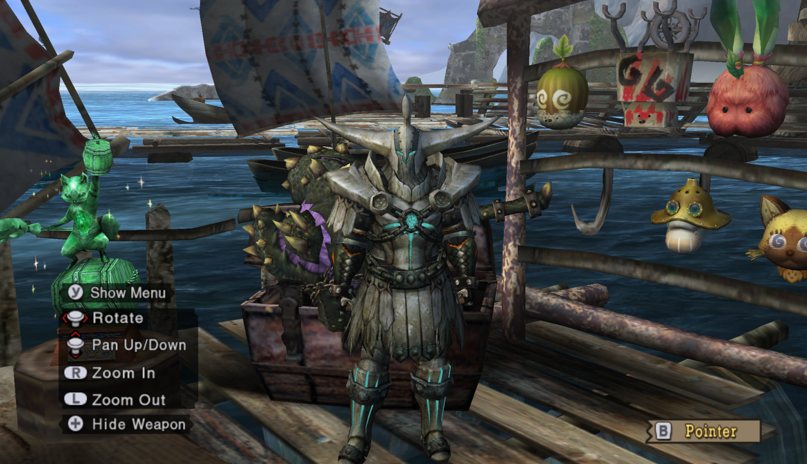
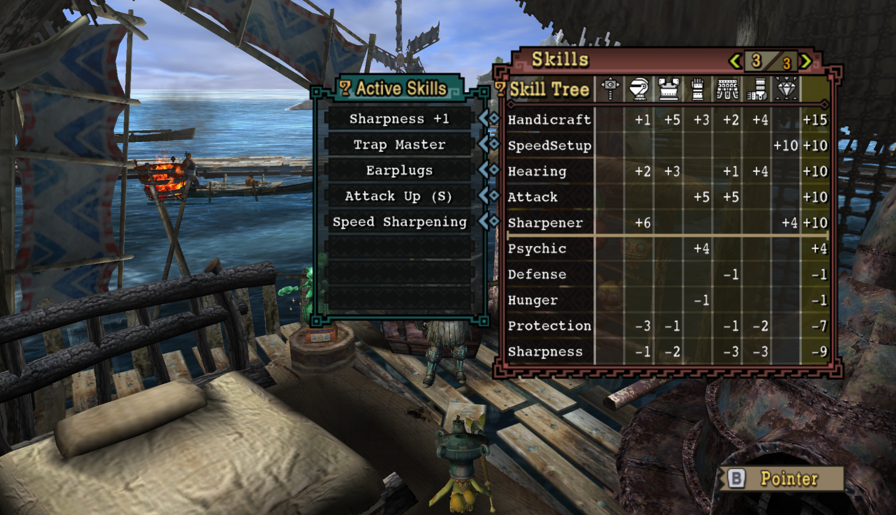

Active Skills:  Sharpness +1, Earplugs  
  
Available Slots:  OOO x2; (Talisman); (Weapon)  
  
 Selene/Helios Helm+ | OOO  
 Selene/Helios Mail+  
 Vangis Vambraces  
 Selene/Helios Coil+ | OOO  
 Selene/Helios Greaves+  

Total:  Handicraft +15, Hearing +10, Attack +5  

It seems natural to get to at least AuS, but the customization is entirely up to you. A common favorite loadout of mine is Sharpness +1, Earplugs, AuS, Trapmaster, Sharpener. That would require a SpeedSetup +10 OO or comparable talisman.

---

### Endgame Standard Earplugs 2

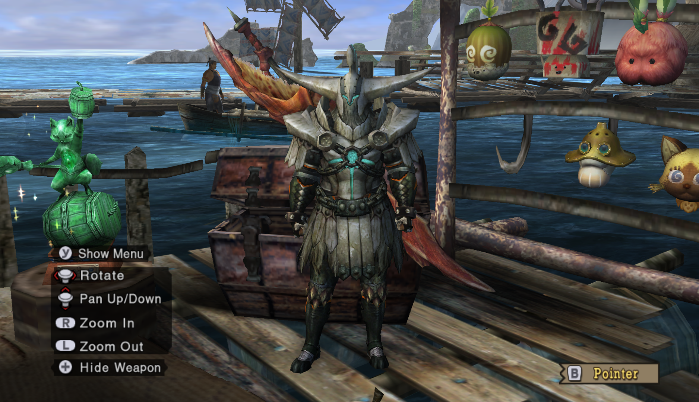
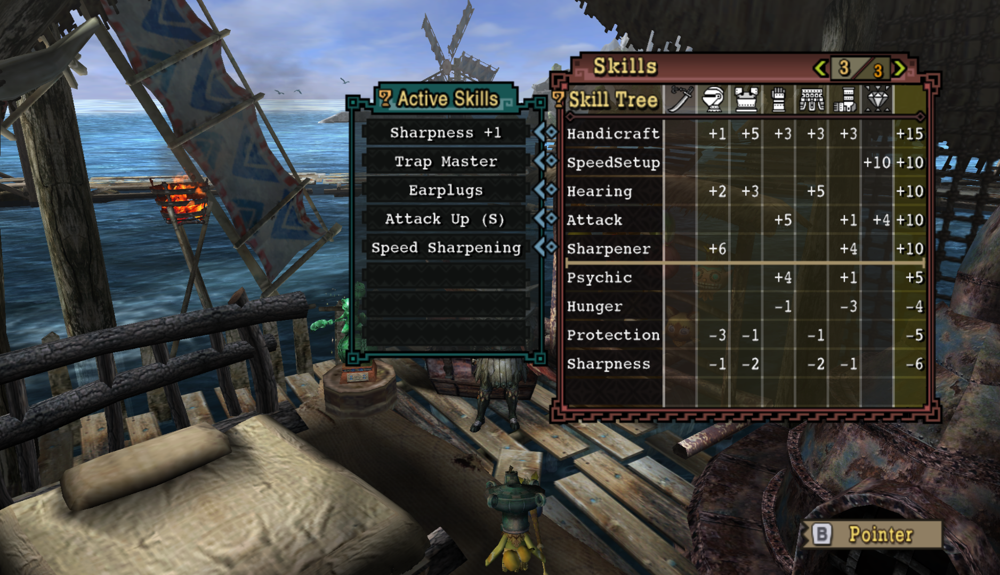

Active Skills:  Sharpness +1, Earplugs  
  
Available Slots:  OOO x2; (Talisman); (Weapon)

 Selene/Helios Helm+ | OOO  
 Selene/Helios Mail+  
 Vangis Vambraces  
 Selene/Helios Coil  
 Vangis Greaves | OOO  

Total:  Handicraft +14, Hearing +10, Attack +6  

Another way to achieve the same loadout as above. The Attack +6 goes really well with a Queen talisman that has C+10 Atk+3 O.

---

### Endgame High Grade Earplugs

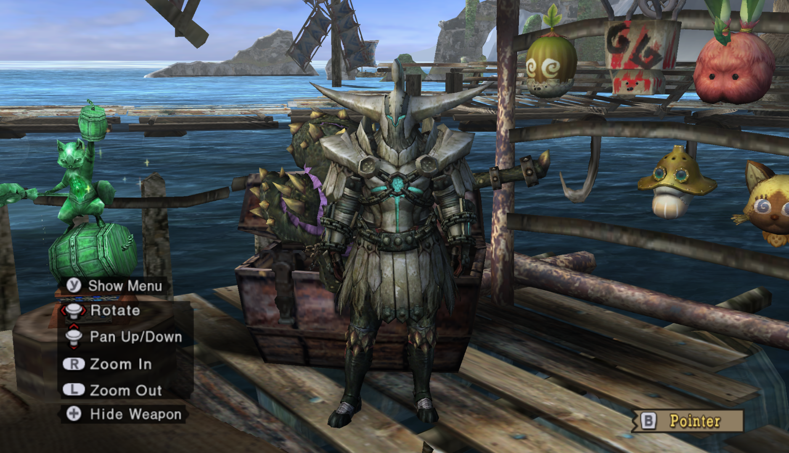
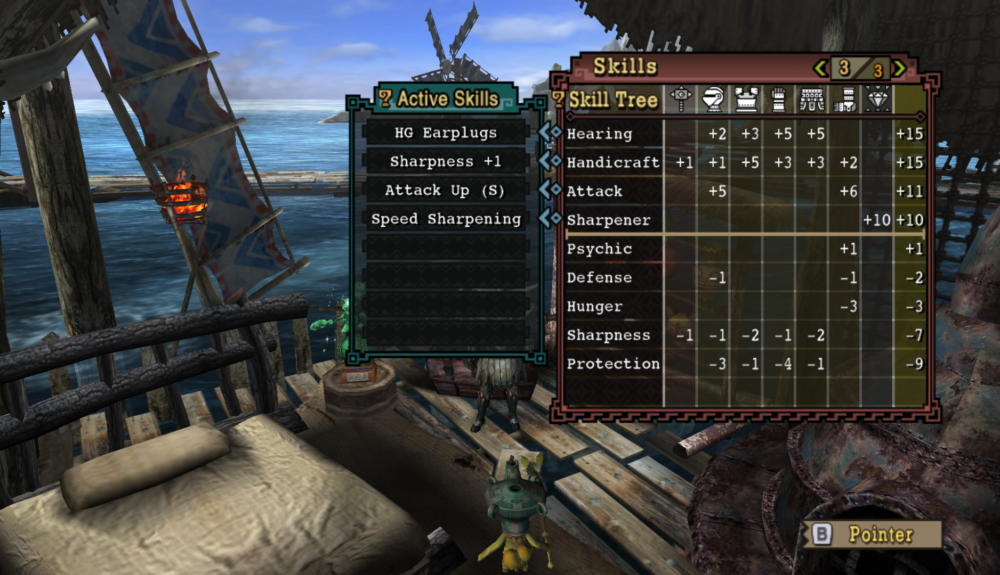

Active Skills:  (Sharpness +1), High Grade Earplugs  
  
Available Slots:  OOO x2; (Talisman); (Weapon)

 Selene/Helios Helm+ | OOO  
 Selene/Helios Mail+  
 Vangis Vambraces  
 Selene/Helios Coil  
 Vangis Greaves | OOO  

Total:  Handicraft +14, Hearing +15, Attack +1  

This is *the* high grade earplugs loadout. Put the handicraft deco in the weapon slot if you can.

If you want a headless one though...

---

### Endgame Scuffed High Grade Earplugs

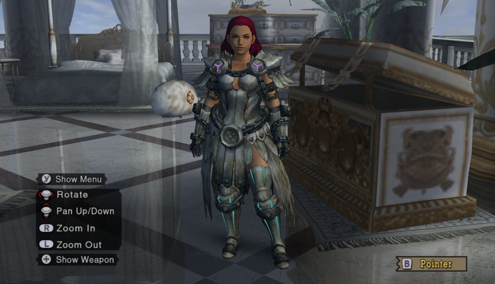
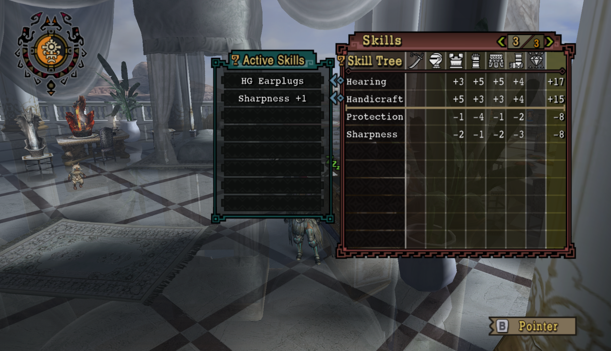

Active Skills:  Sharpness +1, High Grade Earplugs  
  
Available Slots:  (Helm); (Talisman); (Weapon)

 None  
 Selene/Helios Mail+  
 Selene/Helios Vambraces+  
 Selene/Helios Coil  
 Selene/Helios Greaves(+) 

Total:  Handicraft +15/+16, Hearing +17/+16  

You can swap the HR greaves for the LR greaves if you want.  

Truth is, there's a lot of ways to make less optimal versions of Sharpness+1 and some variety of earplugs. When I first reach HR51, these are the first sets I make by mixing whatever Vangis and Helios I have, and I improvise until I can refine them into Endgame Standard or Endgame HGE.

---

### Endgame Standard No Earplugs

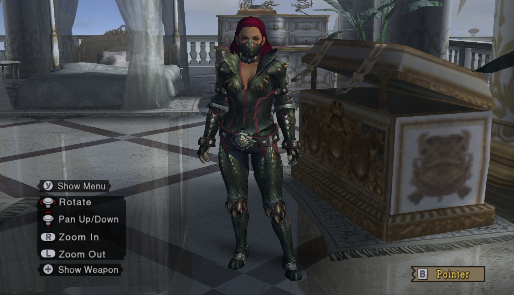

Active Skills:  Sharpness +1, Attack Up (M), Autotracker, Raise Hunger  
  
Available Slots:  OOO x1; (Talisman); (Weapon)

 Vangis Helm  
 Vangis Mail  
 Vangis Vambraces  
 Vangis Coil  
 Vangis Greaves | OOO  

Total:  Handicraft +15, Psychic +15, Attack +15  

Yes, this is just full Deviljho. Not many slots to work with. However, if you're willing to lose some Attack, you can get...

---

### Endgame Standard No Earplugs Flexible

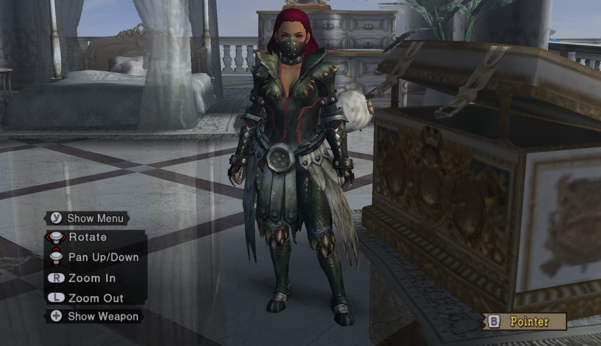

Active Skills: (Sharpness +1), Attack Up S, Detect  
  
Available Slots: OOO x2; (Talisman); (Weapon)  
  
 Vangis Helm  
 Vangis Mail  
 Vangis Vambraces  
 Selene/Helios Coil+ | OOO  
 Vangis Greaves | OOO  

Total:  Handicraft +14, Psychic +12, Attack +12  

In my opinion, losing one level of attack is worth being able to gem in other stuff, like both sharpener and trapmaster just as an example. Also useful is guard, evasion, dung bomb expert, or whatever.  
If you're looking for an evade lancer set, this is it!

---

### Elemental Enjoyers

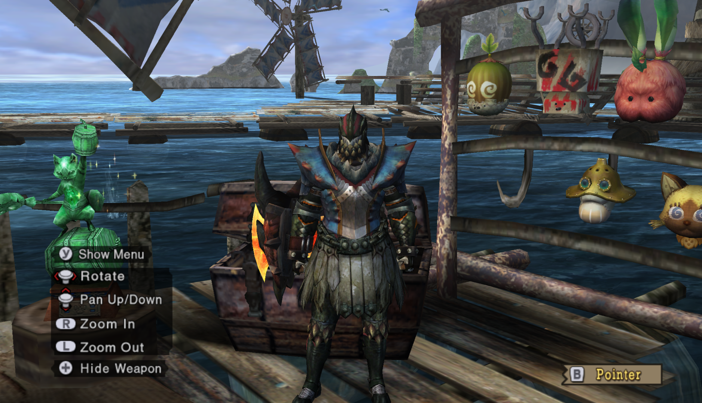
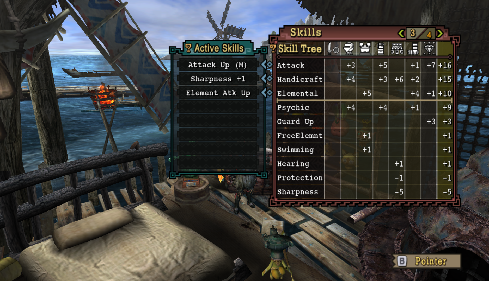

Active Skills:  Sharpness +1, (Element Atk Up), (Attack Up (X))    
  
Available Slots: (Talisman); (Weapon)

 Vangis Helm  
 Lagiacrus Mail+ | OOO (Element 4)  
 Vangis Vambraces  
 Selene/Helios Coil+ | OOO (Handicraft 4)  
 Vangis Greaves | OOO (Element 4)  

Total:  Handicraft +15, Element +9, Attack +9  

I'd rather use a standard sharpness mix, but that's me. With a 2 slot weapon and attack god talisman (Attack +7 OO), you can get AuL. Don't forget to finish off the Element +9 and Attack +9 by adding the corresponding decos either in your weapon or your talisman.

---

### Steel Guard Lancing

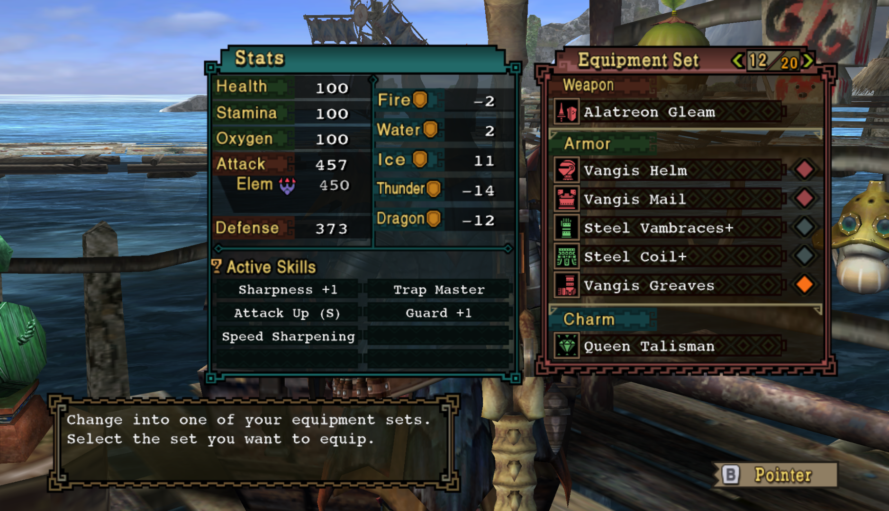

Active Skills:  Sharpness +1, Guard +1, Speed Sharpen

 1-Slot Weapon | O (Handicraft 1)  
 Vangis Helm  
 Vangis Mail  
 Steel Vambraces+ | O (Sharpener 2)  
 Steel Coil+ | O (Guard 1)  
 Vangis Greaves | OOO (Handicraft 4)  
Talisman: Any with (O) or better (Handicraft 1)

Total:  Handicraft +15, Guard +10, Sharpener +10, Attack +7

This is what I have for Guard Lancing that doesn't require a Guard skill in the talisman. You need one more Handicraft point in the tali. Funny enough, C+10 Atk+3 O fits extremely well into this set once more to tack on another C skill as well as AuS, but that is not at all mandatory. 

---

### Alloy+ is Bae

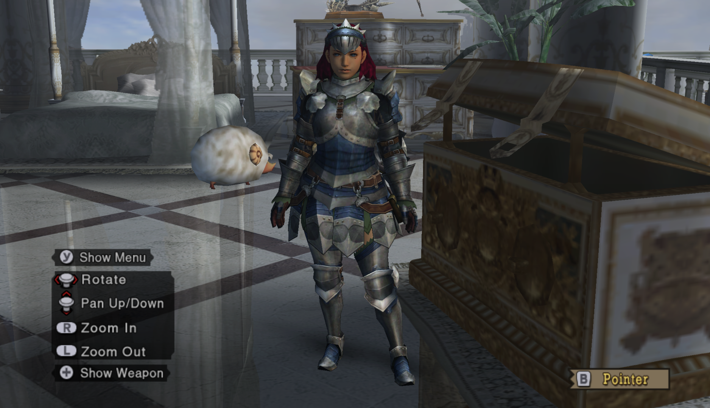

Active Skills:  Critical Eye +2, Trapmaster, Sharpener  
  
Available Slots:  OO x4; (Talisman); (Weapon)

 Alloy Helm+ | OO  
 Alloy Mail+ | OO  
 Alloy Vambraces+ | OO  
 Alloy Coil+ | OO  
 Alloy Greaves+  

Total:  Expert +15, Sharpener +10, SpeedSetup +10  

Useful for weapons that don't benefit much from Sharpness +1, such as Flame Tempest and Reaver "Calamity".  
Since Alloy+ already has the best C skills in the game, I just shove Attack 3 gems into everything, but obviously it's up to you.  
Notably, this is available as soon as you unlock HR31! It's a very good progression set.

---

## Great Sword Sets

Okay, these require Crit Draw talismans. I warned you!

### Endgame GS Standard

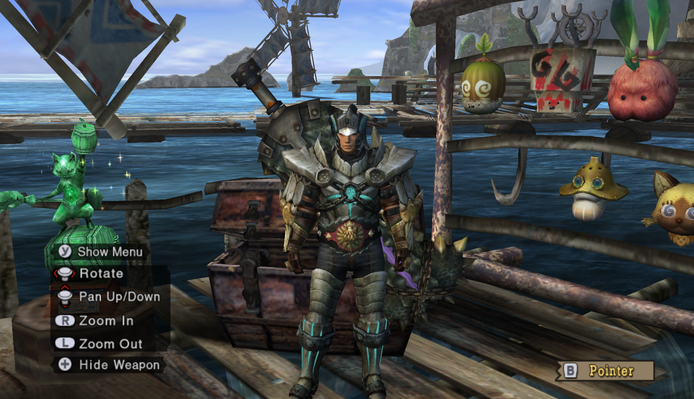
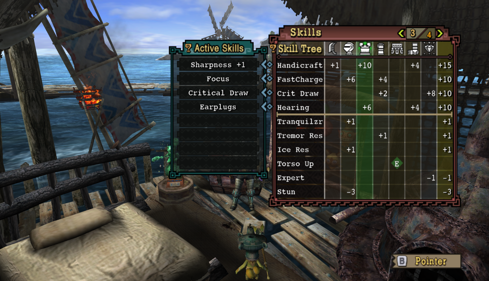

Active Skills:  Sharpness +1, Focus, Critical Draw, Earplugs

 Anguish (P) | O (Handicraft 1)  
 Baggi Helm+ | OOO (FastCharge 4)  
 Selene/Helios Mail+  
 Diablos Vambraces+ | OOO (FastCharge 4)  
 Vangis Coil  
 Selene Greaves+  
Talisman:  Crit Draw +7 O or better

Total:  Handicraft +15, Crit Draw +10, FastCharge +10, Hearing +10

If your Critical Draw talisman is only 7, you could use the very expensive and inferior Alatreon Revolution. If you don't have THAT, then you can use low rank Selene Greaves and not run earplugs.

If you have Crit Draw +6 OO, you can do the following for higher defense...

---

### Endgame GS Standard Redux

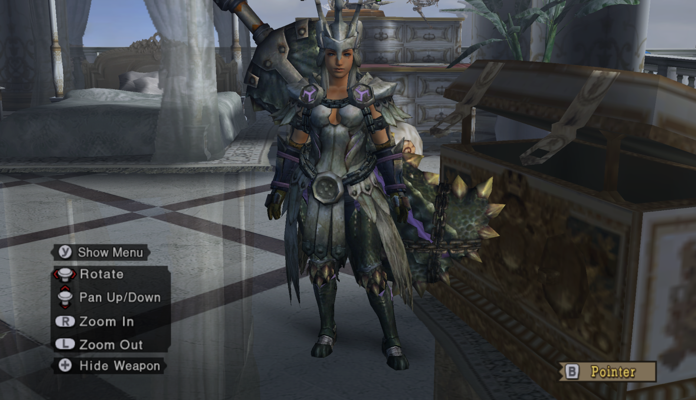

Active Skills:  Sharpness +1, Earplugs, Critical Draw, Focus

 Anguish (P) | O (Crit Draw 1)  
 Selene/Helios Helm+ | OOO (FastCharge 4)  
 Selene/Helios Mail+  
 Hinata/Yamato Kote+ | OOO (FastCharge 4)  
 Selene/Helios Coil  
 Vangis Greaves | OOO (Handicraft 4)  
Talisman:  Crit Draw +6 OO (Crit Draw 3)  

Total:  Handicraft +15, Crit Draw +10, FastCharge +10, Hearing +10

Style! Note that this costs a Stout Horn for your decoration.

---

### Endgame GS Standard No Earplugs

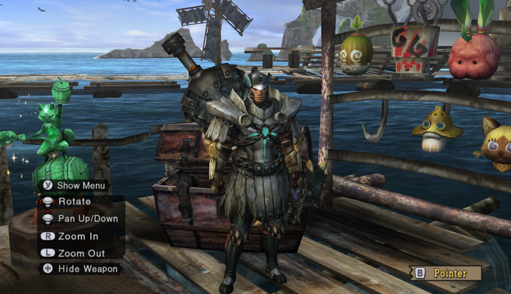
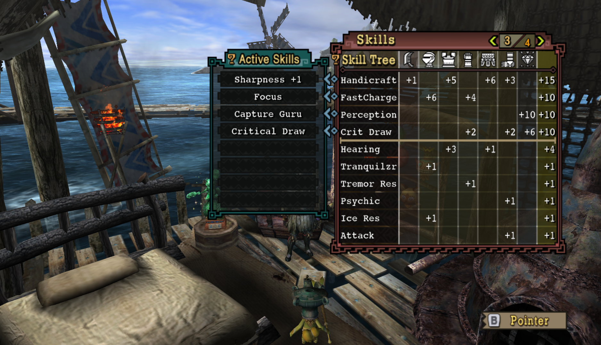

Active Skills:  Sharpness+1, Critical Draw, Focus, C+10

 Anguish (P) | O (Handicraft 1)  
 Baggi Helm+ | OOO (FastCharge 4)  
 Selene/Helios Mail+  
 Diablos Vambraces+ | OOO (FastCharge 4)  
 Selene/Helios Coil+ | OOO (Handicraft 4)  
 Vangis Greaves | OOO (Crit Draw 3, Handicraft 1)  
Talisman: Crit Draw +5/+6, C+10

Total: Handicraft +15, Crit Draw +10, FastCharge +10, C+10

For when earplugs don't help. I've seen Item Use Up and Capture Guru as the most useful C skills on the talisman.

If your talisman is Crit Draw 6, then you don't have to blow a stout horn for the decoration. Just use two Crit Draw 1 decorations instead.

---

### Punishing Meme

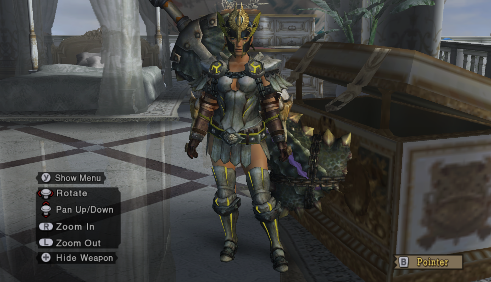
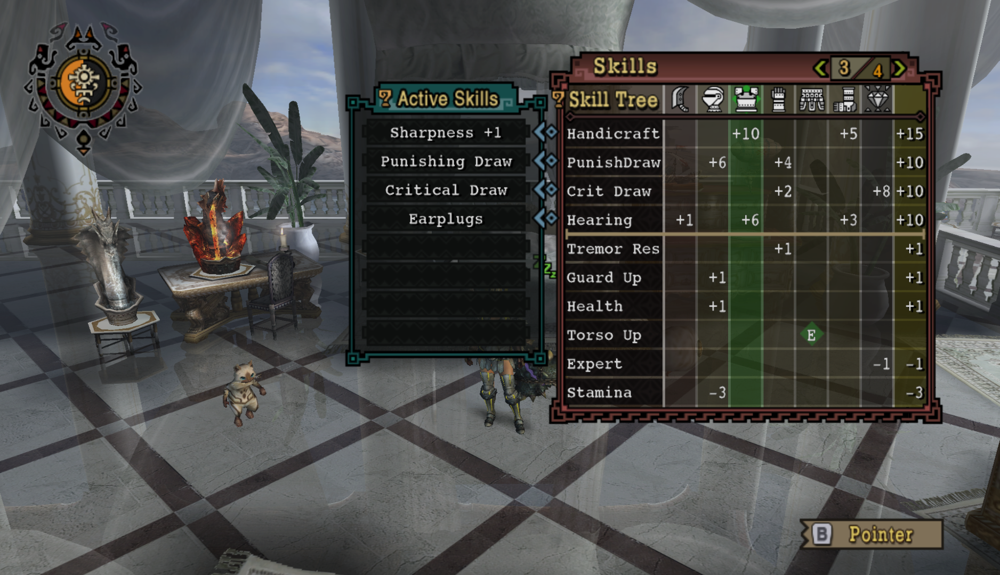

Active Skills:  Sharpness +1, Critical Draw, Punishing Draw, Earplugs

 Anguish (P) | O (Hearing 1)  
 Damascus Helm | OOO (PunishDraw 4)  
 Selene Mail+  
 Diablos Vambraces+ | OOO (PunishDraw 4)  
 Vangis Coil  
 Selene Greaves  
Talisman: Crit Draw +7 O or better

Total:  Handicraft +15, Crit Draw +10, PunishDraw +10, Hearing +10

If you're into that sort of thing.

---

## Pierce Gunning

### Deviating Uragaan Smasher

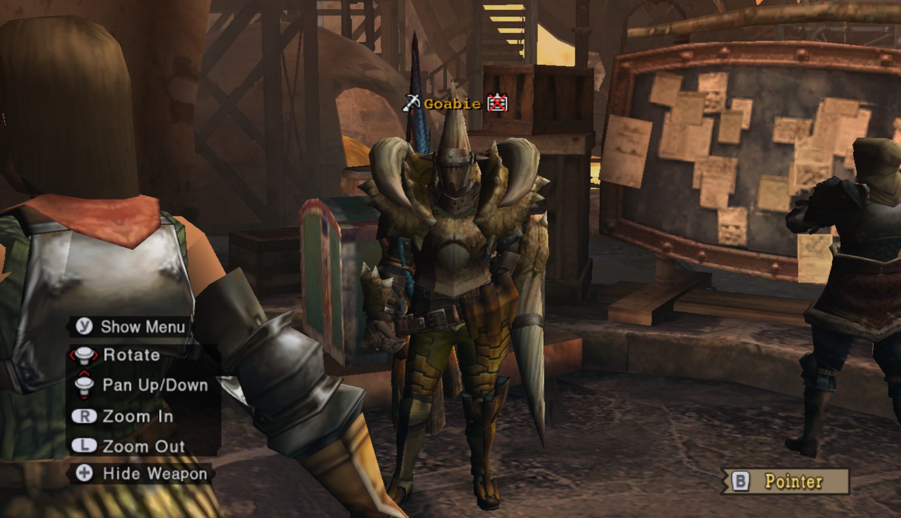
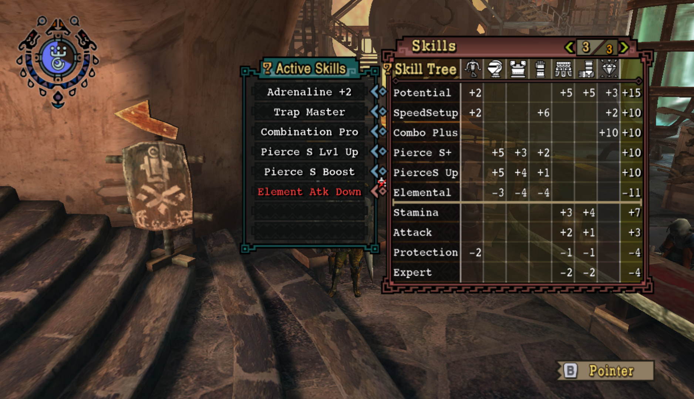

Active Skills:  Pierce Boost, Pierce S Lvl 1 Up, Critical Eye +X, Element Atk Down  
Available Slots:  O x1, OO x2, OOO x2; (Talisman)

 Thundacrus Rex |   Barrozooka O |  Thundacrus OO  
 Diablos Cap+  
 Diablos Vest+  
 Diablos Guards+ | OOO  
 Alloy Coat+ | OO  
 Gobul Leggings+ | OOO

Total: PierceS Up +10, Pierce S+ +10, Expert +4  

This gun loads 10 pierce1 rounds and fires at 0.6 range with high L deviation. The build above is prepared to gem in Critical Eye, the superior damage option for pierce shots. Otherwise, you can slot it however you like and use whatever talisman you want. If you want evasion, use Barioth Coat+ (OOO), Barioth Leggings, and an evasion talisman. Or if you're playing with Adrenaline, go with the Barroth+ like I did in the screenshot until we can get Black Leather Pants.

If you don't have/can't get a Stout Horn for the chest piece, the low rank Diablos Vest is only one point worse than the high rank one.

I've named this gun the Uragaan smasher because it obliterates the poor guy. In the Advanced quest Heroes Wanted, 60 Adrenaline Pierce S Lv1 shots and probably some bombs will put one of them low enough to capture!

---

### Straight Shooters

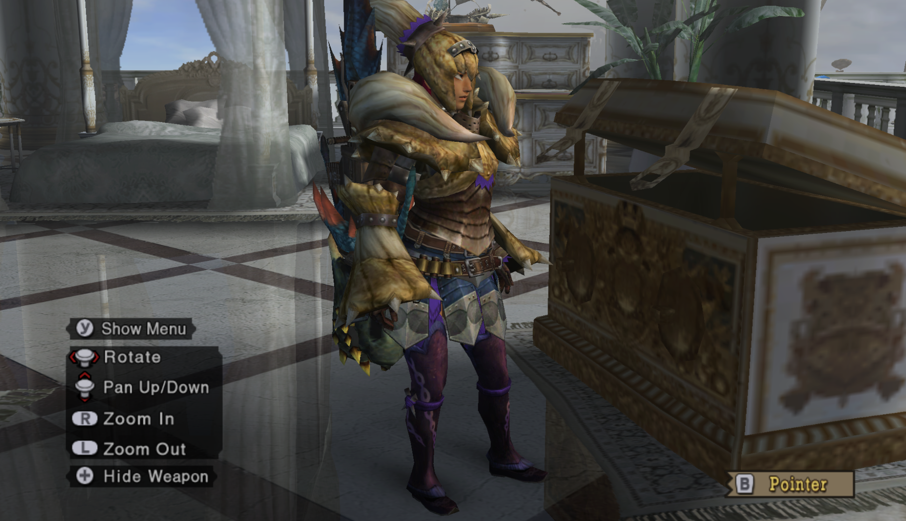
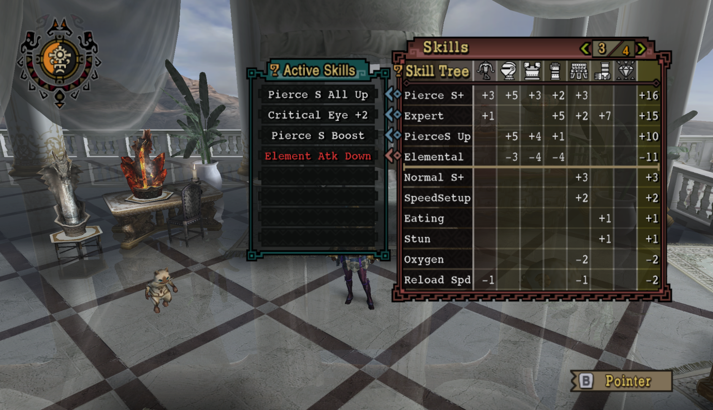

Active Skills:  Pierce S Boost, Pierce S All Up, Critical Eye 2, Element Atk Down  

 Thundacrus Rex |  Devil's Grin O (Expert 1) |  Thundacrus Rex OO (PierceS+ 3)  
 Diablos Cap+  
 Diablos Vest+  
 Diablos Guards+ | OOO (Expert 5)  
 Alloy Coat+ | OO (Pierce S+ 3)  
 Gobul Leggings+ | OOO (Expert 5)  

Total: PierceS Up +10, Pierce S+ +16, Expert +15

This gun loads 8 Pierce S Lv2 rounds and fires at 0.8 range with no deviation. Use whatever talisman you want. Like above, if you want evasion, swap the bottom pieces and/or use an appropriate talisman.

Also like above, substitue low rank chest if you need to.

This gun wants to fire straight through the longest part of the body. Fire straight into Deviljho or Agnaktor's face and thru the body, for example.

---

### World Eater Gun

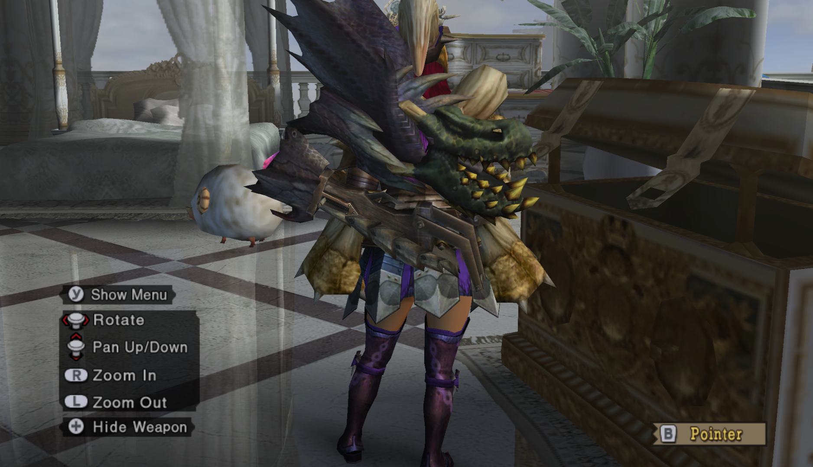

The same as above, but change the gun parts to  
 Chaos Wing |  Devil's Grin O |  Blizzard Cannon

Note that this gun has a folding frame so it is very immobile. It is used in World Eater speedruns, but can also be used freestyle in that fight. Its range is 0.96 so you can fire a little more comfortably vs the big guy, but whether or not it's better than just firing regular old 0.8 range bullets with a medium bowgun probably depends on the player.

For all of the above pierce gunning sets, the waist and leggings are up to you! For evasion, use Barioth+ Coat and Barioth- Leggings. For adrenaline, use Barroth+ Coat and Barroth+ Leggings, or when Black Leather Pants is in the game, use that.

---

## Normal and Elemental Gunning

### Normal Meme

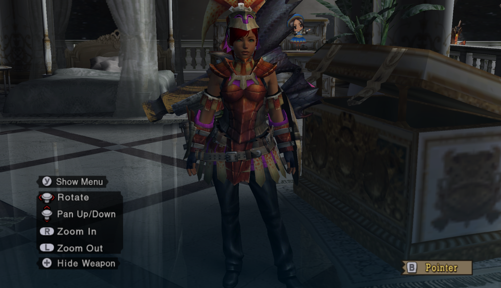
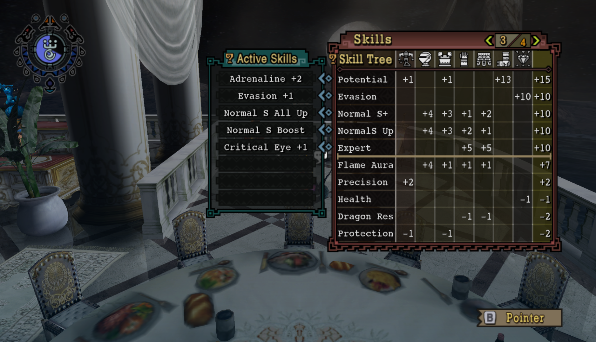
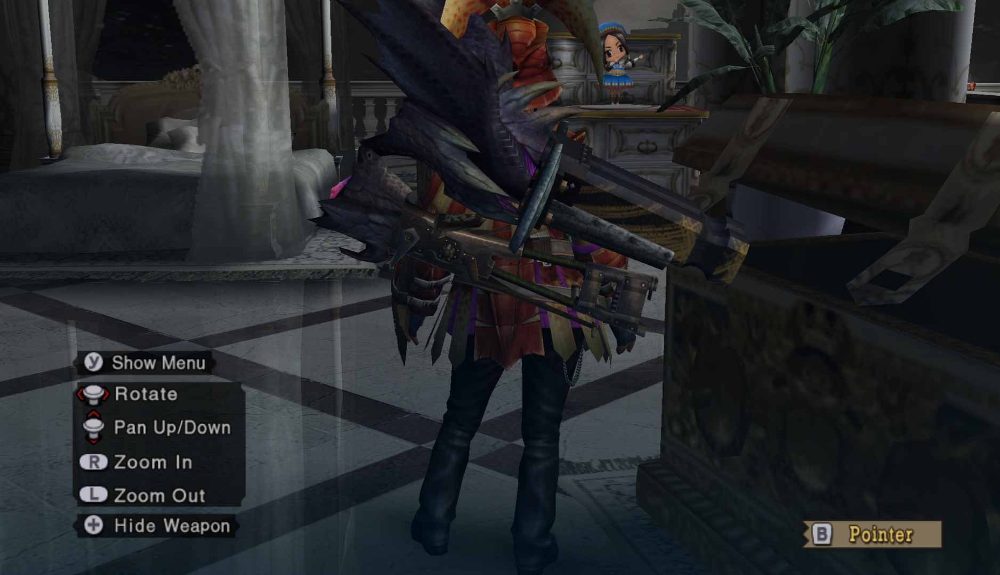

Active Skills:  Normal S Boost, Normal S All Up  
  
Available Slots:  O x3, OOO x2; (Legs); (Talisman)

 Chaos Wing |  Jhen Cannon O |  Aquamatic "Needler" O; or Vulcannon  
 Agnaktor Cap+  
 Agnaktor Vest+ | O  
 Agnaktor Guards+ | OOO  
 Agnaktor Coat+ | OOO  
 None  

Total: Normal S Up +10, Normal S+ +10

Look, no pants!

Sorry, Normal shot is sort of a meme. It's kind of good vs Qurupeco.

---

### Elemental Rapid Fire Bonus Shot

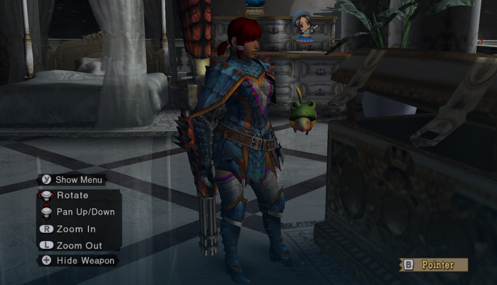
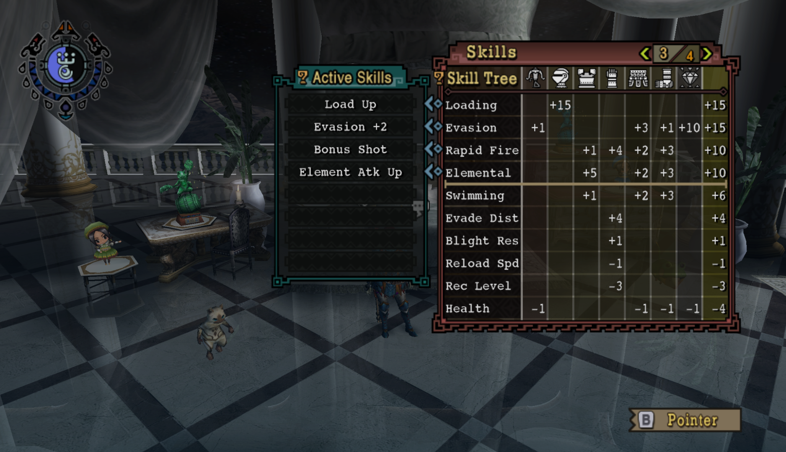

Active Skills:  Element Atk Up, Bonus Shot  
  
Available Slots:  O x2, OO x2; (Head); (Talisman)

 Rathling Gun+ |  Rathling Gun+ O |  Rathling Gun+ OO  
 None  
 Lagiacrus Vest+ | OOO (Element 4)  
 Escadora Arma | O (Rapid Fire 1)  
 Lagiacrus Coat+ | OO  
 Lagiacrus Leggings+ | O  

Total: Rapid Fire +10, Elemental +10

For the head piece, you could wear Barrage Earring (meh), or any earring of your choice, or Barroth Helm+/Cap+ and a potential talisman. Or whatever you want!

---

### Ghost Rider Rapid Fire Bonus Shot

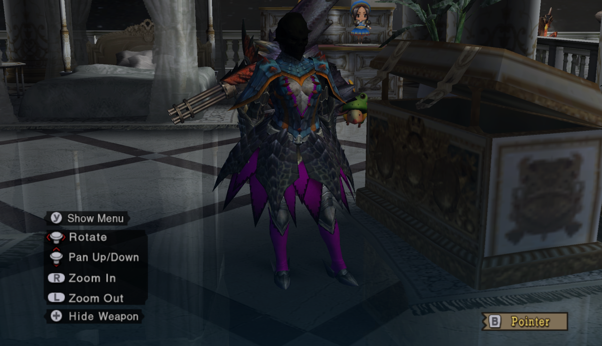
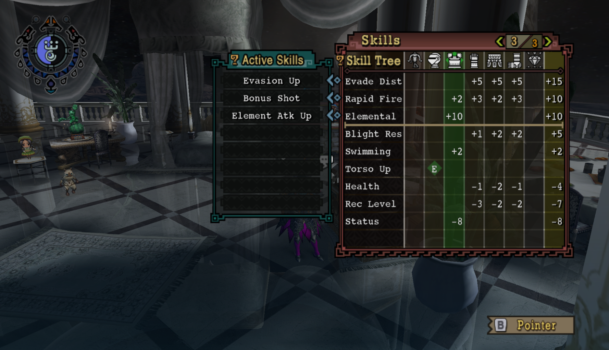
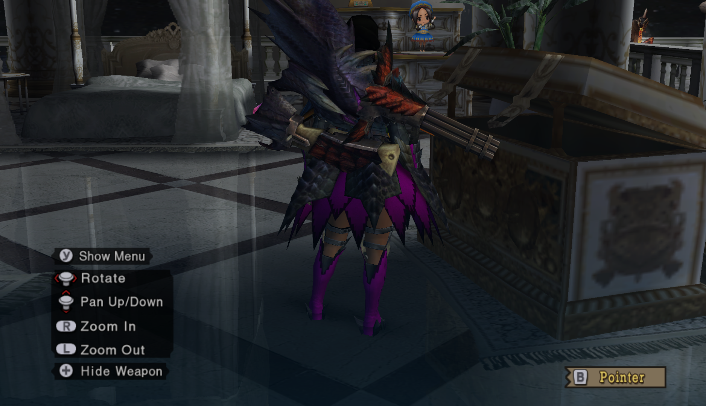

Active Skills:  Element Atk Up, Bonus Shot, Evasion Up  
  
Available Slots:  O x1, OO x1; (Talisman)

 Chaos Wing |  Rathling Gun+ O |  Rathling Gun+ OO  
 Skull Mask  
 Lagiacrus Vest+ | OOO (Element 4)  
 Escadora Arma | O (Evade Dist 1)  
 Escadora Force | OO (Evade Dist 1, Evade Dist 1)  
 Escadora Scala | O (Evade Dist 1)  

Total: Elemental +10, Evade Dist +15, Rapid Fire +10

We get more raw on the gun, and Evasion Up is there to make up for the lack of mobility with the HBG. It's actually pretty fun.

The listed guns are for rapid firing fire shots. I find the other elemental shots bad/useless, but you can just switch the barrel and stock to find ones that load the ammo type you want.

---

### Deep Fried Alatreon

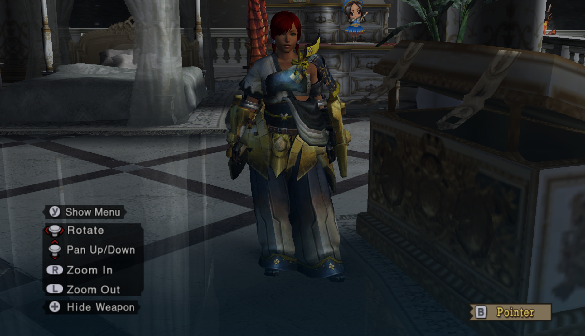
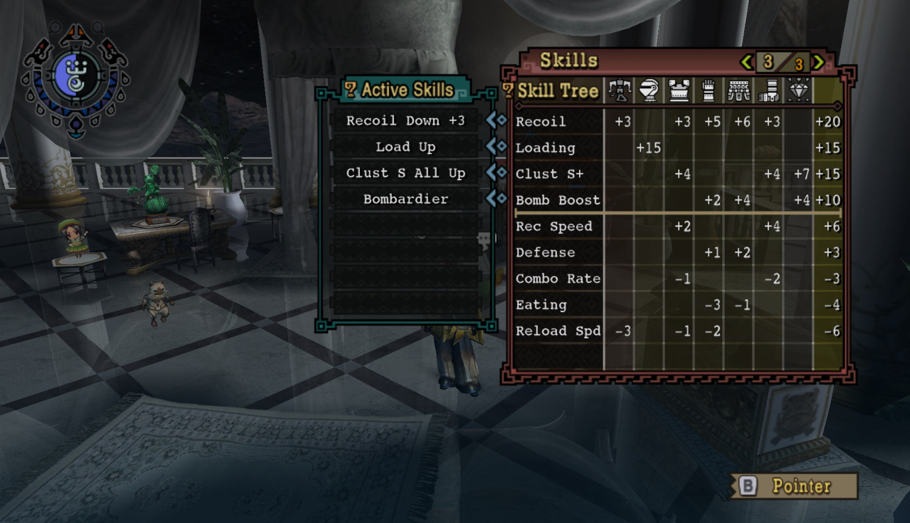
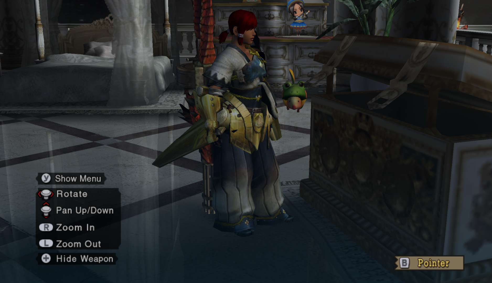

Active Skills:  Load Up, Recoil Down 3, Clust S All Up

 Rathling Gun+ |   Rathling Gun+ O (Clust S+ 1) |  Agnablaster OO (Recoil 1, Recoil 1)  
 Barrage Earring  
 Amagi/Mutsu Muneate+ | O (Recoil 1)  
 Uragaan Guards+ | OOO (Recoil 4)  
 Uragaan Coat+ | O (Recoil 1)  
 Amagi/Mutsu Hakama+  
Talisman: Clust S +6 or better  

Total: Loading +15, Clust S+ +15, Recoil +20

Alatreon abuse gun, loading 5 Clust S Lv2 and firing with no recoil. If you have Clust god (Clust S+ +7 OO), you can gem in bombardier too.

Honestly, there's probably a cheaper way to make this without requiring a Clust S +6 talisman. The key takeaway is, this is the gun you *must* use, and the armor skills you are aiming for are Clust S All Up and Recoil Down 3. If you do not have Barrage Earring, that is fine; just load 4 Clust S Lv 2 shot instead of 5.

Look at the Uragaan+ and Jhen+ pieces, check your talismans, and try it out.

---

### Status Gunning
Use  Thundacrus Rex |  Light Bowgun/Jhen Cannon (O) |  Chaos Wing. Get Recoil Down +2, Trapmaster, and Bombardier. The rest is irrelevant. You don't need Load Up.  You don't need Status Atk Up.

Full Uragaan+ meets these requirements.

Active Skills:  Defense Up (S), Recoil Down +2, Bombardier, Slow Eater

Available Slots:  O x3(/4), OOO x2; (Talisman)

---

## Status Melee Sets

Note: These are very, very flexible. Mine are just some simple examples.

In my opinion, if you run paralyze, then trapmaster is mandatory.  
If you run sleep, bombardier is mandatory.

### Blast Earring, anyone?

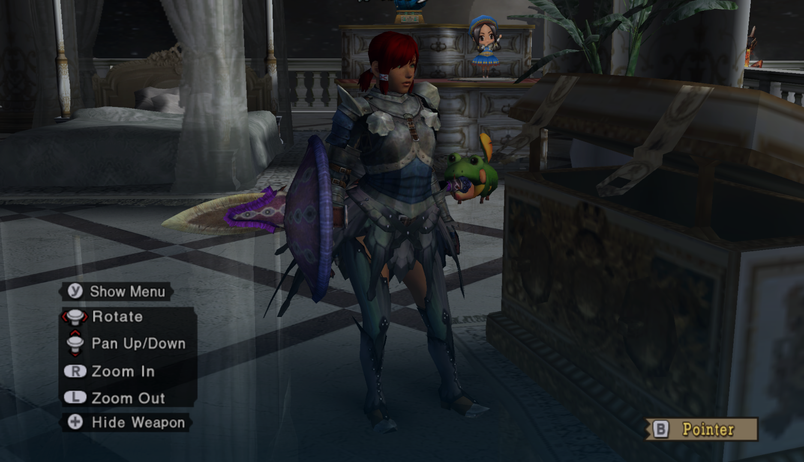
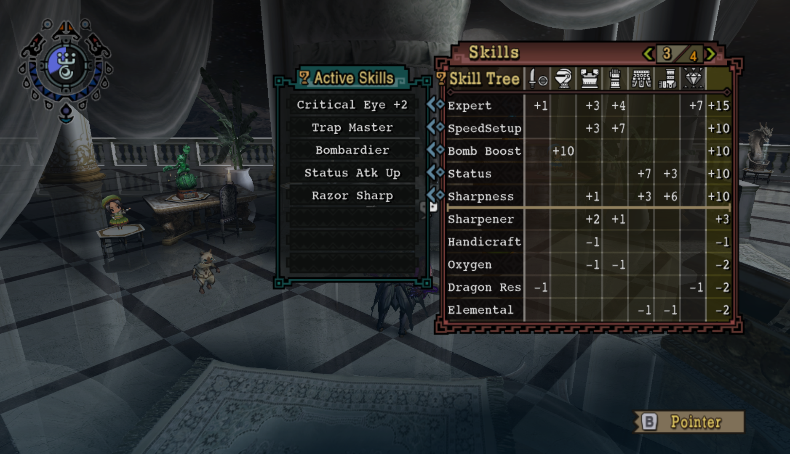

Active Skills:  Status Atk Up, Trapmaster, Razor Sharp  
  
Available Slots:  (Head); (Weapon); (Talisman)

 None  
 Alloy Mail+ | OO (SpeedSetup 2, Sharpness 1)  
 Alloy Vambraces+ | OO (SpeedSetup 2, SpeedSetup 2)  
 Bnahabra Faulds+ | O (Status 1)  
 Bnahabra Greaves+ | O (Status 1)  

Total: Sharpness +10, Status +10, SpeedSetup +10

Plenty of room to add other skills of your choice.

---

### Blast Earring, anyone? Lance Remix

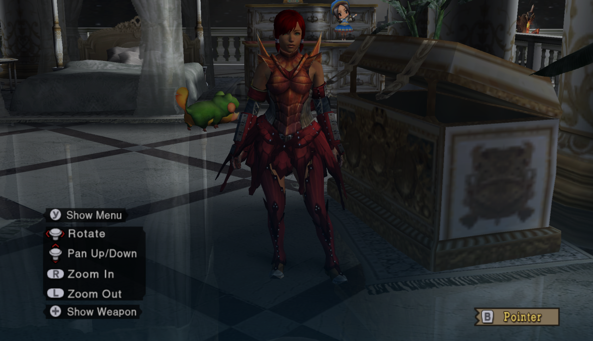
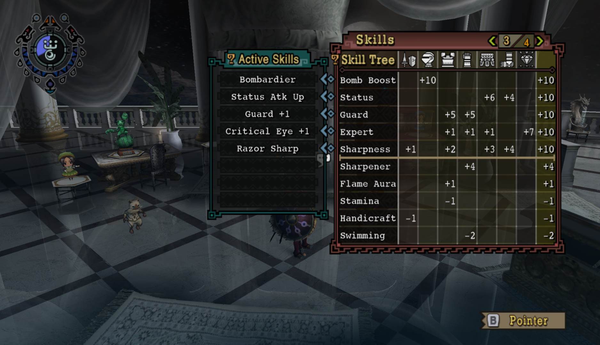

Active Skills:  Status Atk Up, Razor Sharp, Guard +1  
  
Available Slots:  O x3; (Head); (Weapon); (Talisman)

 None  
 Agnaktor Mail+ | O  
 Steel Vambraces+ | O  
 Bnahabra Faulds+ | O  
 Bnahabra Boots  

Total: Sharpness +9, Status +10, Guard +10

For people who like guard lancing. Note the Bnah boots are low rank!

---

### Who Needs Blast Earring?

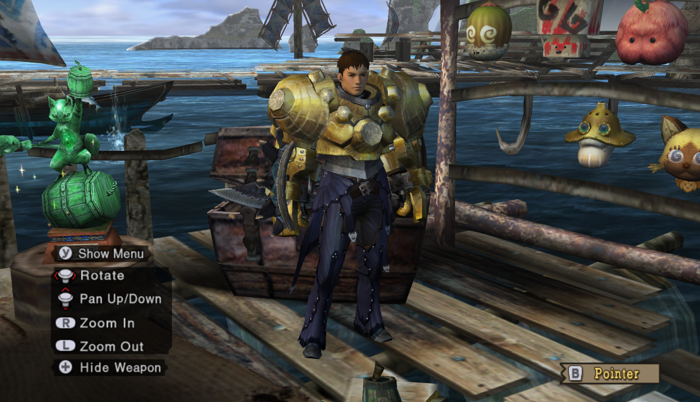
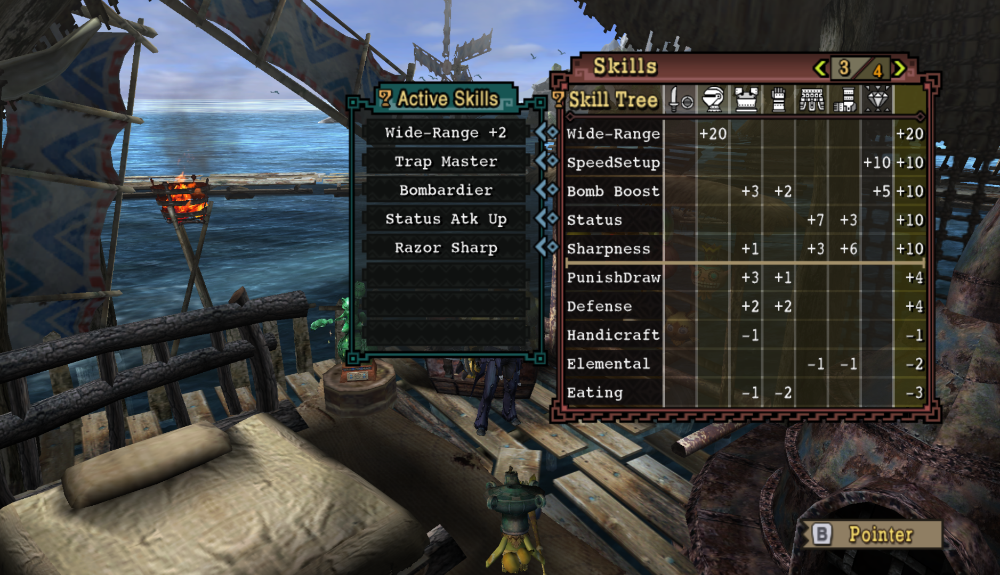

Active Skills:  Status Atk Up, Razor Sharp, Bombardier 
  
Available Slots:  OO x1, OOO x1; (Talisman)

 Morpheus Knife | OO  
 Uragaan Helm+ | O (Bombardier 2)  
 Uragaan Mail+ | O (Sharpness 1)  
 Uragaan Vambraces+ | OOO  
 Bnahabra Faulds+ | O (Status 1)  
 Bnahabra Greaves+ | O (Status 1)  

Total:  Bombardier +8, Status +10, Sharpness +10

There are still five slots left in the armor, and I haven't even included a talisman here. Put in the bomb boost gem to make sure you reach Bombardier.

If you have Bomb Boost +5 SpeedSetup +10 tali, you can even leave off the Uragaan Helm+.

---

### Low Rank Lagi

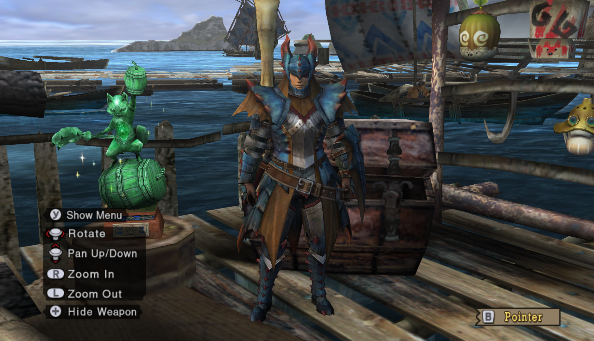
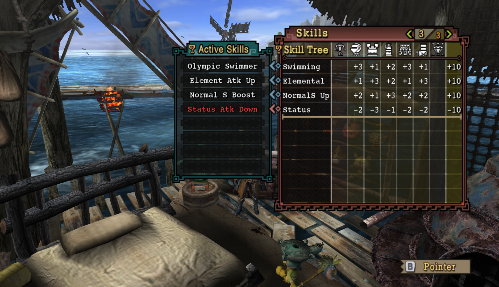

Active Skills:  Normal S Boost, Element Atk Up, Olympic Swimmer, Status Atk Down  
  
Available Slots:  O x1, OO x4; (Weapon); (Talisman)

 Lagiacrus Cap | OO  
 Lagiacrus Vest | O  
 Lagiacrus Guards | OO  
 Lagiacrus Coat | OO  
 Lagiacrus Leggings | OO  

Low Rank elemental gunning goodness. Lagiacrus is so flexible.

---

