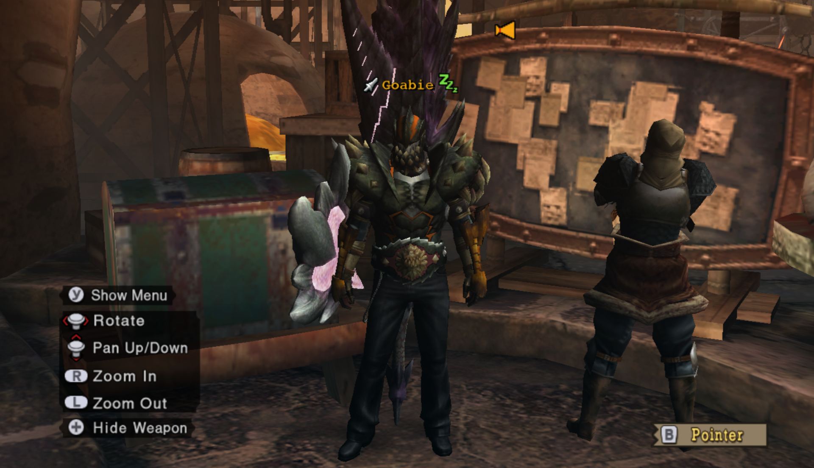

# The Armory

Welcome to my armory! This is a compilation of useful endgame loadouts that I either discovered or was given. If you're looking for a functional set, look no further!

My goal for all of these sets is to *not* dictate what talismans you must use, whenever possible. Greatsword users, beware. You're gonna need a tali.

Not endgame HR yet but still looking for some armor? Try [progression](progression.md).

## Contents

- [General Melee Sets](#general-melee-sets)
- [Great Sword Sets](#great-sword-sets)
- [Pierce Gunning](#pierce-gunning)
- [Normal, Elemental, and Clust Gunning](#normal-and-elemental-gunning)
- [Status Gunning](#status-gunning)
- [Status Melee Sets](#status-melee-sets)
- [Barroth Adrenaline](#barroth-adrenaline)
- [Black Leather Pants Adrenaline](#black-leather-pants-adrenaline)

## General Melee Sets

 

 Endgame Standard Earplugs 

### Endgame Standard Earplugs  

Active Skills:  Sharpness +1, Earplugs  
  
Available Slots:  OOO x2; (Talisman); (Weapon)  
  
 Selene/Helios Helm+ | OOO  
 Selene/Helios Mail+  
 Vangis Vambraces  
 Selene/Helios Coil+ | OOO  
 Selene/Helios Greaves+  

Total:  Handicraft +15, Hearing +10, Attack +5  

It seems natural to get to at least AuS, but the customization is entirely up to you. A common favorite loadout of mine is Sharpness +1, Earplugs, AuS, Trapmaster, Sharpener. That would require a SpeedSetup +10 OO or comparable talisman.

---

 

 Endgame Standard Earplugs 2 

### Endgame Standard Earplugs 2

Active Skills:  Sharpness +1, Earplugs  
  
Available Slots:  OOO x2; (Talisman); (Weapon)

 Selene/Helios Helm+ | OOO  
 Selene/Helios Mail+  
 Vangis Vambraces  
 Selene/Helios Coil  
 Vangis Greaves | OOO  

Total:  Handicraft +14, Hearing +10, Attack +6  

Another way to achieve the same loadout as above. The Attack +6 goes really well with a Queen talisman that has C+10 Atk+3 O.

 

---

 Endgame High Grade Earplugs 

### Endgame High Grade Earplugs

Active Skills:  (Sharpness +1), High Grade Earplugs  
  
Available Slots:  OOO x2; (Talisman); (Weapon)

 Selene/Helios Helm+ | OOO  
 Selene/Helios Mail+  
 Selene/Helios Vambraces+  
 Selene/Helios Coil  
 Vangis Greaves | OOO  

Total:  Handicraft +14, Hearing +15, Attack +1  

This is *the* high grade earplugs loadout. Put the handicraft deco in the weapon slot if you can.

If you want a headless one though...

---

 Endgame Headless High Grade Earplugs 

### Endgame Headless High Grade Earplugs

Active Skills:  Sharpness +1, High Grade Earplugs  
  
Available Slots:  (Helm); (Talisman); (Weapon)

 None  
 Selene/Helios Mail+  
 Selene/Helios Vambraces+  
 Selene/Helios Coil  
 Selene/Helios Greaves(+) 

Total:  Handicraft +15/+16, Hearing +17/+16  

You can swap the HR greaves for the LR greaves if you want.  

Truth is, there's a lot of ways to make less optimal versions of Sharpness+1 and some variety of earplugs. When I first reach HR51, these are the first sets I make by mixing whatever Vangis and Helios I have, and I improvise until I can refine them into Endgame Standard or Endgame HGE.

Note that this setup is actually great if you want to Greatsword and have a dual tremor res crit draw O tali. Put on Diablos Helm+ and rock S+1, HGE, Critical Draw, and Tremor-Proof!

 

---

 Endgame Standard No Earplugs 

### Endgame Standard No Earplugs

Active Skills:  Sharpness +1, Attack Up (M), Autotracker, Raise Hunger  
  
Available Slots:  OOO x1; (Talisman); (Weapon)

 Vangis Helm  
 Vangis Mail  
 Vangis Vambraces  
 Vangis Coil  
 Vangis Greaves | OOO  

Total:  Handicraft +15, Psychic +15, Attack +15  

Yes, this is just full Deviljho. Not many slots to work with. However, if you're willing to lose some Attack, you can get...

---

 Evade Lance 

### Endgame Standard No Earplugs Flexible | Evade Lance

Active Skills: (Sharpness +1), Attack Up S, Detect  
  
Available Slots: OOO x2; (Talisman); (Weapon)  
  
 Vangis Helm  
 Vangis Mail  
 Vangis Vambraces  
 Selene/Helios Coil+ | OOO  
 Vangis Greaves | OOO  

Total:  Handicraft +14, Psychic +12, Attack +12  

In my opinion, losing one level of attack is worth being able to gem in other stuff, like both sharpener and trapmaster just as an example. Also useful is guard, evasion, dung bomb expert, or whatever.  

If you're looking for an evade lancer set, this is it!

---

 Elemental Focus 

### Elemental Enjoyers (2 slotted weapon)

Active Skills:  Sharpness +1, (Element Atk Up), (Attack Up (X))    
  
Available Slots: (Talisman); (Weapon)

 Vangis Helm  
 Lagiacrus Mail+ | OOO (Element 4)  
 Vangis Vambraces  
 Selene/Helios Coil+ | OOO (Handicraft 4)  
 Vangis Greaves | OOO (Element 4)  

Total:  Handicraft +15, Element +9, Attack +9  

I'd rather use a standard sharpness mix, but that's me. With a 2 slot weapon and attack god talisman (Attack +7 OO), you can get AuL. Don't forget to finish off the Element +9 and Attack +9 by adding the corresponding decos either in your weapon or your talisman.

This is kind of nice with the two slot high element weapons, like Barbrian Sharq, Abyssal Striker, Sabertooth (G), etc.

---

 Elemental Focus 2 

### Elemental Enjoyers (no slots)

Active Skills:  Sharpness +1, (Element Atk Up), (Attack Up (X))    
  
Available Slots: (Talisman);

 Vangis Helm  
 Selene/Helios Mail+  
 Vangis Vambraces  
 Selene/Helios Coil+ | OOO (Element 4)  
 Vangis Greaves | OOO (Element 4)  

Talisman: OO or better

Total:  Handicraft +16, Element +8, Attack +10  

Attack +5/6 OO goes well with this set. Note that I don't particularly like either of these elemental sets.

---

 Guard Lance 

### Steel Guard Lancing

Active Skills:  Sharpness +1, Guard +1, Speed Sharpen

 1-Slot Weapon | O (Handicraft 1)  
 Vangis Helm  
 Vangis Mail  
 Steel Vambraces+ | O (Sharpener 2)  
 Steel Coil+ | O (Guard 1)  
 Vangis Greaves | OOO (Handicraft 4)  
Talisman: Any with (O) or better (Handicraft 1)

Total:  Handicraft +15, Guard +10, Sharpener +10, Attack +7

This is what I have for Guard Lancing that doesn't require a Guard skill in the talisman. You need one more Handicraft point in the tali. Funny enough, C+10 Atk+3 O fits extremely well into this set once more to tack on another C skill as well as AuS, but that is not at all mandatory. 

---

 My Weapon Hates Handicraft 

### Alloy+ is Bae

Active Skills:  Critical Eye +2, Trapmaster, Sharpener  
  
Available Slots:  OO x4; (Talisman); (Weapon)

 Alloy Helm+ | OO  
 Alloy Mail+ | OO  
 Alloy Vambraces+ | OO  
 Alloy Coil+ | OO  
 Alloy Greaves+  

Total:  Expert +15, Sharpener +10, SpeedSetup +10  

Useful for weapons that don't benefit much from Sharpness +1, such as Flame Tempest and Reaver "Calamity".  
Since Alloy+ already has the best C skills in the game, I just shove Attack 3 gems into everything, but obviously it's up to you.  

Notably, this is available as soon as you unlock HR31! It's a very good progression set.

---

 Elemental Awakening (is mostly dumb) 

### Elemental Awakening

Active Skills:  Awaken, Olympic Swimmer, Element Atk Up, Status Atk Down
  
Available Slots:  O x4; OOO x1; OO x2; (Talisman); (Weapon)

 Lagiacrus Helm+ | O  
 Lagiacrus Mail+ | OOO  
 Lagiacrus Vambraces+ | O  
 Lagiacrus Faulds+ | OO  
 Lagiacrus Greaves+ | O  

Total: FreeElemnt +15, Swimming +10, Elemental +10, Status -12

For elemental awakening. There are a select few weapons where this is worthwhile, which makes it kinda cool. A *lot* of room for decorations; I think Speed Sharpening is mandatory.

A list of worthwhile weapons (Note: never Greatsword or Hammer!)  
 Odyssey (Arena SnS) | 350   
 Doom Crown | 280   
 Diablos Spear | 250   
 Elder Babel Spr (R) | 300   
 Tenebra D | 560   
 Sinister Saints | 500   

If you want status awakening, look below.

---

 Status Awakening (is REALLY dumb) 

### Status Awakening

Active Skills:  Awaken, Sharpness +1, Earplugs

 Iron Devil | OOO (FreeElemnt 4)  
 Helios Helm+ | OOO  (Handicraft 4)  
 Helios Mail+  
 Lagiacrus Vambraces+ | O (FreeElement1)   
 Helios Coil  
 Escadora Scale  

Total: Handicraft +15, Hearing +10, FreeElemnt +15

I think the only weapon this set is worth it on is Iron Devil.

---

## Great Sword Sets

Okay, these require Crit Draw talismans. I warned you!

 Endgame GS Standard 

### Endgame GS Standard

Active Skills:  Sharpness +1, Focus, Critical Draw, Earplugs

 Anguish (P) | O (Handicraft 1)  
 Baggi Helm+ | OOO (FastCharge 4)  
 Selene/Helios Mail+  
 Diablos Vambraces+ | OOO (FastCharge 4)  
 Vangis Coil  
 Selene Greaves+  
Talisman:  Crit Draw +7 O or better

Total:  Handicraft +15, Crit Draw +10, FastCharge +10, Hearing +10

If your Critical Draw talisman is only 7, you could use the very expensive and inferior Alatreon Revolution. If you don't have THAT, then you can use low rank Selene Greaves and not run earplugs.

If you have Crit Draw +6 OO, you can do the following for higher defense...

---

 Endgame GS Standard Redux

### Endgame GS Standard Redux

Active Skills:  Sharpness +1, Earplugs, Critical Draw, Focus

 Anguish (P) | O (Crit Draw 1)  
 Selene/Helios Helm+ | OOO (FastCharge 4)  
 Selene/Helios Mail+  
 Hinata/Yamato Kote+ | OOO (FastCharge 4)  
 Selene/Helios Coil  
 Vangis Greaves | OOO (Handicraft 4)  
Talisman:  Crit Draw +6 OO (Crit Draw 3)  

Total:  Handicraft +15, Crit Draw +10, FastCharge +10, Hearing +10

Style! Note that this costs a Stout Horn for your decoration.

---

 Endgame GS Standard Redux 2

### Endgame GS Standard Redux #2

A new version of the above with higher armor and a lesser talisman requirement! This one only needs Crit Draw7 O once again.

Active Skills:  Sharpness +1, Earplugs, Critical Draw, Focus

 Anguish (P) | O (Crit Draw 1)  
 Selene/Helios Helm+ | OOO (FastCharge 4)  
 Selene/Helios Mail+  
 Hinata/Yamato Kote+ | OOO (FastCharge 4)  
 Selene/Helios Coil+ | OOO  (Critical Draw 3, Handicraft 1)  
 Helios Greaves  
Talisman:  Crit Draw +7 O (Handicraft 1)  

Total:  Handicraft +15, Crit Draw +10, FastCharge +10, Hearing +10

This still costs a stout horn, but with a much more common talisman.

---

 Endgame GS Standard No Earplugs

### Endgame GS Standard No Earplugs

Active Skills:  Sharpness+1, Critical Draw, Focus, C+10

 Anguish (P) | O (Handicraft 1)  
 Baggi Helm+ | OOO (FastCharge 4)  
 Selene/Helios Mail+  
 Diablos Vambraces+ | OOO (FastCharge 4)  
 Selene/Helios Coil+ | OOO (Handicraft 4)  
 Vangis Greaves | OOO (Crit Draw 3, Handicraft 1)  
Talisman: Crit Draw +5/+6, C+10

Total: Handicraft +15, Crit Draw +10, FastCharge +10, C+10

For when earplugs don't help. I've seen Item Use Up and Capture Guru as the most useful C skills on the talisman.

If your talisman is Crit Draw 6, then you don't have to blow a stout horn for the decoration. Just use two Crit Draw 1 decorations instead.

---

 Pickle Eater 

### Pickle Eater

Active Skills:  Sharpness +1, Critical Draw, High Grade Earplugs, (Tremor-Proof)

See <a href="#endgame-headless-high-grade-earplugs"> here </a> and put on Diablos Helm+. Your talisman only needs to be Crit Draw 5 or better.

If you have a talisman with both Tremor Res and Crit Draw skills, you may be able to get both! This is a set for hunting Diablos and Deviljho.

---

 Bomb Breaker 

### Bomb Breaker

Active Skills: Sharpness +1, C +10, Critical Draw, Tremor-Proof, Earplugs

 Anguish (P) | O (Handicraft 1)  
 Diablos Helm+  
 Selene/Helios Mail+  
 Diablos Vambraces+ | OOO  
 Vangis Coil  
 Selene/Helios Greaves+  
Talisman: C+10 OO or see below

Total: Handicraft +15, C +10, Crit Draw +10, Tremor Res +10, Hearing +10

This set has 4 or 5 slots, depending on your talisman. If you have the perfect rolled +10 +3 O, you won't need to use a stout horn on a decoration. Otherwise, just fill in the 5 slots to complete Critical Draw and Tremor-Proof.

The perfect rolled C+10 A+3 O would be Crit Draw 3 or Tremor Res 3.  

In my opinion, Trap Master is the big C skill winner here. Big surprise.

I think Tremor-Proof buys you more openings vs Uragaan, and Focus may not be super relevant vs him anyway. I'm a terrible GS, so take this with a grain of salt. Still, the set has a lot of fine skills.

---

 Punish Draw 

### Punishing Meme

Active Skills:  Sharpness +1, Critical Draw, Punishing Draw, Earplugs

 Anguish (P) | O (Hearing 1)  
 Damascus Helm | OOO (PunishDraw 4)  
 Selene Mail+  
 Diablos Vambraces+ | OOO (PunishDraw 4)  
 Vangis Coil  
 Selene Greaves  
Talisman: Crit Draw +7 O or better

Total:  Handicraft +15, Crit Draw +10, PunishDraw +10, Hearing +10

If you're into that sort of thing.

---

## Pierce Gunning

For all of the below pierce gunning sets, the waist and leggings are up to you! For evasion, use Barioth+ Coat and Barioth- Leggings. For adrenaline, use Barroth+ Coat and Barroth+ Leggings, or when Black Leather Pants is in the game, use that.

 Close Range High Deviation 

### Deviating Uragaan Smasher

Active Skills:  Pierce Boost, Pierce S Lvl 1 Up, Critical Eye +X, Element Atk Down  
Available Slots:  O x1, OO x2, OOO x2; (Talisman)

 Thundacrus Rex |   Barrozooka O |  Thundacrus OO  
 Diablos Cap+  
 Diablos Vest+  
 Diablos Guards+ | OOO  
 Alloy Coat+ | OO  
 Gobul Leggings+ | OOO

Total: PierceS Up +10, Pierce S+ +10, Expert +4  

This gun loads 10 pierce1 rounds and fires at 0.6 range with high L deviation. The build above is prepared to gem in Critical Eye, the superior damage option for pierce shots. Otherwise, you can slot it however you like and use whatever talisman you want. If you want evasion, use Barioth Coat+ (OOO), Barioth Leggings, and an evasion talisman. Or if you're playing with Adrenaline, go with the Barroth+ like I did in the screenshot until we can get Black Leather Pants.

If you don't have/can't get a Stout Horn for the chest piece, the low rank Diablos Vest is only one point worse than the high rank one.

One way deviation is not an issue, since the trajectory of the bullet is completely predictable. It allows you to use Felyne Temper for free without suffering misfired shots.

I've named this gun the Uragaan smasher because it obliterates the poor guy. In the Advanced quest Heroes Wanted, 60 Adrenaline Pierce S Lv1 shots and 2 Large Barrel Bomb+ will put one of them low enough to capture!

---

 Medium Range Straight Shootin' 

### Straight Shooters

Active Skills:  Pierce S Boost, Pierce S All Up, Critical Eye 2, Element Atk Down  

 Thundacrus Rex |  Devil's Grin O (Expert 1) |  Thundacrus Rex OO (PierceS+ 3)  
 Diablos Cap+  
 Diablos Vest+  
 Diablos Guards+ | OOO (Expert 5)  
 Alloy Coat+ | OO (Pierce S+ 3)  
 Gobul Leggings+ | OOO (Expert 5)  

Total: PierceS Up +10, Pierce S+ +16, Expert +15

This gun loads 8 Pierce S Lv2 rounds and fires at 0.8 range with no deviation. Use whatever talisman you want. Like above, if you want evasion, swap the bottom pieces and/or use an appropriate talisman.

Also like above, substitute low rank chest if you need to.

This gun wants to fire straight through the longest part of the body. Fire straight into Deviljho or Agnaktor's face and thru the body, for example.

---

 Straight Shooters Alternate Gun 

### Straight Shooters (Alternate Gun)

 Rathling Gun+ |  Devil's Grin |  Diablazooka

This gun loads more Pierce 1 shots than the above, making it more comfortable to use. Ultimately, it depends if you want 2 or 3 decoration slots in the gun. If you want 3, use the Thundacrus Rex combination above. If you only need 2, I recommend this one.

---

 Long Range Straight Shooters 

### World Eater Gun

The same as above, but change the gun parts to  
 Chaos Wing |  Devil's Grin O |  Blizzard Cannon

Note that this gun has a folding frame so it is very immobile. It is used in World Eater speedruns, but can also be used freestyle in that fight. Its range is 0.96 so you can fire a little more comfortably vs the big guy, but whether or not it's better than just firing regular old 0.8 range bullets with a medium bowgun probably depends on the player.

---

## Normal and Elemental Gunning

 Normal Meme (Don't Use This. Seriously.) 

### Normal Meme

Active Skills:  Normal S Boost, Normal S All Up  
  
Available Slots:  O x3, OOO x2; (Legs); (Talisman)

 Chaos Wing |  Jhen Cannon O |  Aquamatic "Needler" O; or Vulcannon  
 Agnaktor Cap+  
 Agnaktor Vest+ | O  
 Agnaktor Guards+ | OOO  
 Agnaktor Coat+ | OOO  
 None  

Total: Normal S Up +10, Normal S+ +10

Look, no pants!

Sorry, Normal shot is just terrible. It's kind of good vs Qurupeco.

---

 Elemental DPS 

### Elemental Rapid Fire Bonus Shot

Active Skills:  Element Atk Up, Bonus Shot  
  
Available Slots:  O x2, OO x2; (Head); (Talisman)

 Rathling Gun+ |  Rathling Gun+ O |  Rathling Gun+ OO  
 None  
 Lagiacrus Vest+ | OOO (Element 4)  
 Escadora Arma | O (Rapid Fire 1)  
 Lagiacrus Coat+ | OO  
 Lagiacrus Leggings+ | O  

Total: Rapid Fire +10, Elemental +10

For the head piece, you could wear Barrage Earring (meh), or any earring of your choice, or Barroth Helm+/Cap+ and a potential talisman. Or whatever you want!

---

 Elemental HBG Evasion Up 

### Ghost Rider Rapid Fire Bonus Shot

Active Skills:  Element Atk Up, Bonus Shot, Evasion Up  
  
Available Slots:  O x1, OO x1; (Talisman)

 Chaos Wing |  Rathling Gun+ O |  Rathling Gun+ OO  
 Skull Mask  
 Lagiacrus Vest+ | OOO (Element 4)  
 Escadora Arma | O (Evade Dist 1)  
 Escadora Force | OO (Evade Dist 1, Evade Dist 1)  
 Escadora Scala | O (Evade Dist 1)  

Total: Elemental +10, Evade Dist +15, Rapid Fire +10

We get more raw on the gun, and Evasion Up is there to make up for the lack of mobility with the HBG. It's actually pretty fun.

The listed guns are for rapid firing fire shots. I find the other elemental shots bad/useless, but you can just switch the barrel and stock to find ones that load the ammo type you want.

---

 I Want to Cheese Alatreon! 

### Deep Fried Alatreon

Active Skills:  Load Up, Recoil Down 3, Clust S All Up

 Rathling Gun+ |   Rathling Gun+ O (Clust S+ 1) |  Agnablaster OO (Recoil 1, Recoil 1)  
 Barrage Earring  
 Amagi/Mutsu Muneate+ | O (Recoil 1)  
 Uragaan Guards+ | OOO (Recoil 4)  
 Uragaan Coat+ | O (Recoil 1)  
 Amagi Hakama+/Mutsu Gusoku+  
Talisman: Clust S +6 or better  

Total: Loading +15, Clust S+ +15, Recoil +20

Alatreon abuse gun, loading 5 Clust S Lv2 and firing with no recoil. If you have Clust god (Clust S+ +7 OO), you can gem in bombardier too.

Honestly, there's probably a cheaper way to make this without requiring a Clust S +6 talisman. The key takeaway is, this is the gun you *must* use, and the armor skills you are aiming for are Clust S All Up and Recoil Down 3. If you do not have Barrage Earring, that is fine; just load 4 Clust S Lv 2 shot instead of 5.

Look at the Uragaan+ and Jhen+ pieces, check your talismans, and try it out.

---

 Speedrun Gun 

## Status Gunning

Use  Thundacrus Rex |  Light Bowgun/Jhen Cannon (O) |  Chaos Wing. 

Get Recoil Down +2, Trapmaster, and Bombardier. The rest is irrelevant. You don't need Load Up (but it can be very nice.)  You don't need Status Atk Up.

Light Bowgun barrel gives more flexibility and loads more ammo types than Jhen Cannon. If you're unsure of how the fight is going to go and want a safety net, use Light Bowgun.

Full Uragaan+ meets these requirements.

Active Skills:  Defense Up (S), Recoil Down +2, Bombardier, Slow Eater

Available Slots:  O x3(/4), OOO x2; (Talisman)

---

 Ice Status Hybrid 

### Akiko's Ice Elemental Status Blend

Active Skills:  Recoil Down +2, Bonus Shot, Bombardier, Element Atk Up  

 Blizzard Cannon |   Thundacrus Rex; O (Rapid Fire 1) |   Chaos Wing

 Uragaan Cap+ | O (Elemental 1)  
 Lagiacrus Vest+  | OOO (Elemental 4)  
 Mutsu/Amagi Kote+ | OOO (Rapid Fire 4)  
 Uragaan Coat+ | O (Recoil 1)  
 Legiacrus Leggings+ | (Elemental 1)  

Bomb Boost 7 | O (Rapid Fire 1)  

For a blend of status and ice elemental shooting. Useful against Diablos and Alatreon, notably that you can still fire ice and deal damage instead of being rendered ineffective once your status ammo is exhausted!

Cool set! Thanks to Akiko for contributing.

---

## Status Melee Sets

Note: These are very, very flexible. Mine are just some simple examples.

In my opinion, if you run paralyze, then trapmaster is mandatory.  
If you run sleep, bombardier is mandatory.

 Generic Status 

### Blast Earring, anyone?

Active Skills:  Status Atk Up, Trapmaster, Razor Sharp  
  
Available Slots:  (Head); (Weapon); (Talisman)

 None  
 Alloy Mail+ | OO (SpeedSetup 2, Sharpness 1)  
 Alloy Vambraces+ | OO (SpeedSetup 2, SpeedSetup 2)  
 Bnahabra Faulds+ | O (Status 1)  
 Bnahabra Greaves+ | O (Status 1)  

Total: Sharpness +10, Status +10, SpeedSetup +10

Plenty of room to add other skills of your choice.

---

 Guard Lance Status 

### Blast Earring, anyone? Lance Remix

Active Skills:  Status Atk Up, Razor Sharp, Guard +1  
  
Available Slots:  O x3; (Head); (Weapon); (Talisman)

 None  
 Agnaktor Mail+ | O  
 Steel Vambraces+ | O  
 Bnahabra Faulds+ | O  
 Bnahabra Boots  

Total: Sharpness +9, Status +10, Guard +10

For people who like guard lancing. Note the Bnah boots are low rank!

---

 Blademaster Sleep Bomb 

### Who Needs Blast Earring?

Active Skills:  Status Atk Up, Razor Sharp, Bombardier 
  
Available Slots:  OO x1, OOO x1; (Talisman)

 Morpheus Knife | OO  
 Uragaan Helm+ | O (Bombardier 2)  
 Uragaan Mail+ | O (Sharpness 1)  
 Uragaan Vambraces+ | OOO  
 Bnahabra Faulds+ | O (Status 1)  
 Bnahabra Greaves+ | O (Status 1)  

Total:  Bombardier +8, Status +10, Sharpness +10

There are still five slots left in the armor, and I haven't even included a talisman here. Put in the bomb boost gem to make sure you reach Bombardier.

If you have Bomb Boost +5 SpeedSetup +10 tali, you can even leave off the Uragaan Helm+.

---

## Barroth Adrenaline
These are my favorite sets (for carting.) Though honestly, having to give up trapmaster and speedsharpen for adrenaline is a little sad :(

My whole purpose with these, aside from having fun and carting stupidly, is to be able to eat a hit even when I'm in adrenaline thanks to the far sturdier defense of Barroth pieces instead of Black Leather Pants.

**Beware: these require good potential talismans.**

### Adrenaline Earplugs  

Active Skills:  Sharpness +1, Earplugs, Adrenaline +2  
  
Available Slots:  OO, OOO

Weapon - O (Handicraft 1)  
 Barroth Helm+/Cap+ | OO  
 Selene/Helios Mail+  
 Barroth Vambraces+ | OOO  
 Vangis Coil  
 Selene/Helios Greaves+  
Talisman:  Potential 5 or better

Helm Total: Handicraft +15, Hearing +10, Attack +4, Potential +4  
Cap Total: Handicraft +15, Hearing +10, Attack +5, Potential +5

With potential god (potential7 OO), I use the helm. This also grants AuS. The cap gives 2 more skill points, which means you could actually give up AuS and take either speedsharpen or trapmaster in the 5 available slots, but don't underrate adrenalized defense!

If you have a good Potential +5/6 C+10 talisman, feel free to run that for the extra C skill!

---

### Adrenaline No Earplugs

Active Skills:  (Adrenaline +2), Sharpness +1, Attack Up (M)  
  
Available Slots:  OO; (Weapon); (Talisman)

 Barroth Helm+/Cap+ | OO  
 Barroth Mail+  
 Vangis Vambraces  
 Selene/Helios Coil+ | OOO (Handicraft 4)  
 Vangis Greaves | OOO (Handicraft 4)  
Talisman:  Potential 6 or better (preferably much better!)

Helm Total: Handicraft +15, Potential +4, Attack +15  
Cap Total: Handicraft +15, Potential +5, Attack +16  

Since this is non earplugs, I use this set with a lance, but of course, you can do whatever you want. Even cart to Deviljho because it's just unfair without Evasion+1 and definitely not a skill issue.

With Potential 6 OO and Sabertooth (G), this set (pictured) actually reaches AuL even with the Barroth Helm+! All the powah!

---

### Adrenaline No Handicraft

Active Skills: Adrenaline +2, Marathon Runner, Attack Up (M)

Available Slots: OO, 3x O; (Weapon); (Talisman)

 Barroth Helm+ | OO  
 Barroth Mail+  
 Barroth Vambraces | O  
 Barroth Faulds+ | O  
 Barroth Greaves+ | O  
 
Total: Potential +16, Stamina +10, Attack +16

For those non Sharpness +1 weapons (Flame Tempest, Reaver "Calamity"). If you want lower defense but one extra slot, use the HR cap and the HR arms. Otherwise, the LR arms are nice and cheap - no Wyvern Stones required.

This is pretty niche, but is extremely flexible with all those slots and talisman unused.

---

## Black Leather Pants Adrenaline

Available for farming in the event quest Rage Match (Tri Server Project, when?)

At the cost of lower defense, you can squeeze in an extra skill using Black Leather Pants instead of [Barroth Adrenaline](#barroth-adrenaline).

---

### BLP Blade Flexible

Active Skills:  Adrenaline +2, Sharpness +1  
  
Available Slots:  OOO; (Weapon); (Talisman)

 Vangis Helm  
 Helios Mail+  
 Barroth Vambraces+ | OOO  
 Selene/Helios Coil+ | OOO (Handicraft 4)  
 Black Leather Pants  

Helm Total: Handicraft +15, Potential +15  

I personally only use BLP blademaster when evade lancing Deviljho, so I will talisman and socket for evasion. Pictured is an Evasion+5 Stun+10 talisman that I had lying around. Obviously any Evasion+5 or better talisman will suffice.

You can probably make this another way by using Vangis Vambraces, freeing up the OOO slot in your waist,  and some sort of C+10 Potential+3 O talisman. Feel free to play around with it.

If you have evasion god and want to max out evade lancing, see below...

---

### BLP Blade Evasion God

Active Skills:  Adrenaline +2, Sharpness +1, Evasion +1, Attack Up (S), Detect  
  
Available Slots: None!  

Weapon - O (Handicraft 1)  
 Vangis Helm  
 Vangis Mail  
 Barroth Vambraces+ | OOO (Handicraft 4)   
 Vangis Coil  
 Black Leather Pants  
Talisman: Evasion +7 OO (Evasion 3)  

Total: Handicraft +15, Potential +15, Evasion +10, Psychic +10, Attack +10  

This is the *only* set that I use the vaunted evasion god talisman. I don't think it's that important of a talisman, really.

Have fun carting to Deviljho!

---

### BLP Pierce 2

Active Skills:  Adrenaline +2, Pierce S All Up, Pierce S Boost, (flexible)  
  
Available Slots: (Waist); (Talisman)

 Frame |  Devil's Grin O (Potential 1) |  Stock O (Pierce S+ 1)  
 Diablos Cap+  
 Diablos Vest+  
 Diablos Guards+ | OOO (Pierce S+ 2, Pierce S+ 1)  
 (flexible - see below)    
 Black Leather Pants  

Total: Potential +15, Pierce S+ +15, PierceS Up +10

For loading and firing Pierce1 and Pierce2. I use this vs Deviljho, Gobul, Agnaktor, and the Rathians. You can run either of my pierce gun combinations (Rathling+ | Devil's Grin | Diablazooka or Thundacrus Rex | Devil's Grin | Thundacrus Rex.)

You can customize the waist and talisman as you see fit. Since I use this vs Deviljho, I also run evasion. Pictured is Barioth Coat+ OOO (Potential 1, Evasion 3) and an Evasion+6 Combo Rate+10 talisman.

Another option would be Alloy Coat+ or Rathalos Coat+ if you want to try to get Critical Eye with your talisman.

