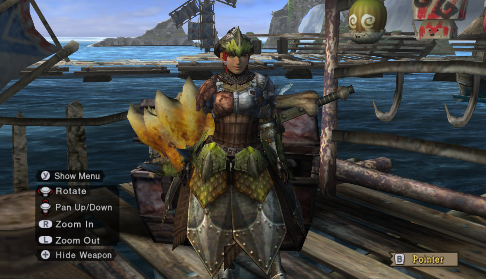
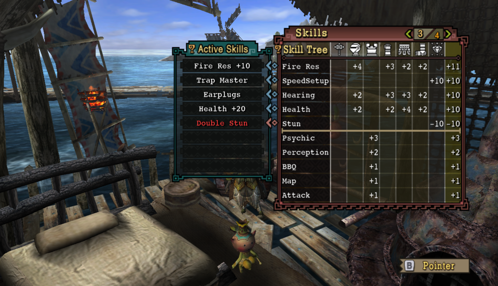
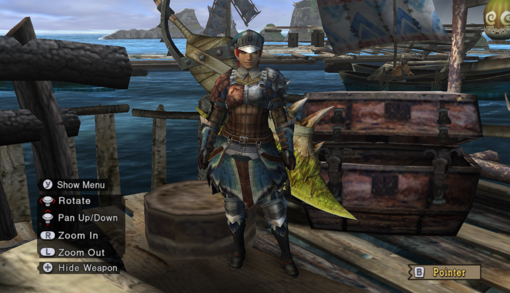
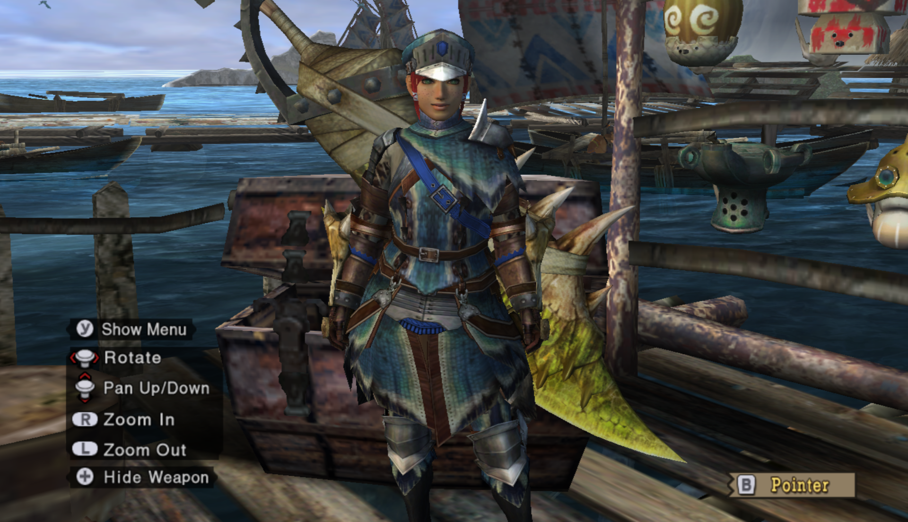
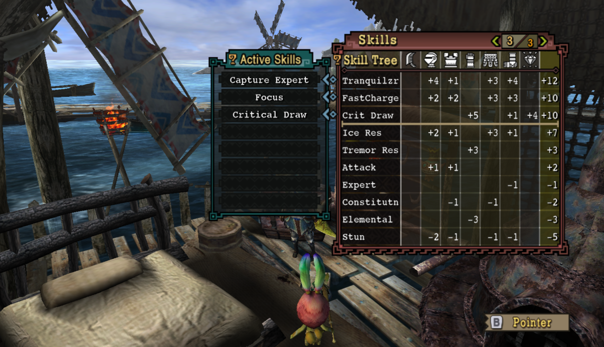
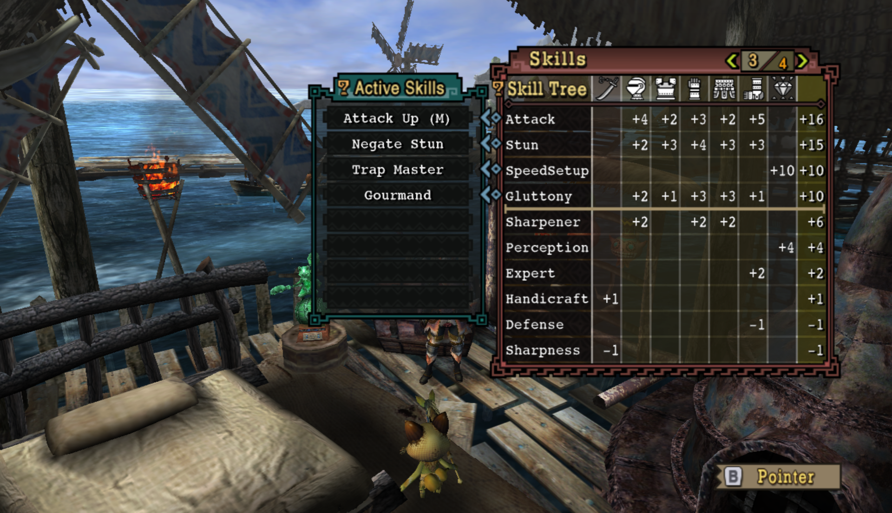
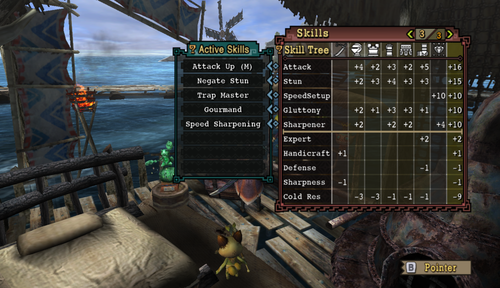
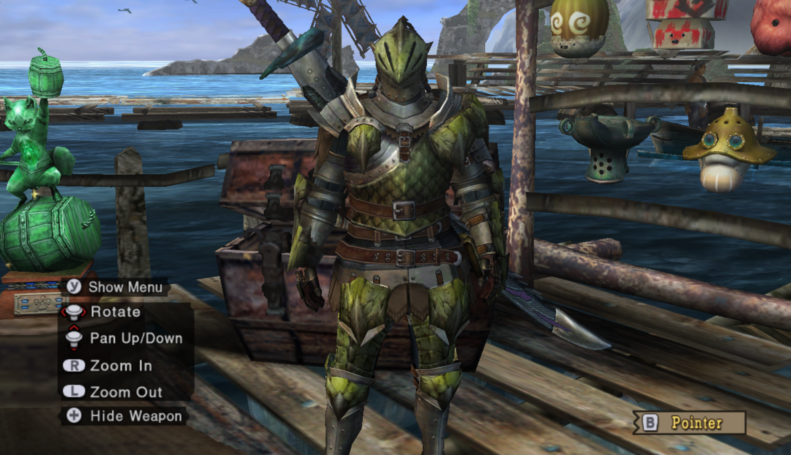
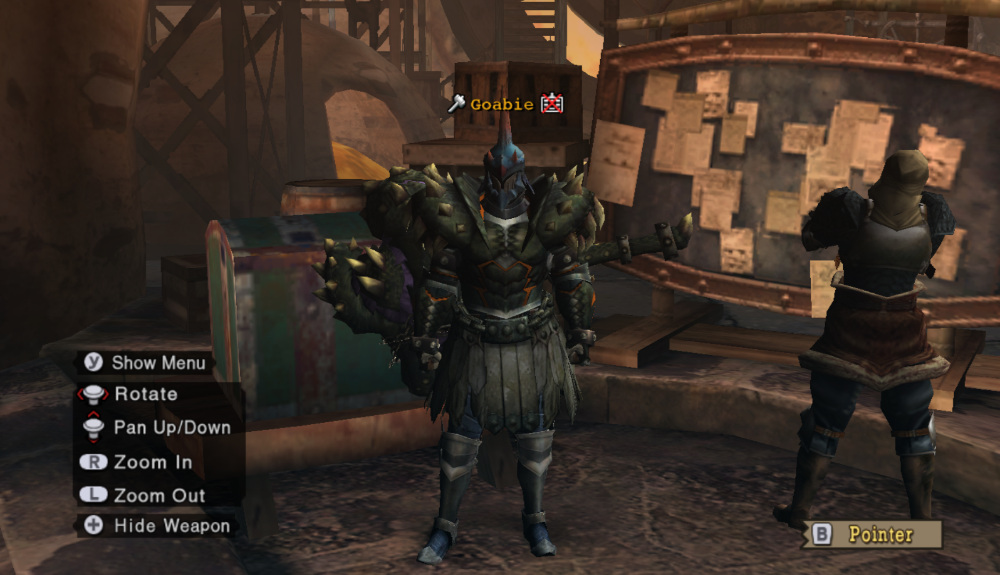
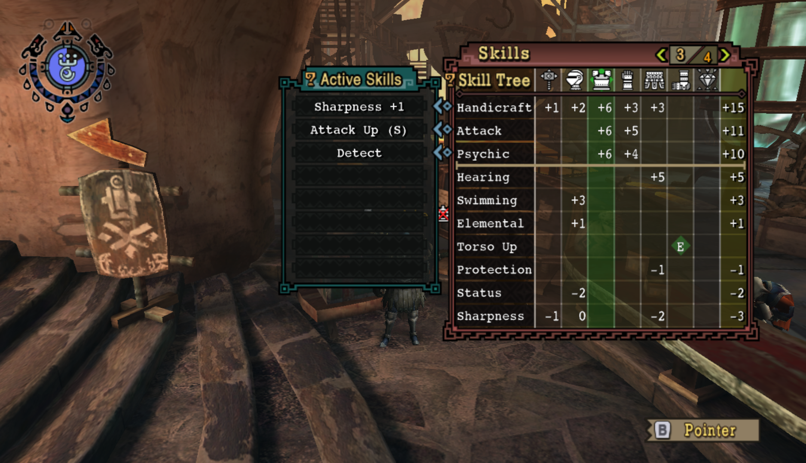

# Armory Progression

You've arrived... and you're naked! We can't just *put* on clothes - we have to work our way up to it.

This page will list what I feel are the most effective, popular, and affordable options for advancing through the game.

Highly WIP.

## Contents

- [HR0-8/Village1\*-3\*](#hr0-8village-1-3)
- [HR9-18/Village4\*](#hr9-18village-4)
- [HR19-30/Village5\*](#hr19-30village-5)
- [Village6\*](#village-6)
- [HR31-40](#hr31-40)
- [HR41-50](#hr41-50)
- [HR51+](#hr51)

## HR0-8/Village 1\*-3\*

Leather (S-tier). 

Chainmail (for combining at home and fishing quests)

Hunter if you like

Buy the above 3 from the Outfitter.

Consider crafting 5 Perception decorations and gemming it into your Hunter or Alloy (only need 4) armor.

---

Alloy, both gunner and blade depending what you're doing (S-tier)

Jaggi, both blade and gunner usable. Gem for Attack up M.

Qurupeco (not immediately useful... kind of anti-recommend)

Bnahbrah Alloy blademaster mix (for multiplayer, solo anti-recommend)

### Weapons Checkpoint
Generally, there are two lines: the metal line and the bone line. It's usually a good idea to have one of each and head down both, using whatever has more damage at your current point in the game.  If there are branching paths, honestly *don't worry about it too much.* Just pick one, or check the Weapon Tree guide if it really bothers you.  

This is what I used to fight Great Jaggi:  
Ludroth's Nail  
Ludroth Bone Mace  
Jawblade  
Heavy Bowgun (all 3 parts)  
Thane Lance  
Ludroth Bone Mace  

## HR9-18/Village 4\*

My relevant weapon collection pre-Barroth at this point:  
Sword and Shield: Royal Claw, Bone Tomhawk  
Greatsword: Ludroth Bone Sword+, Giant Jawblade, Rugged Great Sword  
Lance: Thane Lance, Spiral Lance  
Switch Axe: Bone Axe+  
Hammer: Ludroth Splashhammer, Plume Flint  
Bowgun frames: Royal Launcher, Heavy Bowgun  
Bowgun barrels: Tropeco, Royal Launcher  
Bowgun stocks: Tropeco, Royal Launcher  

Barroth (upgrade to Jaggi, skippable)

Barroth gunner

### Low Rank Rathian Mix

Active Skills:  Fire Res +10, Earplugs, Health +20
  
Available Slots:  OO; (Chest); (Talisman)

 Rathian Helm | O (Hearing 1)  
 Any  
 Rathian Vambraces | OO (Hearing 1, Hearing 1)  
 Rathian Faulds | O (Health 2)  
 Rathian Greaves | OO  

Earplugs!

Note: SKIP THE CHEST PIECE. It's a garbage piece that even costs a Rathian plate. My set above uses no rare materials and gets the job done.

---

### Low Rank Baggi Mix

Active Skills:  Capture Expert, Focus
  
Available Slots:  O x2; (Chest); (Weapon); (Talisman)

 Baggi Helm  
 Any  
 Baggi Vambraces | O (FastCharge 1)  
 Baggi Coil | O  
 Baggi Greaves | O  

For GS focus enjoyers, of whom I am one.

I skipped the chest piece to cheap out on Leader's Crests. But if you're planning to get low rank critical draw and focus, you'll probably need it later. Though you'll also need a decent critical draw talisman.

---

Steel for Guard Lance, highly recommend. Head and legs can be anything. Maybe something that can combine with whatever talismans you have available.

### Bowguns Checkpoint

Gun combos at this point:
Poison Stinger - Tropeco Gun - Tropeco Gun for fire elemental + para  
Royal Launcher - Royal Launcher - Tropeco Gun for water elemental  
Jaggid Frame - Barrozooka - Heavy Bowgun for pierce 1 + RF pierce 2  

Use Alloy for pierce/normal and any armor set with attack up for elemental.

## HR19-30/Village 5\*
### Weapons Checkpoint
These are my relevant weapons going into the Lagiacrus urgent hunt (not repel.)  
Sword and Shield: Qurupeco Chopper, Royal Claw+  
Lance: Rampart, Spiral Lance  
Hammer: Vodyanoy Hammer, Peco Flint  
Greatsword: Valkyrie Blade
Bowgun: see above  
Longsword and Switch Axe: Sorry they are so garbage I wouldn't even use them at this point

Rathalos (upgrade to jaggi/barroth. See about skipping the piece that costs a plate.)

Lagiacrus, more gunner than blade. Blade is skippable.

---

### Low Rank Lagi Gunner

Active Skills:  Normal S Boost, Element Atk Up, Olympic Swimmer, Status Atk Down  
  
Available Slots:  O x1, OO x4; (Weapon); (Talisman)

 Lagiacrus Cap | OO  
 Lagiacrus Vest | O  
 Lagiacrus Guards | OO  
 Lagiacrus Coat | OO  
 Lagiacrus Leggings | OO  

Low Rank elemental gunning goodness. Lagiacrus is so flexible. Note that if you want damage, go with Attack Up and not Critical Eye. Element wants raw; SHOT (pierce or normal) wants affinity. If you're using this set to fire Normal rounds, then I guess go with Critical Eye...

---

### Low Rank Focus Greatsword

Active Skills:  Focus, Critical Draw, Capture Expert
  
Available Slots:  O, (Weapon)

 Baggi Helm  
 Baggi Mail | OO (FastCharge1)   
 Diablos Vambraces  
 Baggi Coil | O (FastCharge1)  
 Baggi Greaves | O (Crit Draw1)
Talisman: Crit Draw +2 or better

This requires a Critical Draw talisman. Sorry :(

Thankfully it's not too rare. I'm using a Crit Draw +4 Knight Talisman. Farm the Rathian egg delivery quest in Moga Village for lots of stacks of talismans.

---

Diablos gunner (requires Majestic horn)

Barioth (upgrade from qurupeco, skippable)

### Weapons Checkpoint
At this point, we're preparing for High Rank!  
Sword and Shield: One of every element  
Greatsword: Sieglinde  
Lance: One of every element  
Longsword: Basically just make all of them  
Switch Axe: Same as above, except the crystal one is pretty dumb  
Hammer: The pure iron line is fine. Hammer is honestly a bit sad until HR 6* :(  
Bowgun: You've probably been collecting these as you go. The barrels and stocks don't need upgrades, so just make them. Of note, Thundacrus stock is incredibly good, Barrozooka barrel is amazing. Agnablaster has its place.

## Village 6\*
Helios Lagi mix. Main note: SKIP THE HELIOS/SELENE CHEST PIECE.

## HR31-40
**You want a high rank armor set ASAP! I like Alloy+ - just gathering, no hunting.**
> Unless you enjoy getting 2 or 3 shot, get a high rank armor set.

---
### Jaggi Starter

Active Skills:  Attack Up (M), Negate Stun, Gourmand
  
Available Slots:  O x2, OO; (Weapon); (Talisman)

 Jaggi Helm+ | O  
 Jaggi Mail | O (Stun 2)  
 Jaggi Vambraces+ | O  
 Jaggi Faulds+ | OO  
 Jaggi Greaves+ | OO (Attack 3)

I prefer full Alloy+, but everyone swears by Jaggi+. Note that I am using the *low rank* chest because there is no way I'm spending a Bird Wyvern Gem on this!

Gem it up however you want.

---

Alloy+ (S-tier)

Two low piece Bnahbrah mix (link to armory)

Barroth+ (pieces endgame viable) (use LR barry arms if no wyvern stones)

---

### Rathian High Grade Earplugs

Active Skills:  Fire Res +10, Earplugs, Health +20
  
Available Slots:  O; (Weapon); (Talisman)

 Rathian Helm+ | OOO (Hearing4)  
 Rathian Mail+ | O (Hearing1)  
 Rathian Vambraces | OO (Protection2)  
 Rathian Faulds | O (Hearing1)  
 Rathian Greaves | OO (Protection2, Protection2)  

This is for Gigginox and Alatreon, if you really want it.

If you want standard grade earplugs, just overforge my [low rank set](https://github.com/kuhchung/Monster-Hunter-Tri---Goabie-Guide/blob/main/pages/armory/progression.md#low-rank-rathian-mix). It uses three of the same pieces anyways.

---

Weapons to build: Spiral Lance (B), High Sieglinde (P), pre-Iron Impact, Shadowbinder G or P, 

## HR41-50

[Diablos+ Gunner](https://github.com/kuhchung/Monster-Hunter-Tri---Goabie-Guide/blob/main/pages/armory/index.md#deviating-uragaan-smasher)  
Believe it or not, this is endgame!

Baggi+/Diablos+ mix/overforge

Rathalos overforge

---

### Early Vangis

Active Skills:  Sharpness +1, Attack Up S, Detect
  
Available Slots:  (Talisman)

Any Weapon O | (handicraft 1)  
 Any Helm | OO (handicraft 1, handicraft 1)  
 Vangis Mail  
 Vangis Vambraces  
 Selene/Helios Coil  
 Alloy Greaves  

Total:  Handicraft +15, Attack +11, Psychic +10  
Total without helm/weapon: Handicraft +12, Attack +11, Psychic +10  

If you have high ranked people in your city willing to hunt early Deviljho with you via Jaggia Menace, then you can make this set once you gather the Dragonbone relics in the Tundra. Eat for Felyne Explorer, go hunt Great Baggi, et voila!

This is like Tri's version of that Ceanataur set that gives Honed Blade in 4U early game low rank.

If you're lucky enough to get a Deviljho Gem, you can use Vangis Coil instead of Selene/Helios Coil. If you don't want to put a handicraft decoration in your weapon, you can use Skull Mask. Really, if you remove the helmet and weapon, you just need three more handicraft points however you like to get it. Pictured is the Lagiacrus Helm, because I have it sitting around from low rank.

---

Weapons to build: Iron Impact, Thundacrus Rex frame, Sabertooth (G), Nardebosche, Almighty Dahaka, Morpheus Knife, Dancing Hellfire, Agnaktor Firelance

## HR51+
Check out the [Armory](index.md).
