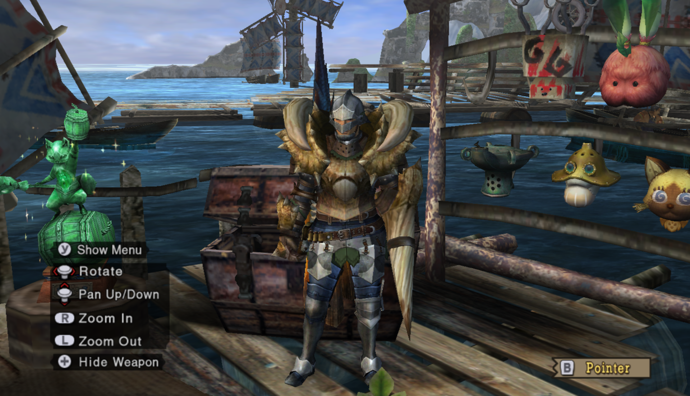
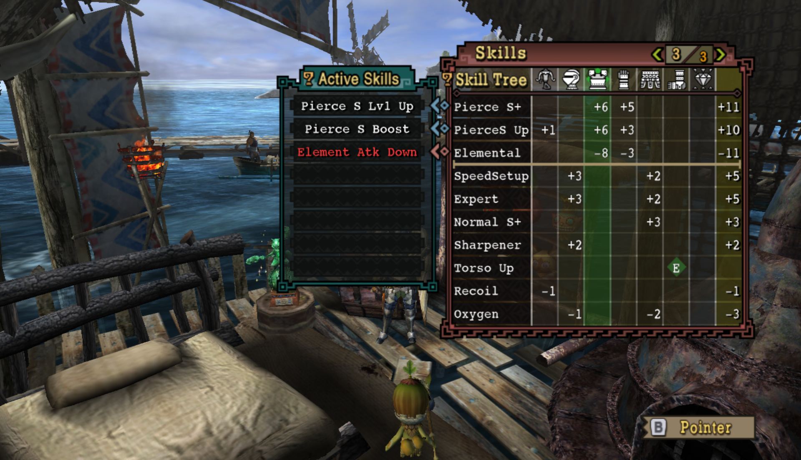

# Armory Progression

You've arrived... and you're naked! We can't just *put* on clothes - we have to work our way up to it.

This page will list what I feel are the most effective, popular, and affordable options for advancing through the game.

Highly WIP.

## Contents

- [HR0-8/Village1\*-3\*](#hr0-8village-1-3)
- [HR9-18/Village4\*](#hr9-18village-4)
- [HR19-30/Village5\*](#hr19-30village-5)
- [Village6\*](#village-6)
- [HR31-40](#hr31-40)
- [HR41-50](#hr41-50)
- [Alatreon-Urgent](#alatreon-urgent)
- [HR51+](#hr51)

## HR0-8/Village 1\*-3\*

### Leather

 Leather Headgear | O  
 Leather Vest | O (Whim 1)   
 Leather Gloves | O (Gathering 1)  
 Leather Belt | O  
 Leather Pants | O (Gathering 1)  

Active Skills: Divine Whim, Gathering +2, Speed Gatherer
  
Available Slots:  2x O; (Weapon); (Chest); (Talisman)

Buy this from the Outfitter with the first 1500z that the Chief gives you.

Wear this on *all* gather quests. This is the game's way of teaching you armor skills and decorations.

If you get a talisman for Pro Transporter, this set will handle all of your gathering needs.

---

Chainmail for combining at home and fishing quests

Hunter if you like for actual hunting. Optional.  

Buy the above 3 from the Outfitter.

Consider crafting 5 Perception decorations and gemming it into your Hunter or Alloy (only need 4) armor.

---

### Alloy

 Alloy Cap | OO (Perception 2)  
 Alloy Vest | O (Perception 2)   
 Alloy Guards | O (Perception 2)  
 Alloy Coat | O (Perception 2)  
 Alloy Greaves

Active Skills: Trapmaster, Speed Sharpen, Critical Eye +1
  
Available Slots:  O; (Weapon); (Chest); (Talisman)

This is my *favorite* low rank set. Pictured is gunner alloy -- just make or buy full blademaster alloy if that's what you're doing instead.

---

Jaggi, both blade and gunner usable. Gem for Attack up M.

Qurupeco (not immediately useful... kind of anti-recommend)

Bnahbrah Alloy blademaster mix (for multiplayer, solo anti-recommend)

### Weapons Checkpoint
Generally, there are two lines: the metal line and the bone line. It's usually a good idea to have one of each and head down both, using whatever has more damage at your current point in the game.  If there are branching paths, honestly *don't worry about it too much.* Just pick one, or check the Weapon Tree guide if it really bothers you.  

This is what I used to fight Great Jaggi:  
Ludroth's Nail  
Ludroth Bone Mace  
Jawblade  
Heavy Bowgun (all 3 parts)  
Thane Lance  

## HR9-18/Village 4\*

My relevant weapon collection pre-Barroth at this point:  
Sword and Shield: Royal Claw, Bone Tomhawk  
Greatsword: Ludroth Bone Sword+, Giant Jawblade, Rugged Great Sword  
Lance: Thane Lance, Spiral Lance  
Switch Axe: Bone Axe+  
Hammer: Ludroth Splashhammer, Plume Flint  
Bowgun frames: Royal Launcher, Heavy Bowgun  
Bowgun barrels: Tropeco, Royal Launcher  
Bowgun stocks: Tropeco, Royal Launcher  

Barroth (upgrade to Jaggi, skippable)

Barroth gunner

### Low Rank Rathian Mix Without Plate

Active Skills:  Fire Res +10, Earplugs, Health +20
  
Available Slots:  OO; (Chest); (Talisman)

 Rathian Helm | O (Hearing 1)  
 Any  
 Rathian Vambraces | OO (Hearing 1, Hearing 1)  
 Rathian Faulds | O (Health 2)  
 Rathian Greaves | OO  

Earplugs!

Note: SKIP THE CHEST PIECE. It's a garbage piece that even costs a Rathian plate. My set above uses no rare materials and gets the job done.

---

### Low Rank Baggi Mix

Active Skills:  Capture Expert, Focus
  
Available Slots:  O x2; (Chest); (Weapon); (Talisman)

 Baggi Helm  
 Any  
 Baggi Vambraces | O (FastCharge 1)  
 Baggi Coil | O  
 Baggi Greaves | O  

For GS focus enjoyers, of whom I am one.

I skipped the chest piece to cheap out on Leader's Crests. But if you're planning to get low rank critical draw and focus, you'll probably need it later. Though you'll also need a decent critical draw talisman.

---

Steel for Guard Lance, highly recommend. Head and legs can be anything. Maybe something that can combine with whatever talismans you have available.

### Bowguns Checkpoint

Gun combos at this point:
Poison Stinger - Tropeco Gun - Tropeco Gun for fire elemental + para  
Royal Launcher - Royal Launcher - Tropeco Gun for water elemental  
Jaggid Frame - Barrozooka - Heavy Bowgun for pierce 1 + RF pierce 2  

Use Alloy for pierce/normal and any armor set with attack up for elemental.

## HR19-30/Village 5\*
### Weapons Checkpoint
These are my relevant weapons going into the Lagiacrus urgent hunt (not repel.)  
Sword and Shield: Qurupeco Chopper, Royal Claw+  
Lance: Rampart, Spiral Lance  
Hammer: Vodyanoy Hammer, Peco Flint  
Greatsword: Valkyrie Blade  
Bowgun: see above  
Longsword and Switch Axe: Sorry they are so garbage I wouldn't even use them at this point

---

### Rathalos Without Plate

Active Skills:  Attack Up (S), Critical Eye +1

Available Slots:  O x3, OO; (Weapon); (Talisman)

 Rathalos Helm | O  
 Rathalos Mail | O  
 Alloy Vambraces | O  
 Rathalos Faulds   
 Rathalos Greaves | OO  

Don't have a Rathalos Plate? Just put in Alloy Vambraces!

I have used *no talisman* and have not touched *any slots*. You can decorate this however you want. I would try to finish out Trapmaster and Speed Sharpen, but you can also go for pure attack if you like.

---

### Low Rank Lagi Gunner

Active Skills:  Normal S Boost, Element Atk Up, Olympic Swimmer, Status Atk Down  
  
Available Slots:  O x1, OO x4; (Weapon); (Talisman)

 Lagiacrus Cap | OO  
 Lagiacrus Vest | O  
 Lagiacrus Guards | OO  
 Lagiacrus Coat | OO  
 Lagiacrus Leggings | OO  

Low Rank elemental gunning goodness. Lagiacrus is so flexible. Note that if you want damage, go with Attack Up and not Critical Eye. Element wants raw; SHOT (pierce or normal) wants affinity. If you're using this set to fire Normal rounds, then I guess go with Critical Eye...

---

### Low Rank Focus Greatsword

Active Skills:  Focus, Critical Draw, Capture Expert
  
Available Slots:  O, (Weapon)

 Baggi Helm  
 Baggi Mail | OO (FastCharge1)   
 Diablos Vambraces  
 Baggi Coil | O (FastCharge1)  
 Baggi Greaves | O (Crit Draw1)  
Talisman: Crit Draw +2 or better

This requires a Critical Draw talisman. Sorry :(

Thankfully it's not too rare. I'm using a Crit Draw +4 Knight Talisman. Farm the Rathian egg delivery quest in Moga Village for lots of stacks of talismans.

---

Diablos gunner for pierce (requires Majestic horn)

Barioth (upgrade from qurupeco, skippable)

### Weapons Checkpoint
At this point, we're preparing for High Rank!  
Sword and Shield: One of every element  
Greatsword: Sieglinde  
Lance: One of every element  
Longsword: Basically just make all of them  
Switch Axe: Same as above, except the crystal one is pretty dumb  
Hammer: The pure iron line is fine. Hammer is honestly a bit sad until HR 6* :(  
Bowgun: You've probably been collecting these as you go. The barrels and stocks don't need upgrades, so just make them. Of note, Thundacrus stock is incredibly good, Barrozooka barrel is amazing. Agnablaster has its place. Poison Stinger frame for raw damage on elemental spitting.

## Village 6\*
Helios Lagi mix. Main note: SKIP THE HELIOS/SELENE CHEST PIECE.

## HR31-40
**You want a high rank armor set ASAP! I like Alloy+ - just gathering, no hunting.**
> Unless you enjoy getting 2 or 3 shot, get a high rank armor set.

Your priority weapons are High Sieglinde (P), Iron Impact, and upgrade whatever elemental based weapons you like to use. Royal Ludroth is available. Flame Tempest and Barioth Switch Axe are available too.

The paralysis weapons are fine/good too.

---
### Jaggi Starter

Active Skills:  Attack Up (M), Negate Stun, Gourmand
  
Available Slots:  O x2, OO; (Weapon); (Talisman)

 Jaggi Helm+ | O  
 Jaggi Mail | O (Stun 2)  
 Jaggi Vambraces+ | O  
 Jaggi Faulds+ | OO  
 Jaggi Greaves+ | OO (Attack 3)

I prefer full Alloy+, but everyone swears by Jaggi+. Note that I am using the *low rank* chest because there is no way I'm spending a Bird Wyvern Gem on this!

Gem it up however you want.

---

[Alloy+ Blademaster](https://github.com/kuhchung/Monster-Hunter-Tri---Goabie-Guide/blob/main/pages/armory/index.md#alloy-is-bae)  
My favorite starter HR set. Make this instead of Jaggi+!

[Status Support Bnahabra](https://github.com/kuhchung/Monster-Hunter-Tri---Goabie-Guide/blob/main/pages/armory/index.md#blast-earring-anyone)  
For if you're hunting in a group of 3 or more, to use with your paralysis weapons. (People don't bring bombs so sleep is sad.)

Barroth+ (pieces endgame viable) (use LR barry arms if no wyvern stones)

---

### Rathian High Grade Earplugs

Active Skills:  Fire Res +10, High Grade Earplugs, Health +20
  
Available Slots:  O; (Weapon); (Talisman)

 Rathian Helm+ | OOO (Hearing4)  
 Rathian Mail+ | O (Hearing1)  
 Rathian Vambraces | OO (Protection2)  
 Rathian Faulds | O (Hearing1)  
 Rathian Greaves | OO (Protection2, Protection2)  

This is for Gigginox and Alatreon, if you really want it.

If you want standard grade earplugs, just overforge my [low rank set](https://github.com/kuhchung/Monster-Hunter-Tri---Goabie-Guide/blob/main/pages/armory/progression.md#low-rank-rathian-mix). It uses three of the same pieces anyways.

---

### Early HR Pierce

Active Skills:  Pierce S Boost, PierceS Lv1 Up
  
Available Slots:  3x OO ; (Talisman)

 Jaggid Fire |  Barrozooka O (PierceS Up) |  Thundacrus  
 Alloy Helm+ | OO  
 Diablos Vest  
 Dialos Guards  
 Alloy Coat+ | OO  
 Alloy Leggings+  

Total: Pierce S+ +11, PierceS Up +10, SpeedSetup +5, Expert +5

We can't get Diablos+ materials yet, but you can use this as a stopgap to fire the far superior Pierce ammo while still upgrading to partial HR defensive values. I use the Alloy Helm+ because Alloy Cap+ doesn't provide any relevant extra armor skills. Therefore, we can choose the higher defensive blademaster piece.

I would finish out Trapmaster and Critical Eye, but it is totally up to you. I would recommend **against** gemming for Pierce S+ ALL Up. You do not need to load more Pierce 2 (it's rapid fired.)

---

## HR41-50
New priority weapons available:  
Lance: Sabertooth (G), Agnaktor Firelance  
SnS: Djinn, Nardebosche  
Longsword: Dancing Hellfire  
Hammer: Iron Impact  
Bowgun: Thundacrus Rex frame and stock  

[Diablos+ Gunner](https://github.com/kuhchung/Monster-Hunter-Tri---Goabie-Guide/blob/main/pages/armory/index.md#deviating-uragaan-smasher)  
Believe it or not, this is endgame!

Baggi+/Diablos+ mix/overforge

Rathalos overforge

Lagiacrus overforge

---

### Early Vangis

Active Skills:  Sharpness +1, Attack Up S, Detect
  
Available Slots:  (Talisman)

Any Weapon O | (handicraft 1)  
 Any Helm | OO (handicraft 1, handicraft 1)  
 Vangis Mail  
 Vangis Vambraces  
 Selene/Helios Coil  
 Alloy Greaves  

Total:  Handicraft +15, Attack +11, Psychic +10  
Total without helm/weapon: Handicraft +12, Attack +11, Psychic +10  

If you have high ranked people in your city willing to hunt early Deviljho with you via Jaggia Menace, then you can make this set once you gather the Dragonbone relics in the Tundra. Eat for Felyne Explorer, go hunt Great Baggi, et voila!

This is like Tri's version of that Ceanataur set that gives Honed Blade in 4U early game low rank.

If you're lucky enough to get a Deviljho Gem, you can use Vangis Coil instead of Selene/Helios Coil. If you don't want to put a handicraft decoration in your weapon, you can use Skull Mask. Really, if you remove the helmet and weapon, you just need three more handicraft points however you like to get it. Pictured is the Lagiacrus Helm, because I have it sitting around from low rank.

---

Weapons to build: Iron Impact, Thundacrus Rex frame, Sabertooth (G), Nardebosche, Almighty Dahaka, Morpheus Knife, Dancing Hellfire, Agnaktor Firelance

## Alatreon Urgent
I have crossed this urgent three ways now.

One is HGE with Iron Impact.  
Another is Jaggi+ with Barroth+ chest and Nardebosche.  
Final way is overforged Low Rank Rathalos with High Sieglinde P.

It's a tough fight! Look for teammates online to help you out!

## HR51+
Check out the [Armory](index.md).
