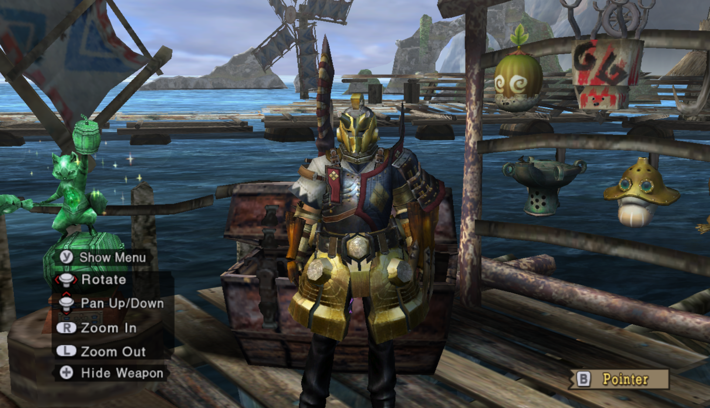
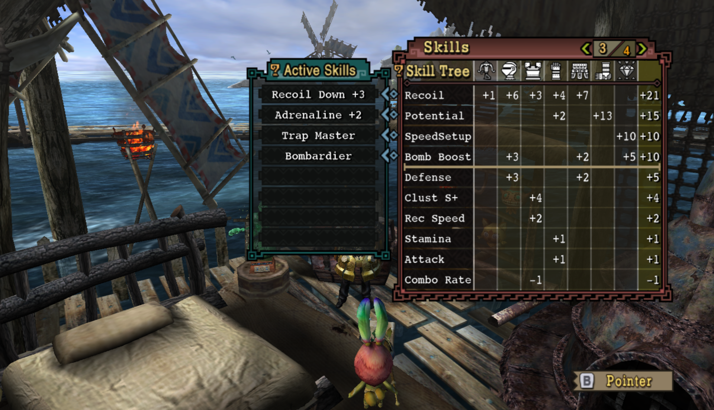
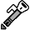
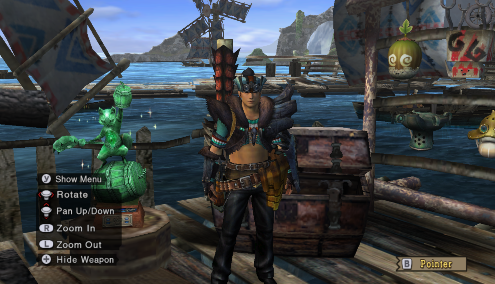
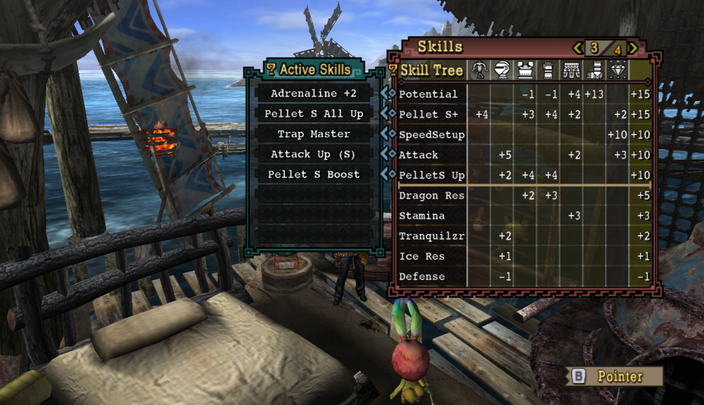
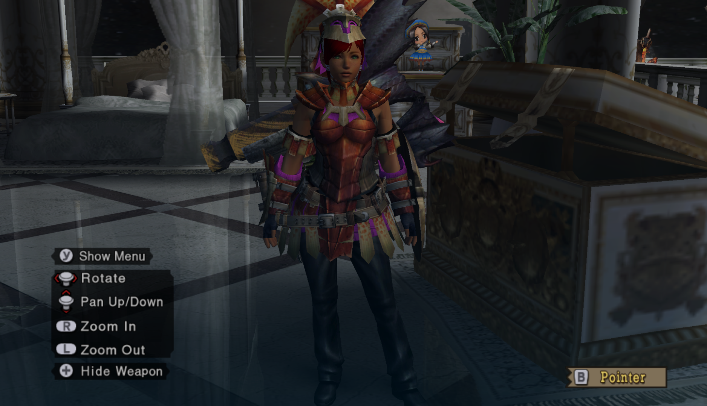
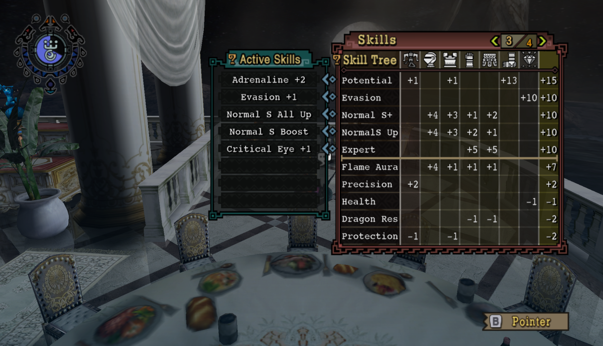
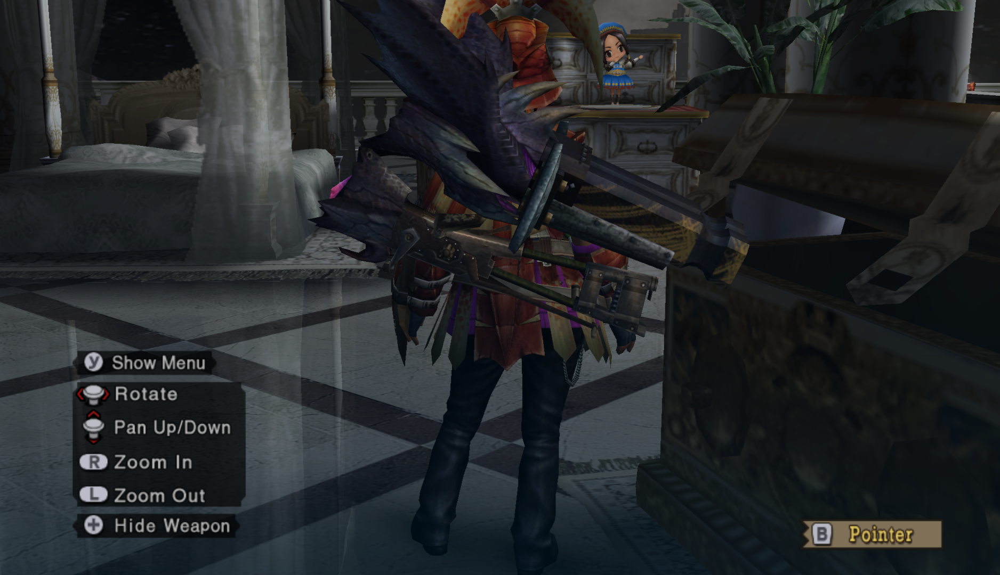

# Who Let Him Cook?

These are my experimental builds that are... not safe for life. Use these at your own risk, or treat them as a warning for your own sanity!

### KABUM!

 Rathling Gun+ |  Chaos wing |  Poison Stinger O (Recoil 1)  
 Uragaan Cap+ | O (Bomb Boost 2)  
 Mutsu Muneate+ | O (Recoil 1)   
 Barroth Guards+ | O (Recoil 4)  
 Uragaan Coat+ | O (Recoil 1)  
 Black Leather Pants  
Talisman: Bomb Boost 5 SpeedSetup 10  

I tried to make WyvernFire a thing.

Don't try to make WyvernFire a thing.

Honestly, the gun could probably be constructed differently. But it's still gonna suck.

---

### Razor Sharpness +1

 Some  
 Bullshit  
 Sharpness +1  
 Razor  
 Sharp  
Talisman: Handicraft 4 but not OOO decoration lolol

I honestly don't even know the set is. People unironically thought it was really good. It requires a specific Dragon Talisman and uh, would you rather have S+1 Razor Sharp, or S+1 Speed Sharpen? Oh wait, I forgor, the S+1 Speed Sharpen *also* comes with Earplugs, Trapmaster, and Attack Up Small.

**HMM...**

---

### Phbhtbhtbhthbthbt-ellet

 Blizzard Cannon |  Devil's Grin O (Pellet S+ 2) |  Rathling Gun+  O (Pellet S+ 2)  
 Baggi Cap+ | OOO (Attack 5)  
 Dober Vest | O (PelletS Up 1)   
 Dober Guards | O (Pellet S Up 1)  
 Barroth Coat+ | O (Pellet S+ 2)  
 Black Leather Pants  
Talisman: SpeedSetup 10 Attack 3 O (Pellet S+ 2)  

I have a [5:10](https://www.youtube.com/watch?v=60vGCjr9JlU) Qurupeco solo.

And it's the *only* thing pellet is good at. Besides getting your teammates to hate you.

On top of that, these armor pieces conflict with adrenaline and expert, for Pete's sake.

It's pretty drippy though.

--- 

### Normy 

Active Skills:  Normal S Boost, Normal S All Up

Available Slots:  O x3, OOO x2; (Legs); (Talisman)

 Chaos Wing |  Jhen Cannon O |  Aquamatic "Needler" O; or Vulcannon  
 Agnaktor Cap+  
 Agnaktor Vest+ | O  
 Agnaktor Guards+ | OOO  
 Agnaktor Coat+ | OOO  
 None  

Total: Normal S Up +10, Normal S+ +10

Sorry for the title. I don't mean to marginalize normal people.
