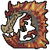
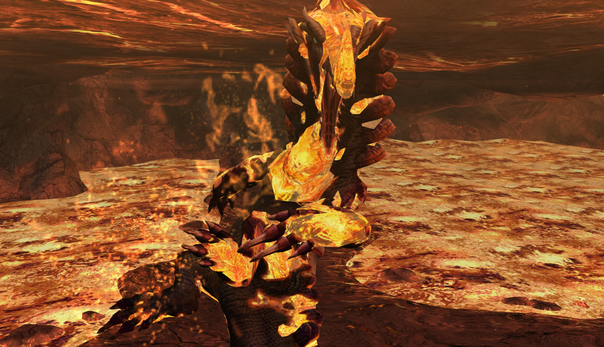
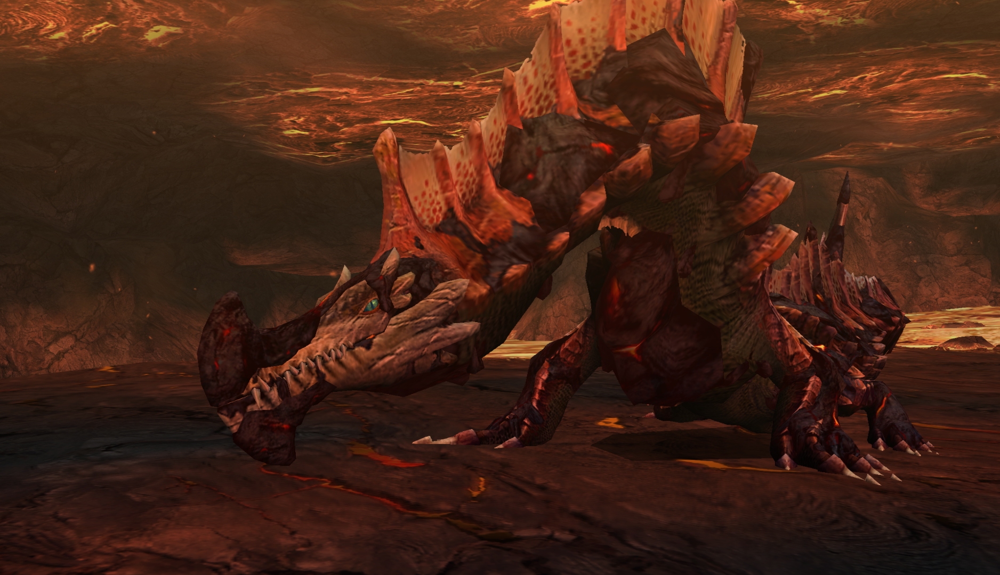
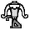
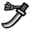

#  Hunter’s Notes - Agnaktor 

  
Goabie’s Weapon Recommendations:  Medium Bowgun,  LS,  Lance (Guard),  SnS  
  
Elemental Weakness: Water 

Afflictions:  /  Fire

TODO: Flavor text

Rage tells: Speedup, fire in mouth

## Preparations
Bring sonic bombs and pitfall traps.

## Sonic bombing
You can only sonic the lava shark leaping on his very final dive. It's always an odd number as far as I know. Up to 7 if raged (unsure about non-rage)... I would go for it at 3.

Like all monsters, you cannot sonic him when raged.

The sonic bomb timing is actually a little bit tight. Don't be surprised if you miss a few times when you first try it.

A funny thing can happen when Agnaktor is exhausted and goes to area 5. If you stop him from eating, he will remain exhausted. If he digs to escape, you sonic... he gets out, then digs to escape, you sonic... repeat until end of hunt.

## Avoidance and Evasion
On the subject of Agnaktor's lava shark leaping... do not superman dive it! It is a death sentence because he is going to hit you on the very next attack.

His quadruple beak slam is considered one attack. If you've eaten a hit (or guarded it), then you have gotten past it and the remaining beak slams from this animation will not hurt you. Attack!

Evading the quadruple beak slam does not get you past it the way guarding does. If you evade a beak slam, you are still at risk.

Be ready to change direction if Agnaktor rushes you with a lava surf! He tracks and homes in on your movement in an instant, but if you just flip 180 degrees and hard turn around as soon as he begins his approach, he will be locked into your old trajectory and miss you completely.

A nice flashbomb opening is at the very end of his world laser.

## Reward oddities
All 4 claws must be broken for a claw break reward.

Beaks are only available through breaks.

Tails must be carved off of a tailcut.

## Status
I actually do not like paralysis in this fight. Due to his armor hardening mechanic, it may be totally wasted.

## Turnapound  
Start completely flush and perpendicular with his hind leg, release as he turns. The upswing hits the hind leg and the pound hits the, you guessed it, head.
