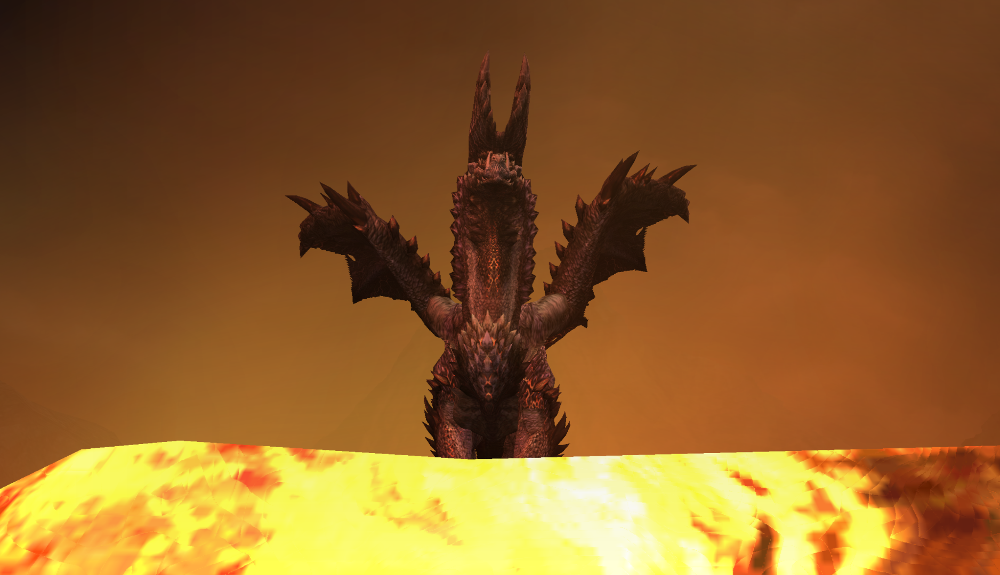
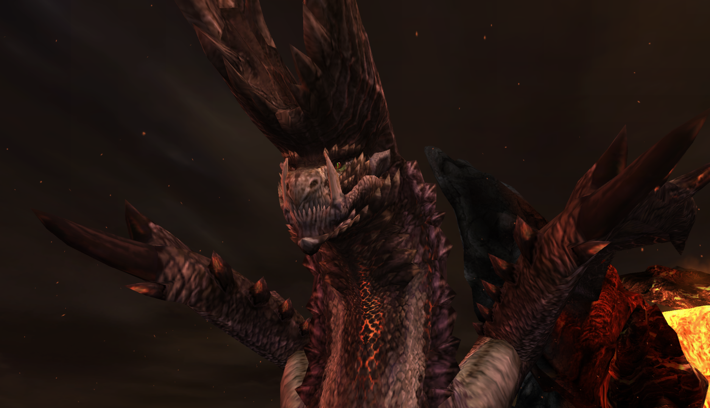

#  Hunter’s Notes - Alatreon 

Elemental Weakness:  Ice, then  Water

Alatreon - Elder Dragon  
Threat Level : ★★★★★★(★)  
Blazing black dragons, so named for resembling both lightning and darkness.  They mercilessly tear apart whoever touches their sharp scales.  Elementally unstable, their actions can affec the very weather.  Living natural disasters.

Rage tells: Speedup, fire in mouth

TODO: Flavor text
TODO: This page needs a lot of work!

## The Big Black Pony
Alatreon is hard. No, really. He is **hard**. Nothing else in Monster Hunter Tri compares to this guy. Future incarnations of him got nerfed into the ground, almost as if the devs realized just how overtuned he is compared to the rest of the monster cast.

His fireball radius is enormous, too large to roll away from if you're out of position. No other monster in Tri has a blast radius like that. His HP is enormous, magnified by the fact that all of his hitzone multipliers are awful, and his head is constantly dipping in and out of range. Literally frames.

It's glorious.

## Alatreon's Flying Rules
Alatreon's flying is a huge point of consternation for hunters. You do not have ballista binders like in other games. If he flies in Tri, you are just boned.

Here are the mechanics for how his flight works.

### 1. Charge the Horns
First, Alatreon must have at least one horn to fly! 

He has a movement where he puts both front legs on the floor, lowers and shakes his head (this is an attack - do not be there!), and then puts his head down and growls while blue electricity sparks where his horns are. As long as he has entered any part of this animation, he is now charged. It doesn't matter if you stagger him as he does it. In fact, that makes it worse because you lose a chance to hit his head.

If both horns have been broken, he can still perform this animation, but no lightning will charge and it is just a free hit for you.

Once the blue lightning on his horns is charged, you are on a timer before he flies.

It's okay to curse at the screen or groan or whatever it is you do every time he charges his horns. Especially do it with feeling if you were close to a KO or paralysis because...

### 2. Dispel the Lightning
To prevent a flight, you must deal a set amount of damage to his horns while the lightning is charged. TODO: approximate damage TODO: approximate time to flight

If you do reach that threshold, Alatreon will stagger backwards and lower his head briefly, shaking it around as if he had just been punched in the jaw. **This animation takes precedence over everything**. That means, if Alatreon is paralyzed or in KO state, as soon as you hit this threshold, he stops whatever he is doing and will go to this animation. It really sucks!

(Speculative but feels right) The damage dealt to his horns while his lightning is charged is on a separate counter. If you do not dispel the lightning in time, I believe the damage dealt will be carried over to the next time he charges his horns.

### 3. Call Down the Thunder
( This part about the two different flights is kind of speculative. Feel free to correct me! )
If you do not dispel the lightning in time, Alatreon takes flight! He has two flights - low and high altitude.

When he goes into his low fly, you are now on a timer before he goes into high flight. Note: High flight is pretty stupid and you actually get a free hit at the end of it, but all of this sucks. And he will enter low flight again after (I think?)

Given enough time, he will stop flying. But if you don't want to run around all that time, here are some things you can and should do to speed it up.

It takes **two** staggers to cancel his flight. Flash bomb counts as one and will ground him, albeit briefly.

If you do not stagger him, he will go into high flight.

If you flash bombed him and stagger him, when the flash daze wears off, he will jump into the air briefly and then land right back down where he started. This is another superpound for the hammer.

If you flash bombed him and do not stagger him, at some point he will do a jump back and remain in the air. Same if he comes down from high flight (get your superpound here) and you do not stagger him.

If he lands and takes low flight again, a stagger or a flash will ground him until the next time he charges his horns.

## Flash Bombing
The air to ground ice stream is 100% reliably flash bombable.

Otherwise, you can try to predict turns, but this can fail miserably many times in a row.

## Evasion and avoidance
His turn dragon claw swipe has an enormous arc. You are probably not safe unless you're actually by his hind feet. This attack can be evaded without evasion+1.

His tail is very active after dragon rushes. You can take a swipe at it on the backswing, but be careful not to get hit. This catches a lot of people off guard the first few times they face him.

Like all tailswings, his dragon rush tail swing is also dodgeable without evasion+1.

Even his growls have a hurtbox. His front feet slam down, and his head on its way down are not safe. You can squeeze a triple pound in here if you know your position very well and are close enough, but I usually settle for a superpound.

His horn charge is like his growl, but wider because he shakes his head back and forth.

When raged, he has a jumpback fireball like Rathalos. Exit!!

## Guard Data
The actual fireball from Alatreon's stepback fireball cannot be guarded without Guard Boost. 

His jumpback fireball **can** be guarded, but it will heavily chip and stagger you. If he decides to dragon rush you next, it may be checkmate.

TODO Guard+1 Guard+2 data.

## Status
Alatreon's paralyze duration is longer than usual, but the threshold increase is so difficult that I think paralysis is a bad choice in this fight.

Alatreon is very vulnerable to sleep. If someone on the hunt is packing sleep, then **all hunters should bring their bomb materials and combines**.

## Wall Lock
There are two walls on the side of the arena. Some players like to climb this so Alatreon will dragon rush into the wall and get his horns stuck, a la Diablos.

If Alatreon has enough time to struggle in the wall, he will break the wall and get free. If you are on the wall, you eat big damage and now the wall is gone.

If you stagger him, he gets free, but the wall remains. It can be used infinitely as long as you stagger him. This is featured in clust cheesing him.

If you are freestyling in a public lobby and nobody makes any motions to go for the wall, then in my opinion, just ignore this mechanic. Do not go and stand on the wall and ping endlessly. I hate you.

## Teamfight Positioning
If there is a hammer on the team and they are competent, then everyone just go and hug the hammer if Alatreon is far away. He's going to dragon rush, so everyone should be in the same place to avoid dragging him all over the SacredLands arena. This might buy the hammer a superpound when he does a dragon rush headswing.

In fact, everyone should just stick close together when Alatreon is far away. Do you really want to waste time by letting him charge around the entire arena instead of breaking his horns, especially if the lightning is charged?

## Reward Oddities
In my opinion, the most valuable Alatreon mats, in order, are:
1. Skypiercer
2. Webbings
3. Azure Dragongem
4. Alatreon Tail

Skypiercers are a 15% drop from breaking **both** horns, which is a tall task for inexperienced hunters. The best way to actually get Skypiercers is to do the event Alatreon, Where Gods Fear to Tread, but that has the issue of facing even badder pony. Still, if everyone is comfortable with the fight, this is the way to go.

Webbings require wing breaks, and breaking the wings is just awful. I recommend either sleep bombing the wings or cheesing him with clust until you get all that you need.

The Azure Dragongem is both a carve and a main reward, so they will come.

Tails must be got via tail carve, and this is the one hunt where I might suggest noob carving midhunt. Certainly, if he goes into flight and isn't targeting you, by all means, carve the tail. Otherwise, if Alatreon dies and you haven't carved it yet, I would prioritize getting these over carving the body, unless you specifically want Azure Dragongem.

## Gale's Video
Really, you should just go watch this instead.
