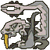
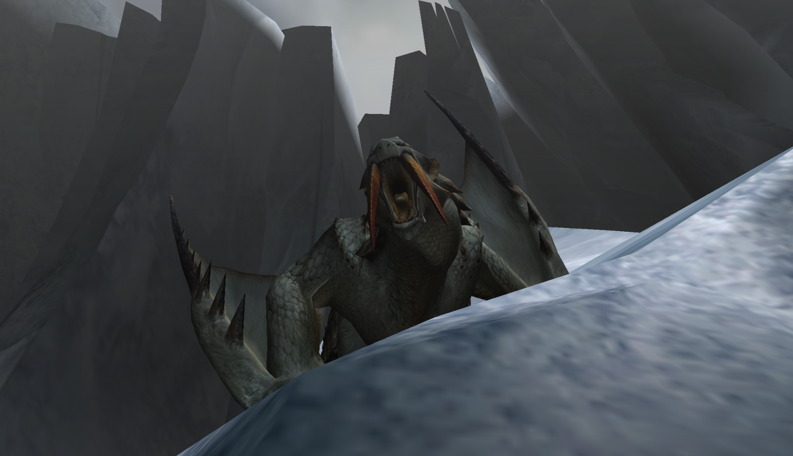
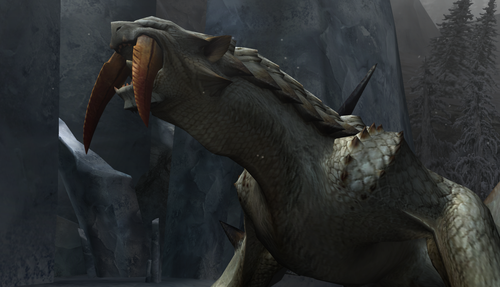
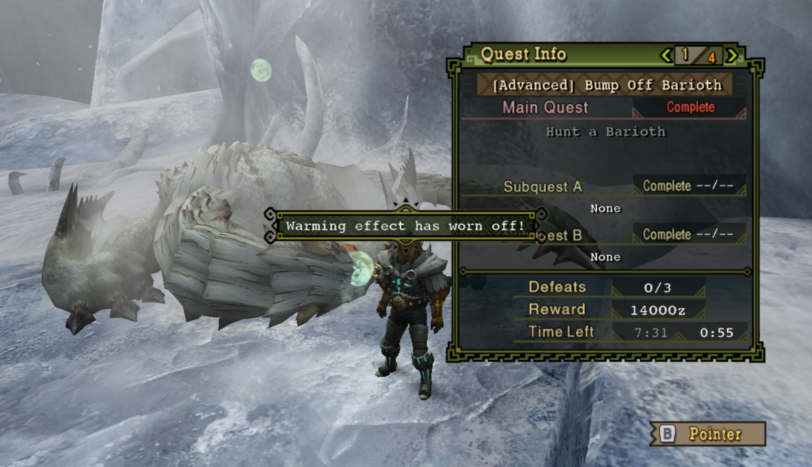

#  Hunter's Notes - Barioth 

  

Goabie's Weapon Recommendations:  Hammer  
Elemental Weakness:  Fire, then  Thunder  
Afflictions:  /  Iceblight,  Snowman

Monster Type : Flying Wyvern   
Threat Level : ★★★★★   
*Wyverns that rule the eternally frozen Tundra.  Barioth use their huge tusks and spiked scales to move freely atop the slippery ice; this ability makes them very difficult to keep up with.*

TODO: Flash bomb timings. But I generally don’t use this because he is very annoying in the flashed state.

Rage Tells: Speedup, red eyes, white smoke

## Climbing onto Barioth ledge
Hang on the wall and don't mantle up until Barioth commits to an attack. The only thing that can hit you while you're on the wall is his snowball. DO NOT SPAM CLIMB UP. Check both ways before crossing the street!

## Barioth Movement
When raged, if Barioth makes a curved leap, he will very likely lunge forward. Get out of the way. It is not your turn.

On a head hit when raged, if he takes a giant stagger back (not a high stagger up), he is about to lunge and then turn into the person who staggered his head. This is a second superpound for a hammer or another charged attack for GS.

If he does one jumping claw swipe, he can go immediately into another movement.

If he does two or three conseuctive jumping claw swipes, he will always growl next.

If Barioth is exhausted, he will almost always growl after every single movement.

## Avoidance and Evasion

On his jumping claw swipe attacks, you can roll underneath the claw that's coming for you by dodging directly into and through it at the last moment. This does not require evasion+1.

You can mash to get out of snowballed state. It takes more effort than mud, however. If barioth is about to wall leap, you can use his wind pressure to break free as well.

His tailswipe is evadable, but only at maybe the final 40-50% of his length. The base of his tail, you cannot evade through.

Like many projectiles, you can shield advance with lance to swallow his ice ball.

## Bombing the wings after KO
This is probably just a weird me thing. I do it in offline.

When you score a KO, you have time for a triple, roll out, sheathe, then speedsetup LBB+ sbb LBB+ kind of far out to where the tip of his wing-claw points. This is how I break bari claws solo for the reward and to make him slip on leaps. If you time it right, this will trip him and you get another triple. 

## Breaking the claws
Breaking one of barioth’s claws may cause him to slip in future movements. His curved jumps are much less threatening now. If you break both, every jump, and every high air swooping lunge will be a guaranteed slip or spinout. He will also drop a shiny on the spinouts.

Note that his wall jump attack actually *gains* in distance from the spinout attack, so you can't hug him too closely on the landing.

## Trapping
Barioth flies into the air after breaking a pitfall trap, which means a flash will stagger it to the floor. The downside is that he will be in flashed status and go crazy once he finally gets to his feet. At least you can use this time to sharpen or something.

## Guard Data
TODO. Guard+1 very good from my experience in arena.

## Turnapound
Release the turnapound aiming at the 90 degree turn, not the 180! Remember, the superpound splash area is huge, so it is actually quite forgiving. If you are having trouble soloing barioth, this single tip will probably get you over the hurdle.

There are other tricky Barioth timings to exploit, but this should get you started!

