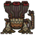
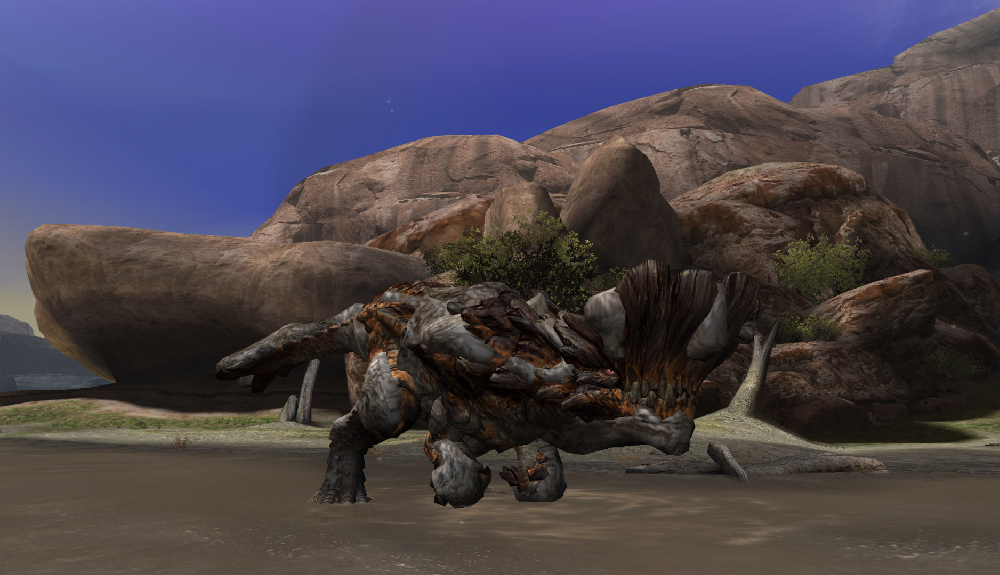
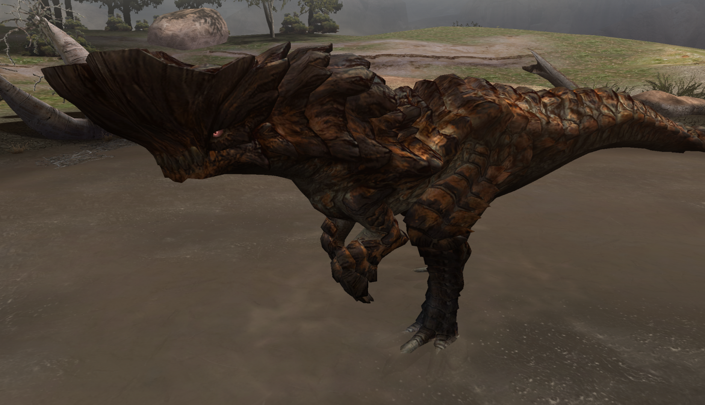

##  Hunter's Notes - Barroth 

Goabie's Weapon Recommendations:  Lance (Guard)  
Anti-recommendations:  Hammer

Elemental Weakness:  Water (when muddy),  Fire (when clean)

Afflictions:  /  Waterblight,  Mudman

Barroth - Brute Wyvern  
Threat Level : ★★★★  
*Barroth usually remain beneath the mud, perhaps to shield themselves from heat; they are even known to attack by flinging mud.  They will charge in a frenzy at anything that distrubs their bogs.*

Rage Tells: White smoke

## The Great Wall of Tri-na
Barroth is widely considered one of the first walls in Monster Hunter Tri, and for good reason. His head hitzone causes your weapons to bounce, meaning that if you mash, you will flinch and then eat his rush. He moves quickly, and his backstep-turn is nigh unpunishable. And he hits hard! This guy is genuinely harder than many monsters that come after him, so here we go!

## Dealing Damage
**DO NOT BRING HAMMER UNLESS YOU WANT TO DEAL NO DAMAGE.** His head hitzone is 1) really difficult to hammer, and 2) **takes very little damage.** Seriously, you move from the head to the claws and you will do twice as much damage. Unless you like the challenge of hammering this guy, and more power to you, *do not bring hammer.*

Barroth's best hitzone is his claws. His best elemental hitzone is his head, but there's a funny caveat...

### Adaptive Elemental Weakness
Barroth's elemental weakness actually varies depending on whether or not he's covered in mud. If he's muddy, he's weak to water. If he's clean, he's weak to fire. I personally recommend packing fire if you're trying to element match. If you're elemental gunning, bring a gun that fires both, but I would rapid fire fire.

If Barroth is in the area with his mud pool, he can go and roll in the mud. Note: his tail is an active hurtzone when he does this, and will trip you. This slathers his entire body in mud once more.

Note that once you break either Barroth's scalp or claws, they can never be mudbound again. That, and the fact that he can't re-mud unless in his starting zone, guides my recommendation to bring fire.

## Evasion and Avoidance
Barroth actually has two forward charges, though they might appear quite similar. The first one is from long range, where the tail backswings to the right. The other is at close range, which includes a head fling upwards and a tailswing to the left. The tailswing to the right (far charge) is an active hurtzone. The tailswing to the left (close charge) is not.  
(TODO: pic)
> You cannot be hurt by this tailswing.

During Barroth's big mud fling attack, there is a relatively safe but very pixelly perfect place you can be. You can either be out behind the edge of his extended tail if your weapon reaches, or otherwise, **be flush in line directly with his left hind foot.** This place is safe from the mudballs... mostly. It's quite picky.
(TODO: pic)
> Fun fact: Barroth cannot do the mud fling attack when you've cleaned his entire body.

Instead of hitting turns as [Great Jaggi](Great-Jaggi.md), [Qurupeco](Qurupeco.md), and [Royal Ludroth](Royal-Ludroth.md) perhaps taught you, I take a swipe at his rear end and just roll away when he begins his backstep-turn. Lances can stay close and just counter and dance with him. If you bounce on the head, you're in trouble. For longswords, the fade slash to the right or left will put you far enough not to eat any straight line charges.

Keep piling damage on the claws, and he'll go down eventually. You'll get the hang of it!

Good luck!

## Lance Data
Barroth's roar and long distance charge deal G1 blockstun. (TODO: link this to lance page when I write it.)

Barroth's close charge deals G2 blockstun.

In my opinion, evade does not get you anything in this fight. Go with Guard+1.

## Reward Oddities
There's nothing unique that can be carved from Barroth's scalp or tail. The main incentive to do these things would be if they are subquest rewards, or having an extra 2-3% chance (TODO: lookup exact number) to carve a Wyvern Stone. I wouldn't bother with either otherwise.
