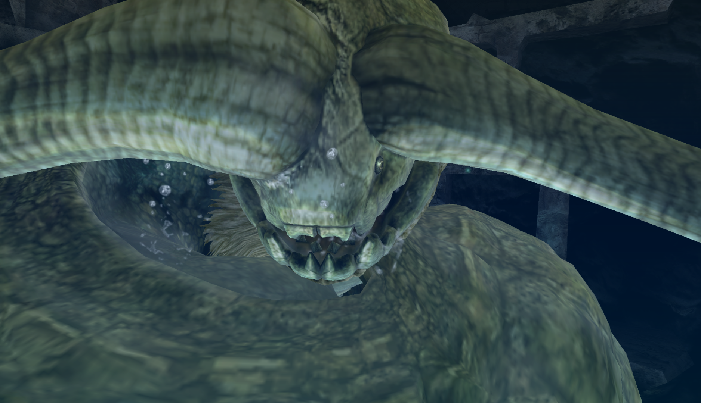
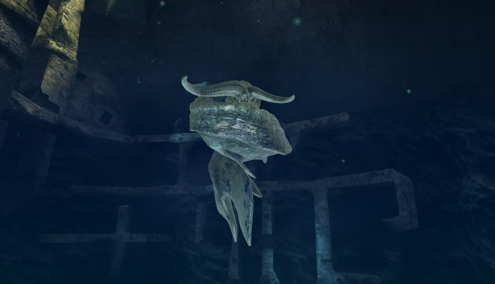

##  Hunter's Notes - Ceadeus 

Goabie's Weapon Recommendations:  Lance  
Elemental Weakness:  Thunder and  Dragon  

Afflictions:  /  Waterblight,  /   Dragonblight

Ceadeus - Elder Dragon  
Threat Level : ★★★★★★  
*Legendary elder dragons known as both "shining giants of the depths" and "great sea dragons."  Not confirmed to exist until recently.  The Moga quakes were due to a Ceadeus Butting its abnormally long horns into the earth.*

Rage Tells: Red pigmentation

## Entering the Fight
Your very first Ceadeus encounter is repel only.

Af.ter that, you can go on the actual hunt quest. You can kill it in one hunt, or you can repel it. Then, when you take the quest again, it begins in the final zone with reduced HP and its part breaks carried over from the last fight, and you go for the kill.

There are two jumping off points for entering the fight. TODO: pics

## Boring Damage Check
Sorry guys, Ceadeus is offline only, and really boring. And offers some of the best armor in the game. You're going to be farming horns and Deep Dragongems for a while if you want all of the good stuff.

## Phase 1
Ceadeus swims toward the final area. Its fins and tails are hurtboxes. On turns, Ceadeus's horns and head are a hurtbox, and the headshake is a hurtbox.

All of this is Lance G0.

## Final Showdown
When you enrage Ceadeus in the final zone, at some point, he will swim to one end of the arena and slowly come up toward the Dragonator. Just wait by the Dragonator and nail him.

There are ballistas that you can man, but aside from doing it for the novelty, I never use them.

## Reward Oddities
Horns must be carved off of the horn break. If you need these, I actually recommend noob carving as soon as it's broken. The horn gives two carves, and if you don't get a Horn, I would just reset and go again.

Tails must be gotten from tail breaks.

Deep Dragongems are a main reward and a carve, but it's still the chase mat.

## Helios/Selene Armor
**Do not** make the low rank Ceadeus chest. I also recommend not making the Ceadeus helm. These two cost a gem and horns, respectively, and are terrible armor pieces. It feels like the game is testing you.

Every single High Rank piece is worth making. Some, multiple times.

**Do not** wear full Helios armor, either low or high rank. These pieces require mixing to maximize.
