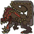

#  Hunter’s Notes - Deviljho 

Goabie's Weapon Recommendations:  Lance,  Medium Bowgun,  Great Sword  
Anti-recommendations:  Long Sword,  SnS, Status Weapons  
Elemental Weakness:  Dragon or  Thunder  
Afflictions:  Defence Down,  /  Dragonblight | Rock Attack;  Waterblight (Flooded Forest),  Iceblight (Tundra),  Fireblight (Volcano).

TODO: picture
TODO: Flavor text

Rage Tells: BIG, RED, AND SPICY!

## Preparations
Bring drugged meat and tinged meat. Bring Large Barrel Bomb+s.

## On the subject of spiked meats
Deviljho rarely (never?) has two consecutive 90 degree turns in its moveset, like the Raths or Qurupeco. But when he *does* do it, he is heading for some spiked meat. Do not stagger him out of it!

If you *do* stagger him out of it, either on his way to eating or in the process of eating, he will never go for that specific piece of meat again.

Once he's eaten one type of meat, there's no point in feeding him any more of that type.

This guy is just as active tired as he is raged. Very unique.

## Damage
Its best hitzone when unraged is the face. Its best hitzone when raged is the belly... by FAR. You want it raged.

Shock trap duration is pitiful when raged. When exhausted, shock trap lasts forever (like with every other monster), and I find this the easiest way to farm tails.

Pitfall when raged so everyone can pile damage onto the belly.

If Jho eats a spiked meat and suffers the status effect, after he breaks free, it is a guaranteed rage.

Put the pitfall trap at a sleeping Jho's chin so that he can wake up, rage, then fall into the pit. DO NOT PIT HIM UNRAGED.

## Evasion and avoidance
The safest way to get past his enormously wide head-tail sweep is RIGHT THROUGH THE MIDDLE. Go underneath and between his legs! If you're well positioned, you can just walk through. Otherwise, roll forward past the head.

Evade lancing is _the_ classic way to fight Deviljho. It really shows off the power of evasion+1 and lance mobility and ability to stick close and be aggressive at all times. Every single one of Deviljho's attacks is easily dodged with evasion+1.

If you want to evade lance it and someone is bringing a longsword, just sigh and switch to bowgun.

He gains dragonbreath when raged. This does not require evasion+1 to dodge through.

His roar does not require evasion+1 to dodge either. Actually, most of his attacks do not _require_ it, but evasion unlocks some easier timings. His hipcheck, if you are too far at the end of his attack animation, cannot be evaded properly for example.

## Status effects
When Deviljho is exhausted, if he hits you with a swipe from his drooling mouth, you are going to be afflicted with defense down. This can be counteracted by eating an adamant seed. You can also just ignore it and keep on fighting.

The dragon breath inflicts dragonblight.

I don't like bringing status weapons to this fight. One sleep and one para via meat is enough, and the fight should be over soon. The para or sleep damage that you inflict may prove meaningless when he eats.

## WORLD EATER SPECIFIC

If you set off smoke bombs and place a drugged meat while he hasn't noticed anyone, he will 100% (?) go for it. This only works for World Eater for whatever reason.
I've seen it glitch out with two drugged meats placed. He seems to go for one, then stops and moves to the other, and then doesn't perform the eating animation af.ter all. So only place one.
