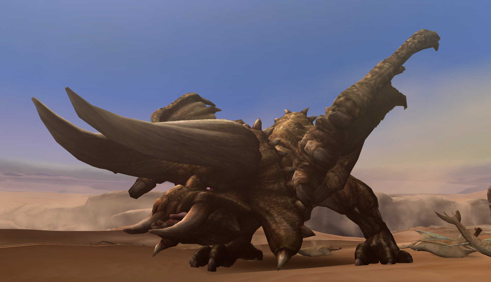
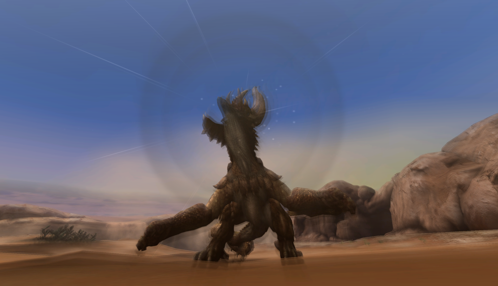

#  Hunter’s Notes - Diablos 

Goabie's Weapon Recommendations:  Lance,  Great Sword  
Elemental Weakness:  Ice

TODO: Flavor text

Rage Tells: Speedup, black smoke

## Preparations
Bring sonic and flash bombs.

Its roar is high grade with a very long freeze duration, but has a very low chip value when blocked.

## Damage
Attack the belly, even with the hammer. (Don't bring a hammer.)

The hammer bounces off the head. If you want horn breaks, hit it with blades or bomb it.

## Traps and Environment
When Diablos is not raged, you can sonic bomb it when it's underground. The timing for this is _very_ lenient, unlike Agnaktor.

Like all monsters, Diablos cannot be sonicked when raged.

A funny thing can happen if you pile on a bunch of damage while Diablos is not raged, and it digs. If you try to sonic bomb it, it may simply jump right back up and enter rage. You did not miss the sonic bomb. The game had Diablos in rage mode but simply did not give you the visual cue until just now. This is speculation as to how the game's logic is working, but I have seen this many times.

After escaping a sonic bomb or a pitfall trap, Diablos will fly into the air and descend. This is a ripe opening for a flash bomb. The timing with lance is approximately 3 triple stabs before you have to sheathe and toss the flash. If you are a status user, please take over this responsibility and let your damage dealers deal damage.

If Diablos still has at least one horn, it can get caught on a lot of environmental objects. These are:
- Area 8 - the two stone/ant pillars and one of the sand banks (you have to be on top of it to lure it.) Don't bother climbing the sand bank one.
- Area 9 - the big sand pillar.
- Area 4 - the stony jaggi (?) nest  
These objects have invisible HP. If Diablos has ever hit them before (including getting caught on one of them), the next hit will break right through it.

It's fairly impractical to take advantage of the environmental effects in large groups, but it can definitely be nice opportunistically in a small lobby.

## Evasion and avoidance
Diablos is a bit like a mini-Deviljho in that all of its movements can be evaded in much the same way. 

Evasion+1 will make this fight a lot more comfortable, but if you're positioned close enough to Diablos (like, hugging his face), you can actually evade all of his movements without Evasion+1. This includes the forward rush, hipcheck, double head swing, etc.

His feet are very active in chipping and tripping you. Very annoying.

On his dig attacks, he will predict your current trajectory and then leap to where you will be. Either superman dive, or bank a hard turn and he will miss you completely.

## Reward Oddities
The only way to get a Stout horn is by breaking both horns and then hoping to roll the 3% drop. This is one of the rarest drops in the game!

You cannot carve anything unique off of a tailcut.

## Status effects
Diabos is very vulnerable to sleep, but you won't find people packing lots of bombs in public lobbies.

It also has a uniquely long paralyze duration. You will probably get two paralysis, but not three.
