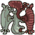
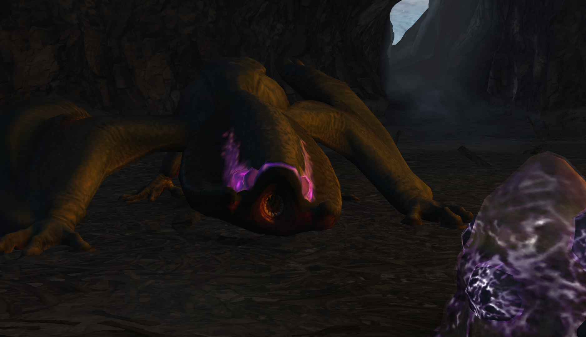
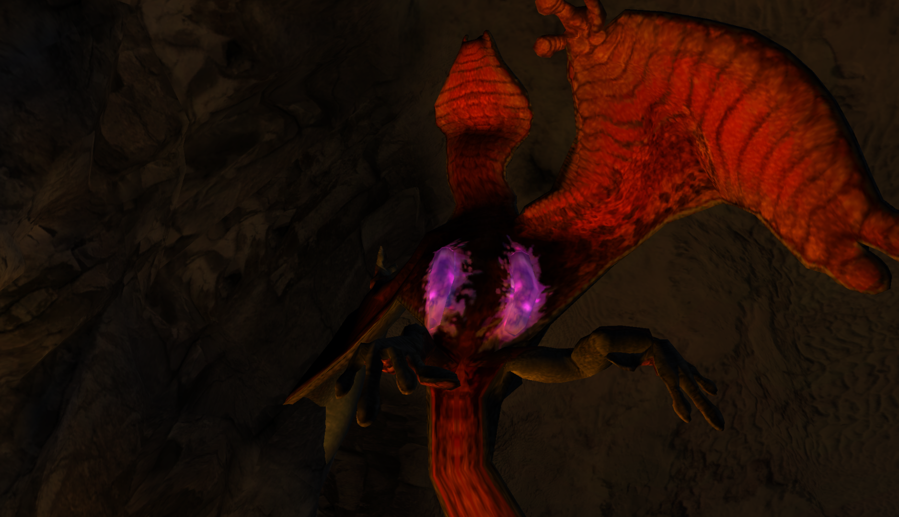

#  Hunter’s Notes - Gigginox 

  
  
Elemental Weakness:  Fire

Afflictions:  Poison

Gigginox - Flying Wyvern  
Threat Level : ★★★★  
*Wyverns that inhabit the Tundra.  Known to stun prey with poison, then freeze the meat in caves.  Gigginox live in darkness and thus have degraded vision; they detect prey through body heat.  Extremely fertile, laying innumerable eggs.*

Rage Tells: White smoke

## Spawn Location
Starts in area 6 of Tundra (TODO: check the stupid map)

## Preparation
Don't be too proud to bring Antidote or Herbal Medicine!

Bring dung bombs.

Immune to flash bombs.

## High Grade Roar
Gigginox is the first monster you encounter with a high grade roar. The range in front of it is a very large cone, but the range behind it is actually not super large. Still pretty big though.

Stun duration from the roar is *long*.

If you are on its centerline and get hit by the roar, if it decides to jump flop attack you next, there is no escape.  
> This is important info for adrenaline gunners. Don't ask me how I know.

## Breaking the Body
Gigginox's body is actually kind of annoying to break. You have to be deep inside the body and even I can't tell when hits connect with it.

Pierce guns and lance upstabs break it most easily in my experience.

## Avoidance and Evasion
In a team, you may want to sacrifice yourself to be swallowed by Gigginox's ceiling attack. This allows the rest of your team to whale on it. 
> Seriously, Gigginox's ceiling time is really annoying.  

The trickiest part of Gigginox are his jump 180 midair turns. Once you get the hang of this, it's not a big deal.

If Gigginox zones from area X to area Y (TODO: check the map for these two numbers) or vice versa, do not follow immediately! Either get to the zone before it, or chill and come in after. It will always jump down from the ceiling, and you will load into the zone and be instantly hit. There is no avoiding it.  
> This is also important info for adrenaline gunners. Don't ask me how I know.

## Lance Data
The poison flop requires Guard Boost to block/counter.

TODO: check G0/1/2 for common Gigginox attacks.

## Turnapound
Standard turnapound. Stand behind it, and release the superpound as it begins its first turn.

## Reward Oddities
Fearsome Maw requires *both* a head and a body break.

Unnvering Talon+ is HR **carve only**. Always kill Gigginox.
