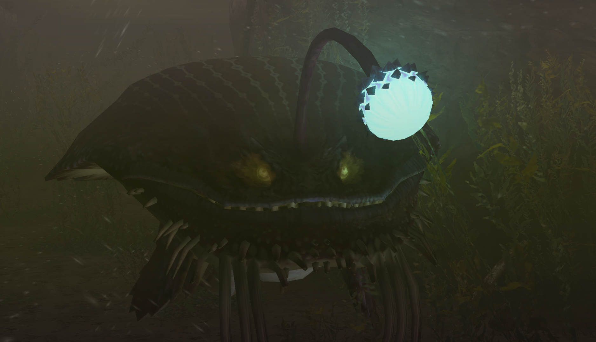

##  Hunter's Notes - Gobul 

Goabie's Weapon Recommendations:  Medium Bowgun,  Great Sword  
Elemental Weakness:  Thunder, then  Fire  

Afflictions:  /  Waterblight,  Paralysis,  Stun

Gobul - Leviathan  
Threat Level : ★★★★  
*Monsters with strong camouflage skills and powerful neurotoxins.  Poor swimmers, Gobul concel themselves and lure prey by imitating plants with their barbels.  Can reportedly swallow Epioth whole.  They love frogs.*

Rage Tells: Pufferfish!

## Preparations
In high rank, I recommend bringing a farcaster in case you spawn in the area behind it.

You can bring sonic bombs, but they rarely come into play in my experience.

Immune to flash bombs.

## Gone fishing
You can gather a frog from area 2 (TODO: check that number). Then, use the frog at the fishing spot and wait for Gobul to latch on. Most people prefer to fight it on land.

## Greatsword Abuse the Gobul
When fishing Gobul, his lantern is briefly available to hit before he bites on the line. If you're running Greatsword with Critical Draw and Focus, you can actually land a level 3 on the lantern. This will stagger Gobul.

You have time to sheathe and immediately return into position. Gobul will try to bite again, and you can land another level 3. This will break the lantern.

You can repeat this loop until either you miss, or Gobul becomes cap ready. If he becomes cap ready, he will break the loop, rage, and limp toward area 3. You win!

## Breaking the Lantern
...can actually be a little difficult on land. If you're pierce gunning, don't expect to break it. Normal 2 has a much better time of it.

The lantern will hang low during KO. Otherwise, you can get a few hits in during pitfall trap, or maybe when he goes underground and sticks the lantern out to flash you.

Underwater, it is very easy. Greatsowrd can actually land level 3s on the lantern for every turn. He will dangle it right in front of your face, just like a Lagiacrus turn.

## Reward Oddities
The lantern must be broken for a lantern reward. In LR, you are guaranteed a Lantern. In HR, you have a low chance to roll a Lantern+.
