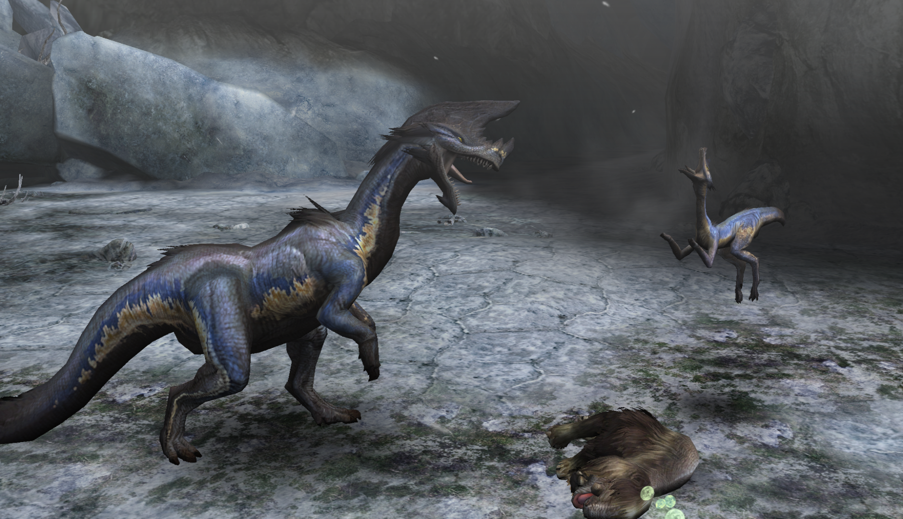

##  Hunter's Notes - Great Baggi 

Elemental Weakness:  Fire

Afflictions:  Sleep

Great Baggi - Bird Wyvern
Threat Level : ★★★
*Carnivorous bird wyverns like the Jaggi.  Noted for their projecting cranial crests and bluish-white skin that's adapted to snow.  Great Baggi craftily command other Baggi to surround their prey and stun them with a tranquilizing fluid.*

Rage Tells: White smoke

## Preparations
Bring Negate Sleep or Flame Aura.

Thank me later.

## Collecting Dragonbone Relics
In HR, if you need Dragonbone Relics, eat for Felyne Explorer and come do this hunt. I always do this solo so I don't have to waste time on waiting for Deviljho to crash into his lair later.
