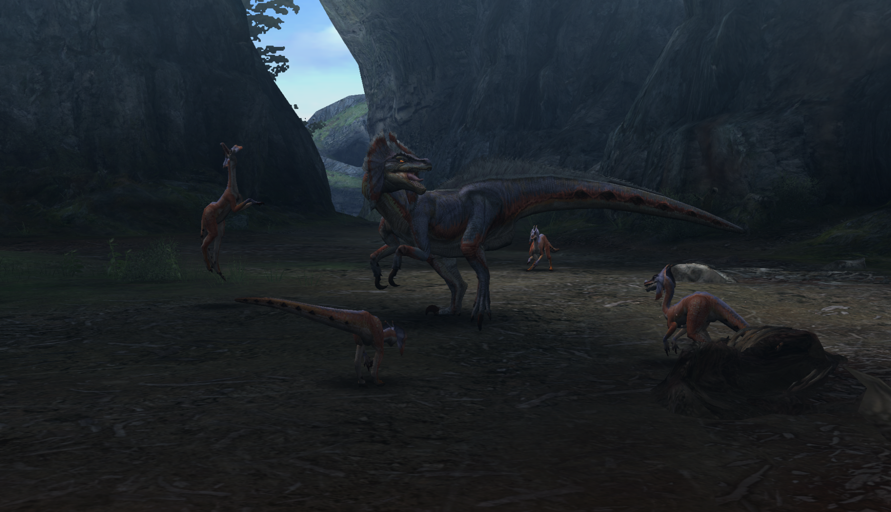

#  Hunter’s Notes - Great Jaggi 

Goabie's Weapon Recommendations: Whatever you like!
Elemental Weakness:  Fire

TODO: Flavor text

Rage Tells: Speedup, white smoke

## Welcome to Monster Hunter Tri!
I fell in love with this game and have played it for hundreds of hours. My first Great Jaggi hunt probably took about 20 minutes.

Great Jaggi is a wonderful way to introduce the player to the hunt. It will take you time to recognize its movements, and soon 20 minutes will become 15, then maybe 8, and then maybe 30 seconds.

The below is how I tried to formulaically break down the general gist of every hunt. Of course, it did not come like this for me. I learned through hundreds of repetitions, but maybe the below can be helpful.

I personally think Great Jaggi can be summarized into four lessons:
1. You are safer than you think
2. You cannot potion freely
3. It is the monster's turn, and you should have exited
4. Recognize the monster's ending, and enter

### You are safer than you think
When I played, and when I watched my wife first play, everything is scary. EVERYTHING. I constantly rolled around with my sword and shield drawn, scared of any twitch that Great Jaggi would make. As it turns out, if you are not committing to any sort of attack, you are fairly safe! With your weapon sheathed and the ability to run, almost everything in the game is simply "run out of the way-able." Don't be *too* frightened, and know that even scary looking attacks like Qurupeco's flint fire claps can be maneuvered around by simply crawling with your lance drawn.

Of course, you won't get anywhere without attacking. But if you ever need a breather, put your weapon away, and nothing can hurt you.

### You cannot potion freely
Great Jaggi has two idles, and I genuinely thought one of them was an attack. He can howl and summon jaggis, or he can swipe his feet twice, push his head forward, and growl. That is not an attack!

Once you realize that these are just free openings for you, you will naturally go on the attack.

The hunt is going well, and you've taken some damage. You want to potion. But every time you take a potion, you do that god damn flex! Why, oh why, do we flex when we potion! Oh shit, Great Jaggi just hit us with its hipcheck and our potion amounted to not much.

*Taking a potion is equivalent to getting your strikes in.* You cannot do it whenever you want! You must have an opening, same as if you were attacking.

### It is the monster's turn, and you should have exited
I use the term exit freely. The idea is simple: I'm waving my Great Sword combo around on Great Jaggi, and he tanked through it and bit me in the face.

Then I keep waving my Great Sword around, and he hits me with a hipcheck, another bite, argh!

When a monster is about to take its turn, you need an exit! This can be either preemptively getting out of the way, or having some sort of plan to avoid the attack. It might be a lance counter or a dodge roll, for example.

You have your turn to attack during its idle. Then it will turn to attack you. Exit.

### Recognize the monster's ending, and enter
I wish Great Jaggi would just howl so I could hit it.

Wait, Great Jaggi's double tail swing doesn't actually have that much range, and his head pokes out at both ends of it. What if I can hit that?

To truly become a dervish of whirling blades, you will have to recognize your openings within a monster's moveset. You can hit Great Jaggi when it howls, and when it growls. But when we're behind it, it takes two 90 degree turns and doesn't do much. And apparently we can smack it when it tail whips... and at the end of its double forward bite...  in fact, with a lance, we can poke and counter through everything...

Oh shoot, I messed it up. Aw man, I can hit him at the end of this attack that he just hit me with!

Notice how eating a hit costs you a hit in return (hand waving.) Greeding an extra hit, only to take a hit, is not worth it. [It is the monster's turn, and you should have exited.](#it-is-the-monsters-turn-and-you-should-have-exited). And once you take enough hits, it costs you another turn to potion because [You cannot potion freely.](#you-cannot-potion-freely)

This will come with time. Every monster has movements that can be exploited, despite how deadly they may be. Manufacturing safe openings to attack will turn you from an Amnesiac into the Hero of Loc Lac.

Good hunting!

