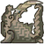
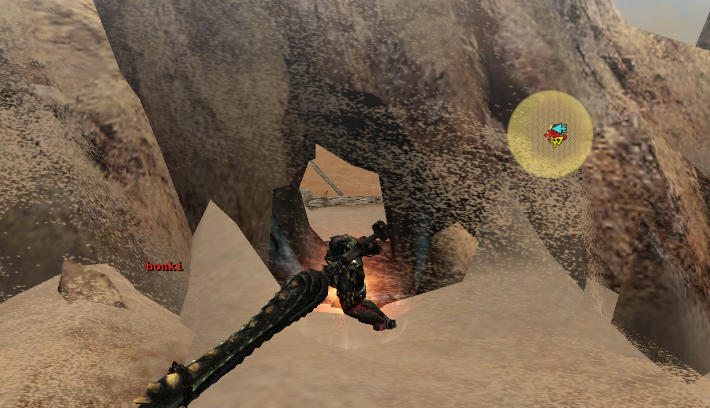
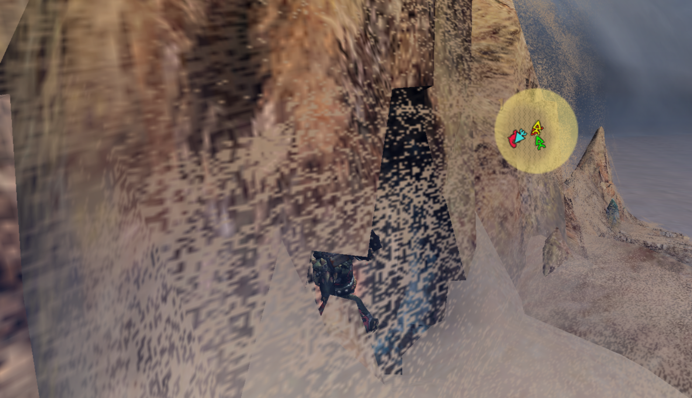
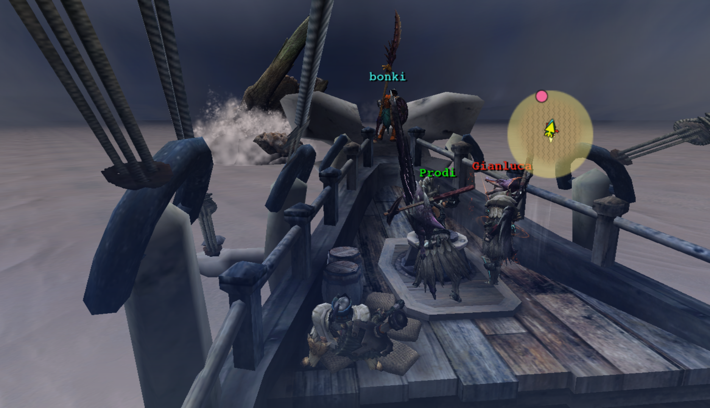
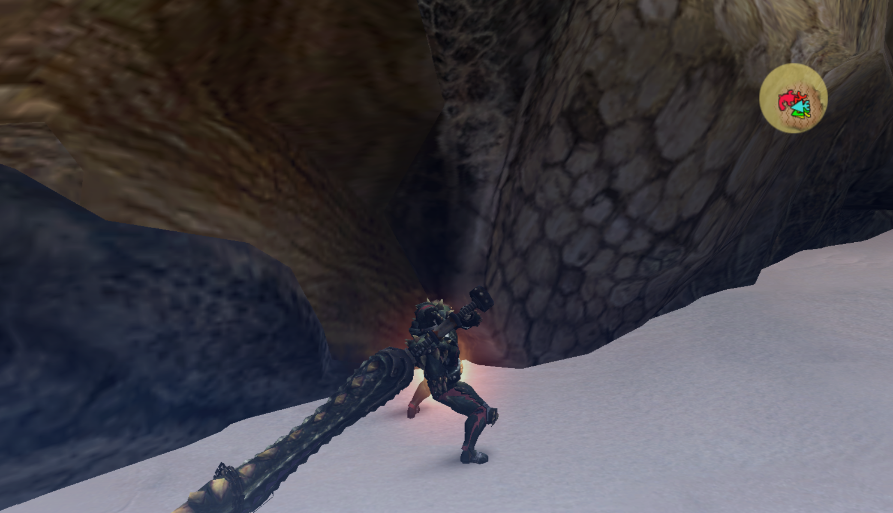
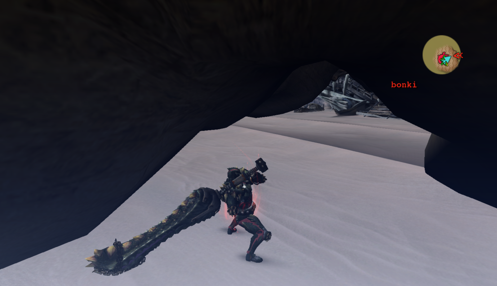

#  Hunter’s Notes - Jhen Mohran 

Goabie's Weapon Recommendations:  Lance,  Great Sword  
Elemental Weakness:  Dragon or  Ice

TODO: picture
TODO: Flavor text

## Loc Lac is in peril! Hunters, assemble!
Jhen Mohran threatens Loc Lac city every two weeks. Everything goes on sale and wares are expanded. Grab your thunderbugs, bomb casings, and other amazing hunt materials now!

## Dealing Damage
Jhen Mohran has a few hitzones that are very effective: the rock cracks, a particular part of the spine, his arms (just for the Brace drop), and the chin.

In addition, you are given 2 dragon bombs at the start of the hunt, and ballista ammo and cannonballs to try and break his tusks. If your gear is not on par (HR 51+), you may be better off manning and using the ship's defenses.

Greatsword and Lance are the two weapons that can really unload damage into Jhen's spine, even after the rock is broken! This is the area you want to hit:

> You'll know you've hit the correct spot if your weapon feels resistance. If your attack slides right through (cough longswords) then you are not dealing damage.

## The Script
Jhen Mohran is on a script. He has two phases: shipside, and final showdown.

There are probably many ways to tackle it, but here is a simple breakdown that should work in public games.

### Shipside - Right
Jhen Mohran starts to the right of the ship. He will always open with 3 (is that accurate?) rock tosses while the hunters put some cannonballs into him or gather some ballista ammo. Then, he will do a tackle into the ship. Goabie's recommendation: bind this! Everyone else, keep dealing damage, either by hitting his arm, or by firing ballistas or cannonballs.

When Jhen is to the right of the ship, he will continuously tackle it. If you're on top of his back, be on the far side if you don't want to get thrown back onto the ship while eating some damage.

### Shipside - Left
Jhen will either greet you with a horn tackle or a belly flop. The belly flop must be gonged to repel it (and you have no reason not to). The horn tackle you can either binder or just let him hit the ship if you want access to his chin early.

When mounting Jhen from this side, it is my recommendation to wait until his tusks are actually underneath the ship's platform. Ignore the little red arrows. It's super glitchy if you try to go early!

The rest of this part, you can just stay on his spine and whale on the whale. If your team does enough damage here, you can immediately skip to the Final Showdown!

### Shipside - Front
When Jhen moves to the front of the ship, you need to hit him with the Dragonator or else lose out on the damage while your boat takes a big chunk instead. The timing is when he jumps out from the sand for the first time as he approaches the ship. It may be earlier than you expect if you were to try it for the first time.

> Hit the Dragonator at about this point. It doesn't have to be *too* precise.
>
> If someone else is hitting the Dragonator, show your utmost faith in them by standing at the bow of the ship and cheering!

### Shipside - Right
jhen Mohran returns to the right side, but he surfaces adjacent to the ship. You can jump on early as soon as he appears. 

## Final Showdown
Jhen begins a crawl toward the ship. Once he gets to it, he will begin belly flopping, rock slamming, everything. If the ship loses all of its hp, you will fail the quest!

Any stagger will repel Jhen for a moment, giving you a respite. It is in this face that we finally have access to his mouth hitzone (unless you're a spicy pierce gunner.)

Staggering his chin twice will cause him to flop over. The noobs will go into Jhen's mouth to carve. The cool people will stay by his face and attack the relevant hitzone with I think 3 Greatsword lvl 3 charges and a lvl 3 smash.

If Jhen is going to belly flop the ship, the gong will also cause an instant falldown like a double chin stagger.

The dragonator will reload and eventually be available for you once more.

## Evasion and avoidance
Not many tips here... and by no means am I an expert. But this works for me in casual lobbies, which is all I do.

The safest place I've discovered is underneath/around Jhen's right armpit (our left, looking at him face on from the ship.) His chin is actually one gigantic hitzone, and hitting the armpit and toward his face will register as a chin hit. Hitting toward the tail is worthless.

Just like when you're on the spine, you can tell if you've done the Good Thing by whether or not your attack feels resistance.

