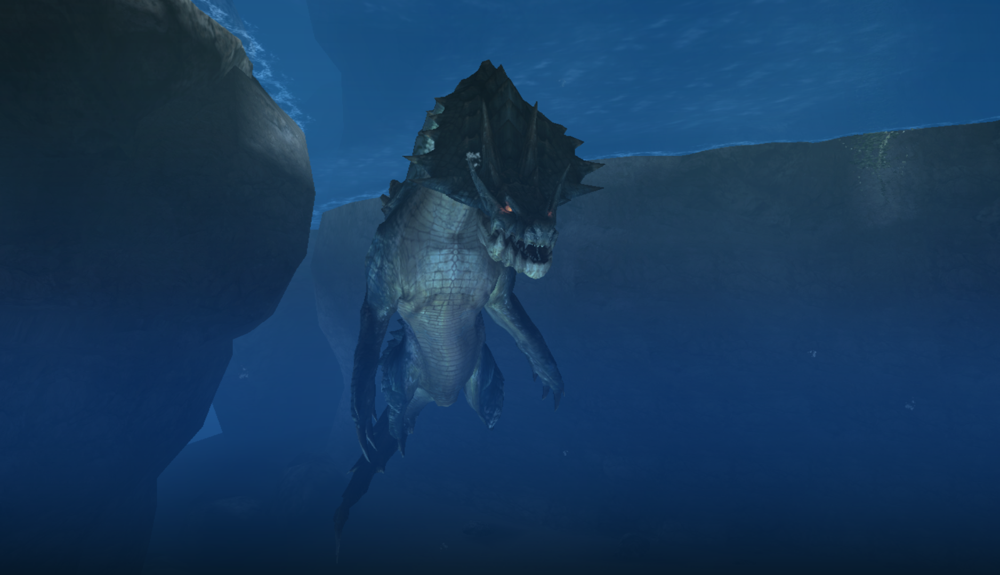

#  Hunter's Notes - Lagiacrus 

  

Goabie's Weapon Recommendations:  Lance (Guard),  Bowgun (Elemental),  Great Sword
Anti-Recommendations:  Hammer  
Elemental Weakness:  Fire
Afflictions:  /  Iceblight,  /  Waterblight

Lagiacrus - Leviathan  
Threat Level : ★★★★★  
*Known as sea wyverns, Lagiacrus are at top of the aquatic food chain.  Feared by sailors as the "Lords of the Seas", they store enough electricity in their spinal organs to make the oceans surge.  Occasionally seen resting on land.*

Rage Tells: Speedup, red eyes

## Running to Lagiacrus
On D. Island, assuming you didn't start in area 6, the fastest way to Lagiacrus is to run to the Rathian nest and leap off the edge to 11. Don't do the long swim!

## Dealing Damage
Lagiacrus's turns involve him putting his head directly level and in front of you. It is really easy to hit his turns with a hammer or a level 3 GS (requires focus usually.)

Lagi's head staggers turn him sideways for a flail. Two staggers will break the horns.

The reason I anti-recommend hammer is because his KO duration actually seems very low. You can't get two full triple pounds iirc. The reason I may not remember correctly is because I haven't done it for over ten years for the aforementioned reason.

Aim for the chest for damage.

If you deal a *lot* of fire damage (Agnaktor Firelance, Dancing Hellfire, fire bowgun), then you should aim for the back instead. A back stagger results in a double duration flail compared to a head stagger and feels longer than a KO as well!

Seriously, four fire gunners can back lock Lagi for the whole fight.

## Avoidance and Evasion
The double hipcheck is really dangerous guys. I don't know what to tell you. Evade through it with evasion+1 I guess.

On the headwhip tailswing, if you're near the head, rolling at the last moment toward the little crook in the curve of his neck will get you out unscathed. You'll be staggered briefly from water pressure, but otherwise unharmed.

The surfs are also surprisingly annoying sometimes, especially when he adds the electric field to increase his range.

When lancing, be aware of the claw swipe on the turn and counter to continue to pour in damage.

The electric field can be lance counetered or shield advanced into.

The *large* electric field probably requires Guard Up (TODO: verify.) Otherwise, just get out of dodge.

## Flash Bombing
I like to flash him as he either readies to surf, or af.ter he's completed surfing and turned back around.

## Reward Oddities
Plates and sapphires are always a main and subquest reward, no matter what Lagiacrus quest you're in.

Tails must be carved.

The horn must be broken for a chance at a horn or horn+.
