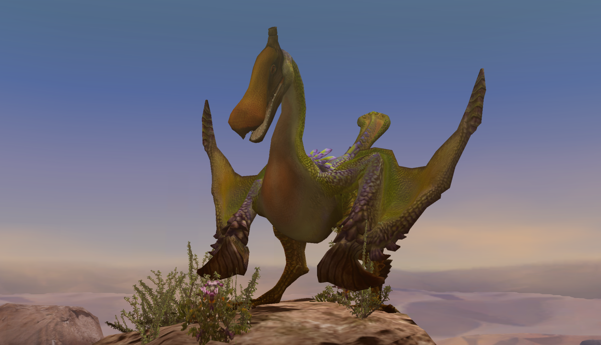

#  Hunter's Notes - Qurupeco 

  

Anti-Recommendations:  Sword and Shield  
Elemental Weakness:  Ice  
Afflictions:  /  Fireblight,   Defense Down

*Qurupeco - Bird Wyvern  
Threat Level : ★★★  
Bird wyverns with unique plumage.  Well known for using their thoracic vocal organs to imitate other monsters' calls, first summoning them, then using the distraction to flee.  Spits a dangerous combustible body fluid.*

Rage Tells: Smoke from mouth, red pigment in tail/body

## Spawn locations
D. Island: Area 7  
Sandy Plains: Area 4

## Level up your hammering
Qurupeco holds his head high! Literally. And the fact that super pounds do not home onto his head, even when he sticks it out (for example, when he does the squawk, the SP will strike his throat) makes him a *very* interesting hammer target. It's much, *much* harder than something like Rathian or Rathalos.

This monster is so cool. It's unfortunate that its HP pool is so low and it is generally not threatening. It is a fantastic training target for aspiring hammers.

If you want to hit the head consistently, you need to perform either spinning golfswings or triple pound golfswings on turns. When he flies, he will dip his head low, and that's when you can get super pounds. You can also super pound him in a neutral position if you're on higher ground.

Qurupeco also teaches you to triple pound it from the wing down side. You want to smack him right where his neck connects to his head in order to avoid missing the regular triple.

Lance, Greatsword, and Switch Axe's overhead chop can all hit the beak consistently as well. 

Seriously, his beak is super duper vulnerable! It takes 70% (cutting) or 90% (impact). The body, flint, legs, tail, etc. are all a fairly big drop off.

You can watch me hammering it in my progression series [here](https://youtu.be/Rt5HOZTzQhc?t=1116).

## Avoidance and Evasion
His acid spit always goes left to right (from our POV.)

His flint claps are very slow and actually very easy to walk around, even with a Greatsword or Lance drawn.

When he sings or howls, you want to try to poke out the throat. If you do, this will put him on the floor.

If you break the beak, every single song or howl will take Qurupeco double time.

You can sonic bomb the singing and howling, but if your weapon is drawn, you actually won't have time unless his beak is broken. A win for Sword and Shield, I guess... at the cost of not being able to hit anything good.

## Flash Bombing
Flash bombs are very effective against Qurupeco. He will either tailspin (annoying) or lower his head and bite (nice!)

## Reward Oddities
Flintstones are a break and a cap reward.

Scales are best carved.
