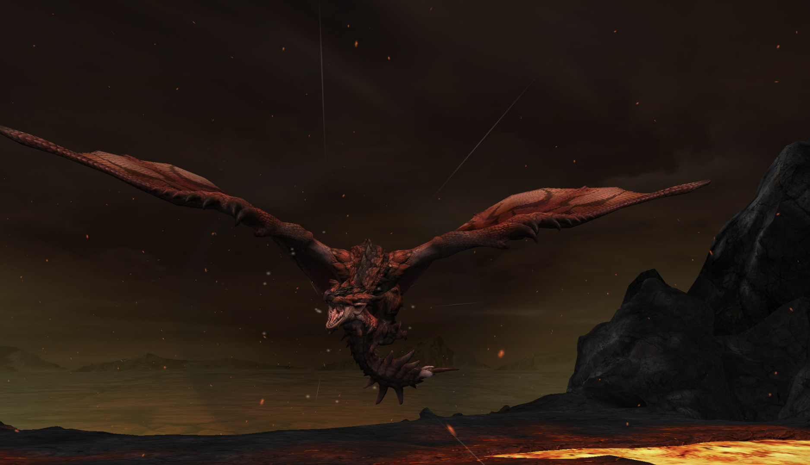

#  Hunter’s Notes - Rathalos 

  
Goabie's Weapon Recommendations:  Hammer,  Great Sword,  Long Sword  
  
Elemental Weakness:  Thunder and  Dragon

Afflictions:   /  Fireblight,  Poison

**TODO: Link videos demonstrating flash bombing**

Monster Type : Flying Wyvern   
Threat Level : ★★★★★   
*Terrible wyverns called the "Kings of the Skies".  Together with Rathian, they stake wide territories centered around their nests.  Rathalos descend on invaders from the sky, attacking with poison claws and breath of fire.*

Rage Tells: Speed up, fire in mouth

Starts in area 2 of Deserted Island in Double Trouble  
Starts in area 7 of Deserted Island if alone

TODO: Starts in Volcano where? But really, hunting him there sucks. Don’t do it.

## How to flash bomb/unfly Rathalos

Rathalos flies a lot, but also has a lot of flash bomb timings. Here are the ones I use:
- When he enters rage with a roar (fire in mouth), throw the flash bomb directly in front of where his face currently is as he's doing his jumpback fireball attack. This is easiest with earplugs, but I think it can be done without if you time your superman dive well.
- When he does the flying triple fireball, count rhythmically with him. 1, 2, 3, 4 (no fireball), 5 (throw), 6 (he's stunned.)
- When he does the poison swooping claw, superman dive, then just throw as soon as you get up. If you're not hittable from his attack and don't need to dive (you're underneath his shadow), just wait a little when he gets back overhead and then throw it.

Otherwise, you can try to predict a turn while he's flying, but he may not oblige. The three methods above are foolproof.

In Low Rank, you can just place large barrel bombs and detonate when he's coming back down from a vertical fly. That will probably stagger him out of the air.

## Avoidance and Evasion
When raged, it is not safe to be overlapping his body when he is about to make his next movement. You _will_ eat a jumpback fireball.

Like all monster tailwhips, you can evade through his without evasion+1.

## Tailcut
Once you stagger the tail, it will cut soon. Useful if you're trying to swipe stagger him out of the air.

## Turnapound
Standard turnapound. Stand behind Rathalos, and release the superpound as he begins his first turn.

When knocked out and going for triple pounds, make sure not to stand under the wing that is up. Go to where the wing is down.

## Preparation
Bring dung bombs for Double Trouble, and hope they work! The raths are very sticky and stubborn, and they like to be together!  
Bring 5 flash bombs.
