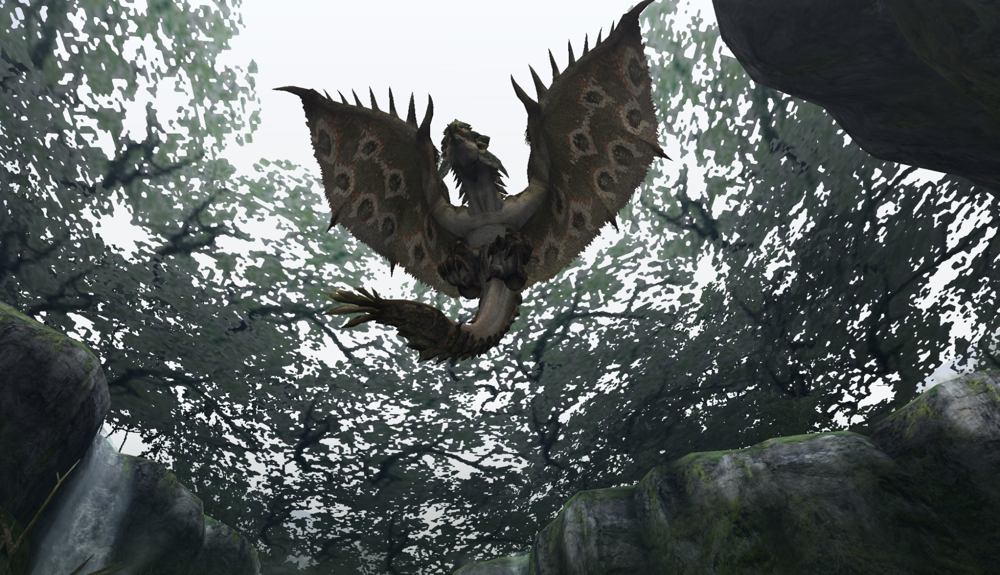

#  Hunter’s Notes - Rathian 

  
Goabie's Weapon Recommendations:  Hammer,  Great Sword,  Long Sword  
  
Elemental Weakness:  Thunder and  Dragon

Afflictions:   /  Fireblight,  Poison

**TODO: Link videos demonstrating flash bombing**

Rathian - Flying Wyvern  
Threat Level : ★★★★  
*Fire-breathing female wyverns, also known as the "Queen of the Land".  With powerful legs and poison-secreting tails, they hunt mainly on the ground.  Sometimes seen preying as a couple, Rathian cooperate well with Rathalos.*

Rage Tells: Speed up, fire in mouth

Rathian is *much* easier than Barroth. It is even easier than Qurupeco.

## Spawn Location
Starts in area 7 of Deserted Island  
Starts in area 3 of Flooded Forest

## Preparation
Bring dung bombs for Double Trouble, and hope they work! The raths are very sticky and stubborn, and they like to be together!  
> Consider Dung Bomb Expert!

Bring flash bombs if you like.

## Flash Bombing
There are two timings I like to flash Rathian if I have an EZ Flash Bomb. Otherwise I don't really bother.

- After the hovering forward lunge bite
This is the little forward movement she performs while flying. She will lower her head and perform a forward bite. Throw the flash bomb when this one is coming.

- After the poison tail flip
You have a timing window to throw a flash bomb as she performs the tail flip. This should flash her out of the air. Note that if you are late on this and the flash still lands, Rathian will be in the flashed state, but she will somehow get "sucked" into the ground and be standing again, instead of staggering and falling.

## Avoidance and Evasion
The triple fireball always goes middle, our left, our right.

Rathian fireballs and fireblasts are just enormous openings for you to land whatever you want on her head.

If she is hovering, she can perform up to two poison tailflips. Do *not* be greedy and stand on her centerline. She can pull these out kind of immediately, and there is basically no reason to be hit by this.  
> In high rank, she actually gains the ability to perform up to three poison tailflips. It's a nasty surprise if you're used to fighting her in Low Rank!

When raged, Rathian can perform three charges in a row. You'll know she's about to charge again if at the end of one charge, she does not perform a forward bite, but instead comes to a standstill and then turn turns.

Like all monster tailspins, you can evade through hers without evasion+1.

## Tailcut
Once you stagger the tail, it will cut soon.

## Turnapound
Standard turnapound. Stand behind Rathian, and release the superpound as he begins his first turn.

When knocked out and going for triple pounds, make sure not to stand under the wing that is up. Go to where the wing is down.

## Reward Oddities
Rathian Plates and Rubies can be gotten from head breaks and tail carves.

Plates and Rubies are also main rewards in Moga Village 6* Double Trouble (plate only) and Loc Lac 6* Double Trouble.
