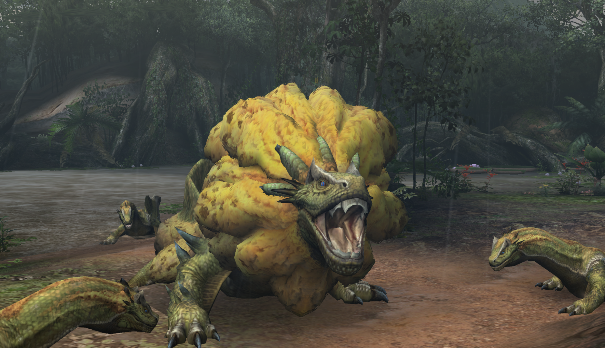

##  Hunter's Notes - Royal Ludroth 

Elemental Weakness:  Fire

Afflictions:  /  Waterblight 

Royal Ludroth - Leviathan  
Threat Level : ★★★  
*Royal Ludroth use their sponge-like neck scales to absorb water and prevent drying out on land.  Once the sponge loses moisture, they attempt to re-enter the water.  They also spew mucus to trip up their prey.*

Rage Tells: White smoke

## Damage
I dunno man. Just hit it.

## Random Info
The snot column will actually block projectiles.

In offline village, capture Royal Ludroth is your most profitable quest for a while, and Royal Ludroth crests are plentiful and sell for a fair chunk of Zenny.
