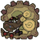

##  Uragaan 

 

Goabie’s Weapon Recommendations:  Medium Bowgun,  Lance (Guard),  SnS  

Elemental Weakness:  Dragon and  Water  

Afflictions:  /  Fireblight,  Sleep

Rage Tells: Speedup, black smoke from nose

## Trapping
Pit into flash
  * If you load 10 pierce 1, when Uragaan is pitted and unraged, you can unload 20 shots before sheathing and flash bombing his roar. If raged, you can get 15.

## Avoidance and Evasion
If you're having trouble avoiding his crazy rolls, here's a tip: He will _never_ roll across the point where he initially started it!

On his rock bomb throw, there is a safe point right in the middle of the circle outlined by his body. Even a non-focus GS has the timing to unleash a level 3 charge into the gut here.

Just like Agnaktor, his quad chin pound is considered a single attack. If you are guard lancing, smash right through it and attack through his animation!

The hurtbox of the quad chin pound is actually very small.

No evasion required to dodge his roar.

