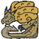
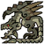
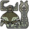

# Hunter's Notes - Index

## <a href="Great-Jaggi.md" >  Great Jaggi </img></a>

<h2 style='text-align: right;'><a href="Qurupeco.md">  Qurupeco </img></a></h2>

## <a href="Royal-Ludroth.md" > Royal Ludroth </img></a>

<h2 style='text-align: right;'> <a href="Barroth.md"> Barroth </img></a></h2>

## <a href="Gobul.md"> Gobul </img></a>

<h2 style='text-align: right;'> <a href="Rathian.md"> Rathian </img></a></h2>

## <a href="Great-Baggi.md" > Great Baggi </img></a>

<h2 style='text-align: right;'><a href="Gigginox.md">  Gigginox </img></a></h2>

## <a href="Lagiacrus.md" > Lagiacrus</img></a>

<h2 style='text-align: right;'><a href="Rathalos.md">  Rathalos </img></a></h2>

## <a href="Barioth.md" > Barioth</img></a>

<h2 style='text-align: right;'><a href="Diablos.md">  Diablos </img></a></h2>

## <a href="Uragaan.md" > Uragaan</img></a>

<h2 style='text-align: right;'><a href="Agnaktor.md">  Agnaktor </img></a></h2>

## <a href="Ceadeus.md" > Ceadeus</img></a>

<h2 style='text-align: right;'><a href="Jhen-Mohran.md">  Jhen Mohran </img></a></h2>

## <a href="Alatreon.md" > Alatreon</img></a>

<h2 style='text-align: right;'><a href="Deviljho.md">  Deviljho </img></a></h2>
